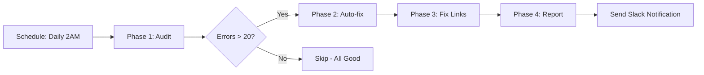

# Wiki Documentation Audit (Complete Workflow)

This workflow audits and fixes Wiki documentation using a **3-level iterative approach**:
1. **Level 1**: Fix structural issues (YAML delimiters, tag format)
2. **Level 2**: Inject missing facets based on file location
3. **Level 3**: Fix broken links with hierarchy-aware path resolution

Each level is run iteratively until convergence (typically 2-3 iterations).

---

## 📊 Phase 1: Initial Audit (Baseline)

Run both audits to establish baseline metrics:

// turbo-all

### Step 1.1: Audit Taxonomy
```powershell
pwsh scripts/pwsh/wiki-tags-lint.ps1 -Path "Wiki/EasyWayData.wiki" -ExcludePaths logs/reports,archive -RequireFacets -RequireFacetsScope core
```

### Step 1.2: Audit Links
```powershell
pwsh scripts/pwsh/wiki-links-anchors-lint.ps1 -Path "Wiki/EasyWayData.wiki" -ExcludePaths logs/reports,archive
```

**Expected Output**: JSON files with error counts
- `wiki-tags-lint.json` - Taxonomy errors
- `wiki-links-anchors-lint.json` - Broken links

---

## 🔧 Phase 2: Fix Taxonomy (3-Level Iterative)

### Level 1: Structural Fixes
```powershell
pwsh scripts/pwsh/wiki-tags-autofix.ps1 -Path "Wiki/EasyWayData.wiki" -ExcludePaths logs/reports -Apply
```
**What it does:**
- Fixes unterminated YAML delimiters (`---`)
- Converts `privacy-internal` → `privacy/internal` (facet format)

### Level 2: Inject Missing Facets
```powershell
pwsh scripts/pwsh/wiki-frontmatter-patch.ps1 -Path "Wiki/EasyWayData.wiki" -ExcludePaths logs/reports -Apply
```
**What it does:**
- Adds missing `domain/*`, `layer/*`, `audience/*`, `privacy/*`, `language/*` based on file path
- Suggests appropriate facets using directory structure

### Level 3: Verify & Iterate
```powershell
pwsh scripts/pwsh/wiki-tags-lint.ps1 -Path "Wiki/EasyWayData.wiki" -ExcludePaths logs/reports -RequireFacets -RequireFacetsScope core
```
**Decision:**
- If errors > 10: Repeat Level 2
- If errors < 10: Proceed to Phase 3 (or fix manually)

---

## 🔗 Phase 3: Fix Links (Hierarchy-Aware)

### Step 3.1: Fix Broken Links
```powershell
pwsh scripts/automation/smart-fix-links.ps1 -Apply
```
**What it does:**
- Maps old paths (`../../../docs/`) to new locations
- Calculates correct relative paths using URI hierarchy
- Converts Obsidian-style links to standard Markdown

### Step 3.2: Verify Links
```powershell
pwsh scripts/pwsh/wiki-links-anchors-lint.ps1 -Path "Wiki/EasyWayData.wiki" -ExcludePaths logs/reports
```

---

## 📈 Phase 4: Final Report

Generate summary of improvements:

```powershell
# Count taxonomy compliance
$before = 243  # Initial failures
$after = (Get-Content wiki-tags-lint.json | ConvertFrom-Json).failures
Write-Host "Taxonomy: $before → $after errors ($(100 - [int](($after/$before)*100))% improvement)"

# Count link integrity
$beforeLinks = 265  # Initial broken links
$afterLinks = (Get-Content wiki-links-anchors-lint.json | ConvertFrom-Json).broken.Count
Write-Host "Links: $beforeLinks → $afterLinks broken ($(100 - [int](($afterLinks/$beforeLinks)*100))% improvement)"
```

---

## 🎯 Expected Results

After 3 iterations:
- **Taxonomy**: >95% compliance (< 20 errors out of ~460 files)
- **Links**: <50 broken links (mostly edge cases)

---

## 🔄 Iteration Strategy

**When to iterate:**
1. **After Level 1**: Always run Level 2
2. **After Level 2**: Run Level 3 (verify). If >10 errors, repeat Level 2
3. **After Level 3**: If >50 broken links, check for new path mappings in `smart-fix-links.ps1`

**When to stop:**
- Taxonomy errors < 10 (manual fix remaining)
- Link errors < 50 (mostly missing files or self-referential)

---

## 🧹 Phase 5: Final Cleanup (Manual/Semi-Automated)

### Step 5.1: Fix Remaining Taxonomy Errors
```powershell
# Option A: Add facets manually to remaining 19 files
# Edit files like standards/agent-environment-standard.md

# Option B: Evolve taxonomy to accept common free tags
# Add to docs/agentic/templates/docs/tag-taxonomy.json:
# "canonical_free_tags": { "preferred": [..., "standard", "architecture", "python", "docker", "powershell"] }
```

### Step 5.2: Create Missing Files
```powershell
# Create start-here.md to resolve ~20 broken links
New-Item -Path "Wiki/EasyWayData.wiki/start-here.md" -ItemType File -Force
# Add basic content with links to main sections
```

### Step 5.3: Update Link Mappings
```powershell
# Edit scripts/automation/smart-fix-links.ps1
# Add new mappings to $FileMap for common broken paths:
# "agent-security-iam.md" = "Wiki/EasyWayData.wiki/security/agent-security-iam.md"
# "ai-security-guardrails.md" = "docs/agentic/ai-security-guardrails.md"
```

### Step 5.4: Re-run Final Audit
```powershell
pwsh scripts/pwsh/wiki-tags-lint.ps1 -Path "Wiki/EasyWayData.wiki" -ExcludePaths logs/reports -RequireFacets -RequireFacetsScope core
pwsh scripts/pwsh/wiki-links-anchors-lint.ps1 -Path "Wiki/EasyWayData.wiki" -ExcludePaths logs/reports
```

---

## 📦 Phase 6: Commit & Push (Automation)

After all fixes are applied, commit changes to git and push to remote.

### Step 6.1: Stage Changes
```powershell
git add Wiki/EasyWayData.wiki/*.md
git add docs/agentic/templates/docs/tag-taxonomy.json
git add scripts/automation/smart-fix-links.ps1
```

### Step 6.2: Commit with Summary
```powershell
$taxonomyErrors = (Get-Content wiki-tags-lint.json | ConvertFrom-Json).failures
$brokenLinks = (Get-Content wiki-links-anchors-lint.json | ConvertFrom-Json).broken.Count
git commit -m "docs: Wiki audit fixes - $taxonomyErrors taxonomy errors, $brokenLinks broken links"
```

### Step 6.3: Push to Remote
```powershell
git push origin main
```

**Note**: In agent mode (n8n), this creates an audit trail of automated fixes.

---

## 🤖 Agent-Ready Notes (Future n8n Integration)

**Vision**: This workflow will become a fully automated agent triggered by n8n (e.g., nightly runs).

**Automation Readiness**:
- ✅ All scripts support `-Apply` flag (no manual intervention)
- ✅ JSON output for programmatic parsing
- ✅ Exit codes for success/failure detection
- ⚠️ Phase 5 still requires manual decisions (taxonomy evolution, file creation)

**n8n Workflow Design**:


**Future Enhancements**:
1. **Smart Taxonomy Evolution**: Agent analyzes common free tags and proposes taxonomy updates
2. **Auto-create Missing Files**: Agent generates stub files for broken links
3. **Link Mapping Learning**: Agent learns new path mappings from successful manual fixes
4. **PR Creation**: Agent creates GitHub PR with fixes for human review

---

## 📝 Notes

- All scripts use `-Apply` flag to make changes
- Without `-Apply`, scripts run in **dry-run mode** (report only)
- JSON output files are overwritten on each run
- Exclude `logs/reports` to avoid auditing generated reports
- **Agent Mode**: When run from n8n, set `$env:AUDIT_AGENT_MODE=1` to suppress interactive prompts
