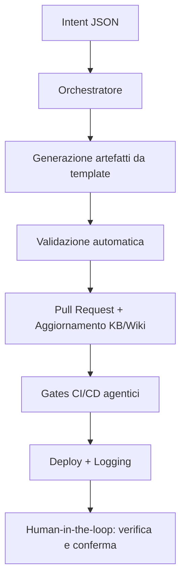

Principio guida
- Il progetto EasyWay deve evolvere verso un portale totalmente agentico e governabile anche da persone non esperte.

Memoria degli obiettivi
- Fonte unica: `agents/goals.json` (machine‑readable). Gli agenti devono leggerla all’avvio e rispettarne i principi.
- Aggiornare `agents/goals.json` quando l’obiettivo si raffina e riflettere il cambiamento nella Wiki.

Convergenza documentazione ↔ agenti
- Per ogni cambiamento in DB/API/Wiki/CI, aggiornare anche:
  - una ricetta KB (`agents/kb/recipes.jsonl`)
  - almeno una pagina Wiki pertinente

Orchestrazione
- Usare `scripts/ewctl.ps1` come entrypoint. Engine: `--engine ps|ts`.
- Gli agenti figli (docs/governance/DB/frontend) devono esporre script idempotenti e con esiti strutturati.

## Workflow agentici

Per realizzare workflow agentici efficaci in EasyWayDataPortal, segui questi principi e passi operativi:

1. **Definisci gli obiettivi e le azioni agentiche**
   - Usa un file machine-readable (es. agents/goals.json) dove ogni agente trova obiettivi, regole e parametri operativi.
   - Ogni workflow deve partire da un “intent” chiaro (es. creazione tabella, aggiornamento KB, deploy).

2. **Usa orchestratori e manifest**
   - Centralizza la logica di orchestrazione in uno script (es. agents/core/orchestrator.js) che carica manifest, goals e knowledge base.
   - Ogni agente deve avere un manifest.json che dichiara permessi, allowed_paths, e azioni disponibili.

3. **Workflow tipico agentico**
   1. **Intent:** L’agente riceve un input strutturato (JSON mini-DSL) che descrive l’azione da compiere.
   2. **Generazione artefatti:** L’agente genera i file necessari (DDL, SP, documentazione) usando template con segnaposto.
   3. **Validazione automatica:** L’agente esegue lint, check di idempotenza, verifica naming e policy.
   4. **Proposta PR:** L’agente crea una pull request con i file generati e aggiorna la KB/Wiki.
   5. **Gates CI/CD:** La pipeline esegue i gates agentici (Checklist, DB Drift, KB Consistency) e logga gli eventi.
   6. **Deploy e auditing:** Se i gates sono verdi, l’agente esegue il deploy e aggiorna i log di esecuzione.

4. **Human-in-the-loop e trasparenza**
   - Ogni azione deve essere tracciata e confermabile da un umano, con log, piani e esiti visibili.
   - La documentazione (Wiki, KB) deve essere aggiornata automaticamente e sempre allineata.

5. **Sicurezza e reversibilità**
   - Usa parametri sicuri (Key Vault/App Config), nessuna credenziale hard-coded.
   - Ogni modifica deve essere reversibile tramite migrazione o rollback.

6. **Strumenti consigliati**
   - Wrapper di orchestrazione: scripts/ewctl.ps1
   - Template SQL e SP: docs/agentic/templates/
   - Logging: agents/logs/events.jsonl
   - Validazione: lint SQL, check naming, gates CI/CD

**Esempio di workflow agentico:**

Gates in pipeline (ibrido)
- Variabile `USE_EWCTL_GATES=true|false` controlla se usare `ewctl` per Checklist/DB Drift/KB Consistency.
- `true` → job `GovernanceGatesEWCTL` esegue `pwsh scripts/ewctl.ps1 --engine ps --checklist --dbdrift --kbconsistency --noninteractive --logevent`.
- `false` → job legacy `PreDeployChecklist`, `KBConsistency`, `DBDriftCheck` + `ActivityLog`.

Definizione di Fatto (agent‑aware)
- KB aggiornata, Wiki aggiornata, gate verdi (Checklist/DB Drift/KB Consistency), eventi loggati in `agents/logs/events.jsonl`.

Sicurezza
- Rispettare `allowed_paths` nei manifest degli agent.
- Usare `WhatIf` per azioni potenzialmente distruttive.
