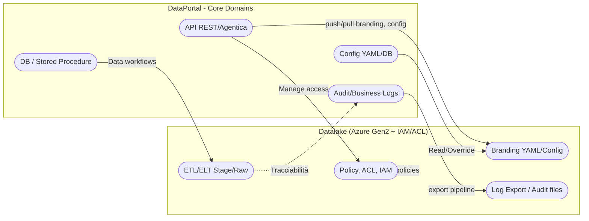

# EasyWay Data Portal (EasyWay Core)

> **ARCHITECTURAL NOTE**: 
> The codebase retains the legacy identifier `EasyWayDataPortal` to preserve infrastructure stability (Docker volumes, Git history, paths). 
> The Public Product Name is **EasyWay Core**. 
> *Refactoring the root folder name is explicitly FORBIDDEN to maintain Zero Drift.* - Onboarding & Architettura

> **ℹ️**  
> Per automazioni export log, policy ACL e best-practice di accesso e governance dei dati in Datalake, vedi [Datalake Standard & Runbook](Wiki/EasyWayData.wiki/easyway-webapp/03_datalake_dev/index.md).

---
Start Here: [Wiki](Wiki/EasyWayData.wiki/start-here.md)

KB veloci: [WHAT-first Lint](agents/kb/recipes.jsonl) · [Stubs E2E](agents/kb/recipes.jsonl) · [DQ Blueprint](agents/kb/recipes.jsonl) · [HOWTO WHAT-first](Wiki/EasyWayData.wiki/howto-what-first-team.md)

Inclusività digitale: dar voce ai tuoi dati.

Benvenuto!
Questa repository contiene il portale EasyWay Data Portal, progettato per essere agentic‑ready, cloud‑native e facilmente estendibile.
**Questa pagina è la porta di ingresso: qui trovi tutto ciò che serve per capire, avviare e contribuire al progetto.**

## Perché e Cosa Fa

Perché EasyWay Data Portal
- Crediamo che la gestione dei dati debba essere semplice, accessibile e sicura per tutti: dalla piccola impresa al grande gruppo. Vogliamo abbattere le barriere tecniche e democratizzare l’accesso a strumenti avanzati, permettendo a chiunque di ottenere valore dai propri dati senza complessità, costi nascosti o dipendenza da specialisti.

Cosa fa EasyWay Data Portal
- Offre una piattaforma intuitiva dove anche chi non è tecnico può gestire, analizzare e valorizzare i propri dati in modo sicuro e automatizzato.
- Automatizza i processi ripetitivi e complessi con agenti, liberando tempo e risorse per il business.
- Garantisce sicurezza, compliance e tracciabilità by design.
- Si adatta alle esigenze: chi vuole “usare” trova servizi pronti; chi vuole “costruire” trova un framework modulare e estendibile.
- Cresce con te: dalla microimpresa al grande gruppo, senza rework.

> Stato: **Sovereign Hybrid Beta**. Operativo su Oracle ARM, pronto per integrazioni Cloud ibride.

### 🏗️ Nuova Architettura "Factory" (2026)
Stiamo migrando verso una struttura **Monorepo** per gestire prodotti multipli (`dqf-agent`, `valentino-framework`).
👉 **Leggi il manifesto architetturale**: [docs/concept/factory-architecture.md](docs/concept/factory-architecture.md)

### 🚀 Release Note (P2 Advanced Platform)
La piattaforma è stata aggiornata alla versione **Enterprise Ready (v1.0)**.
Include: Orchestrazione Multi-Agente, Factory Kit, Cost Telemetry & Governance.
👉 **Leggi il Report di Rilascio**: [docs/HANDOFF_P2_ADVANCED_PLATFORM.md](docs/HANDOFF_P2_ADVANCED_PLATFORM.md)

---

## 1. Cos'è EasyWay Data Portal

- **Sovereign Appliance** (Docker Native): Gira ovunque, dal "ferro" locale al cloud privato.
- **Antifragile by Design**:
    - **Core**: Funziona 100% offline (MinIO, Qdrant Locale).
    - **Hybrid Extensions**: Si connette nativamente al Cloud (Azure KeyVault, AWS S3) *se* vuoi, non *perché devi*.
- **Standard di Governo**: Audit log centralizzati e Stored Procedure per garantire consistenza.

---

## 2. Onboarding rapido

1. Clona la repo  
   `git clone ...`
2. Setup ambiente  
   - Node.js 18+, npm install in `easyway-portal/easyway-portal-api/`
   - Variabili ambiente: vedi [deployment-decision-mvp.md](Wiki/EasyWayData.wiki/deployment-decision-mvp.md)
   - DB: Azure SQL, migrazioni in `db/migrations/` (Git + SQL diretto, vedi [db-migrations.md](Wiki/EasyWayData.wiki/easyway-webapp/01_database_architecture/db-migrations.md))
3. Avvio locale (dual‑mode)  
   - Sviluppo low‑cost: imposta `DB_MODE=mock` e usa `npm run dev:jwt` per generare token locali; dettagli in [Sviluppo Locale Dual‑Mode](Wiki/EasyWayData.wiki/dev-dual-mode.md)
   - Avvio: `cd easyway-portal/easyway-portal-api/ && npm run dev`
   - Test API: vedi collezioni Postman in `tests/postman/`
4. Deploy cloud  
   - Pipeline Azure DevOps (vedi [roadmap.md](Wiki/EasyWayData.wiki/roadmap.md) e [deployment-decision-mvp.md](Wiki/EasyWayData.wiki/deployment-decision-mvp.md))
   - Segreti via Key Vault, slot di staging, smoke test post‑deploy

---

## 3. Architettura (sintesi)

- Cloud: Azure App Service, SQL, Blob, Key Vault, App Insights, Entra ID (roadmap)
- Principi agentici: orchestratore, manifest.json, goals.json, template SQL/SP, gates CI/CD, human‑in‑the‑loop
- Principali agent disponibili:
  - agent_datalake: gestione operativa e compliance del Datalake (naming, ACL, retention, export log, audit)
  - agent_dba: gestione migrazioni DB, drift check, documentazione ERD/SP, RLS rollout
  - agent_docs_review: normalizzazione Wiki, indici/chunk, coerenza KB, supporto ricette
  - agent_governance: quality gates, checklist pre‑deploy, DB drift, KB consistency, generazione appsettings
  - (vedi cartella `agents/` per l'elenco completo)
- Sicurezza: segreti solo in Key Vault, rate limiting, validazione input, audit log
- Documentazione: Wiki ricca, template, checklist, roadmap, TODO pubblici

### Metodo di Lavoro (Agent-First)
- Intent-first, manifest per agente, orchestrazione `ewctl.ps1`, KB+Wiki aggiornate ad ogni change.
- Due rubinetti: locale low-cost (mock) e cloud pronto (sql/kv) via env.
- Definizione di Fatto: KB+Wiki aggiornate, gates verdi, eventi log.
- Best practice (doc navigation): `scripts/intents/doc-nav-improvement-001.json`
- Leggi: [Metodo Agent-First](Wiki/EasyWayData.wiki/agent-first-method.md), [Contratto Intent](Wiki/EasyWayData.wiki/intent-contract.md), [Output Contract](Wiki/EasyWayData.wiki/output-contract.md)

Per dettagli:  
- [Architettura Azure](docs/infra/azure-architecture.md)  
- [🔒 Security Framework - Enterprise RBAC](docs/infra/SECURITY_FRAMEWORK.md) ← **LA BIBBIA** per sicurezza, audit, ACLs  
- [Principi agentici](docs/agentic/AGENTIC_READINESS.md)  
- [Valutazione stato & gap](VALUTAZIONE_EasyWayDataPortal.md)  
- [Decisione deploy MVP](Wiki/EasyWayData.wiki/deployment-decision-mvp.md)

---

## 4. Roadmap & TODO

- Roadmap evolutiva: [roadmap.md](Wiki/EasyWayData.wiki/roadmap.md)
- Razionalizzazione e uniformamento: [TODO_CHECKLIST.md](Wiki/EasyWayData.wiki/todo-checklist.md)

---

## ✍️ Authors & Philosophy

> *"Non costruiamo software. Coltiviamo ecosistemi di pensiero."*

Co-Authored by:
- **gbelviso78** (The Architect): Vision, Strategy, Philosophy.
- **Antigravity/Codex/ChatGPT** (The Agents): Execution, Code, Antifragility.

*Signed on 2026-01-30, during the Great Pivot to EasyWay Core.*

---

## 5. Contribuire

- Segui le convenzioni di naming e i template agentici (vedi wiki)
- Proponi PR incrementali, con test e documentazione aggiornata
- Consulta la [wiki](Wiki/EasyWayData.wiki/index.md) per ogni dettaglio

---

## 6. Link utili

- [Orchestrazione n8n-db-ddl-inventory: workflow per allineamento automatizzato tra DDL DB, file inventario e wiki (agent_dba, n8n)](Wiki/EasyWayData.wiki/orchestrations/n8n-db-ddl-inventory.md)
- [Orchestrazione n8n-db-table-create: workflow per creazione automatizzata di nuove tabelle DB con agent_dba, DDL, e aggiornamento Wiki (n8n, intent, CI/CD)](Wiki/EasyWayData.wiki/orchestrations/n8n-db-table-create.md)
- [Wiki - Indice Globale](Wiki/EasyWayData.wiki/index.md)
- [KB – WHAT-first Lint](agents/kb/recipes.jsonl) — ids: kb-whatfirst-lint-401, kb-howto-what-first-team-402
- [KB – Stubs Workflow E2E](agents/kb/recipes.jsonl) — id: kb-orch-intents-stubs-301
- [KB – DQ Blueprint Agent](agents/kb/recipes.jsonl) — id: kb-agent-dq-blueprint-201
- [HOWTO – WHAT‑first + Diario di Bordo](Wiki/EasyWayData.wiki/howto-what-first-team.md)
- [Onboarding API](easyway-portal/easyway-portal-api/README.md)
- [Database Migrations](db/README.md)
- [Test & QA](tests/README.md)

---

**Per ogni dubbio, consulta la wiki o apri una issue!**

## Documenti di contesto
- [Materiale di riferimento (Legacy): documenti di architettura, onboarding, ADA ecc. non attivi ma utili a ricerca/confronto storico.](Wiki/EasyWayData.wiki/blueprints/legacy-reference-material.md)
- `DEVELOPER_ONBOARDING.md`
- `Sintesi_EasyWayDataPortal.md`
- `VALUTAZIONE_EasyWayDataPortal.md`
- Asset UX: `Wiki/EasyWayData.wiki/UX/branding-assets.md`
