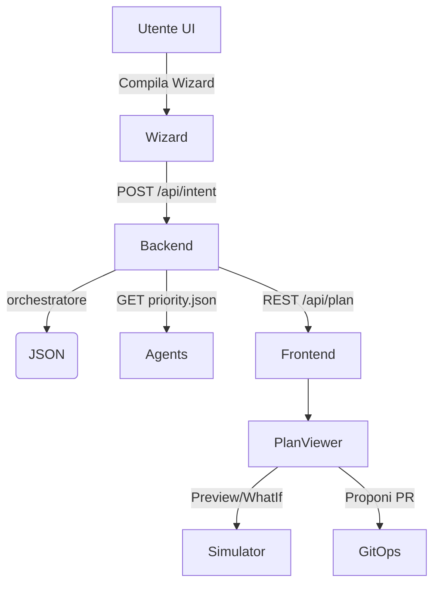

Scopo
- Fornire una specifica pratica e wireframes per le prime funzionalità UX dell’MVP: Wizard (Create table), Plan Viewer e WhatIf/Simulator.
- Definire le API minimali necessarie al frontend per interrogare l’orchestratore e visualizzare plan completi di checklistSuggestions.

Indice
1. Panoramica funzionale
2. Wireframes e flussi (testuali + mermaid)
3. API spec (endpoints, payload, esempi)
4. Esempi JSON (plan + checklistSuggestions + priority.json)
5. Integrazione frontend-backend (stato, error handling)
6. Acceptance criteria & test cases
7. Deliverable e next steps operativi

1) Panoramica funzionale
- Wizard (step-by-step) per creare intent (es. creare tabella + SP). Produce JSON mini‑DSL e invia al backend per generare plan.
- Plan Viewer: visualizza il plan generato dall’orchestratore, con passi, agenti coinvolti, e checklistSuggestions aggregate per agente (severità: mandatory/advisory).
- WhatIf / Simulator: preview dei cambiamenti (diff SQL, runlog simulato) prima di esecuzione reale.
- Checklist panel: area dove l’utente può leggere, commentare, checkare le voci (human-in-the-loop).

2) Wireframes e flussi

2.1 Flusso principale (schema)

2.2 Wizard (Create Table) — step-by-step (schermate)
- Step 1: Info generali
  - Nome entità (USERS)
  - Descrizione business
  - Schema (PORTAL)
- Step 2: Colonne
  - Lista colonne (name, type, constraints, pk)
  - Pulsante "Aggiungi colonna"
- Step 3: NDG / Sequence
  - Opzioni NDG: sequence name, prefix, width
- Step 4: Preview & Generate Intent
  - Preview SQL generato (collapsed)
  - Pulsante "Genera plan" (invia JSON mini-DSL)
  - Pulsante "Salva bozza"

2.3 Plan Viewer — sezioni principali
- Header: intent, autore (se presente), timestamp
- Summary: agents coinvolti, recipeId, suggestion
- ChecklistSuggestions: per agente, con badge severity (M = mandatory, A = advisory)
- Steps: lista step eseguiti/proposti (collapsible)
- Preview / WhatIf: diff SQL e runlog simulato
- Actions: "Proponi PR", "Simula", "Chiedi spiegazione (Assistant)", "Conferma esecuzione"

3) API spec (minimale)

3.1 GET /api/plan?intent={intent}
- Descrizione: ritorna il plan generato dall’orchestratore per l’intent dato (read-only).
- Query params:
  - intent (string) — obbligatorio
- Response 200:
  - { plan: { intent, recipeId, suggestion, manifests, goals, checklistSuggestions } }
- Esempio:
  curl -s "http://localhost:3000/api/plan?intent=create_table_users"

3.2 POST /api/intent
- Descrizione: invia un JSON mini‑DSL (intent) per generare plan e ottenere preview immediata.
- Body:
  - { intent: "create_table_users", payload: { ...mini-dsl... }, author?: "user@company" }
- Response 201:
  - { plan: { ... }, preview: { sql: "...", diff: "...", runlog: "simulated" } }
- Error 4xx/5xx: messaggi strutturati { error: { code, message, details } }

3.3 GET /api/agents/{agent}/priority
- Descrizione: restituisce priority.json consolidato per l’agente (rules).
- Response 200:
  - { rules: [ { id, description, severity, when, checklist } ] }

3.4 POST /api/simulate
- Descrizione: esegue simulazione WhatIf server-side (non tocca DB di produzione).
- Body: { plan: { ... } } oppure { sql: "..." }
- Response 200:
  - { simulatedDiff: "...", runLog: [ { step, outcome, details } ], warnings: [] }

3.5 GET /api/activity-log?planId={id}
- Descrizione: timeline degli eventi relativi al plan (orchestratore/agents/logs)
- Response 200: { events: [ { ts, source, level, message, data } ] }

4) Esempi JSON

4.1 Esempio plan (estratto) — include checklistSuggestions
{
  "plan": {
    "intent": "create_table_users",
    "recipeId": "kb-portal-create-user-001",
    "suggestion": { "agent": "agent_dba", "action": "ps", "args": ["scripts/agent-dba.ps1"] },
    "manifests": [
      { "name": "agent_dba", "role": "dba" },
      { "name": "agent_docs_review", "role": "docs" }
    ],
    "goals": { /* agents/goals.json content */ },
    "checklistSuggestions": {
      "agent_dba": {
        "mandatory": [
          "[seq-ndg-check] Verificare presenza sequence SEQ_USER_ID",
          "[naming] Controllare prefissi PORTAL."
        ],
        "advisory": [
          "[perf] Considerare index su tenant_id",
          "[doc] Aggiungere extended properties per colonne chiave"
        ]
      },
      "agent_docs_review": {
        "mandatory": [],
        "advisory": [
          "[doc-1] Aggiornare Wiki: USAGE/USERS.md"
        ]
      }
    }
  }
}

4.2 Esempio priority.json (agents/agent_dba/priority.json)
{
  "rules": [
    {
      "id": "seq-ndg-check",
      "description": "Verifica NDG/Sequence per entità nuove",
      "severity": "mandatory",
      "when": { "intentContains": ["create_table", "add_entity"] },
      "checklist": [
        "Verificare presenza sequence SEQ_<ENTITY>_ID",
        "Generare NDG con prefisso aziendale"
      ]
    },
    {
      "id": "perf-index-suggest",
      "description": "Suggerimenti performance",
      "severity": "advisory",
      "when": { "columnsContain": ["tenant_id", "email"] },
      "checklist": [
        "Valutare index su tenant_id",
        "Valutare index su email"
      ]
    }
  ]
}

5) Integrazione frontend-backend (note implementative)
- Frontend: componente React (o framework preferito) PlanViewer che chiama GET /api/plan?intent=... e renderizza:
  - Header con intent e azioni (Simula, Proponi PR)
  - Sezione checklistSuggestions: per ciascun agente, mostra due liste (mandatory/advisory) con icona severity e possibilità di expand.
  - Preview: mostra SQL/DIFF (collapsed by default).
- Stato: considerare spinner per chiamate, gestione errori strutturati, fallback se orchestratore non risponde.
- Auth: usare token (bearer) e ruoli. Utenti non-admin vedono solo preview; admin può proporre PR/esecuzioni.

6) Acceptance criteria & test cases (minimi)
- AC-1: GET /api/plan?intent=... ritorna JSON valido e include checklistSuggestions quando esistono priority.json per agenti.
- AC-2: Wizard genera JSON mini‑DSL che produce plan visibile in Plan Viewer.
- AC-3: WhatIf restituisce simulatedDiff senza modificare DB reale.
- AC-4: Plan Viewer evidenzia in modo distinto le checklist mandatory e advisory.
- Test case rapido:
  - Creare intent mock "create_table_users" → POST /api/intent → verificare plan.checklistSuggestions per agent_dba.
  - Aggiungere agents/agent_dba/priority.json con rule mandatory → rigenerare plan → verificare che item compaia.

7) Deliverable e file da aggiungere al repository (suggeriti)
- Wiki/UX/agentic-ux.md (questa pagina)
- EasyWay-DataPortal/easyway-portal-api/src/routes/plan.ts (scaffold)
- agents/core/templates/priority.template.json (gia' presente)
- agents/agent_dba/priority.json (esempio)
- frontend/src/pages/PlanViewer.jsx (prototype)
- frontend/static/mock/plan-sample.json (mock per sviluppo)

8) Note pratiche e suggerimenti tecnici
- Orchestratore: migliorare valutazione delle condizioni "when" (supportare intentContains, branch, changedPaths, columnsContain, tags, recipeMetadata). L'orchestratore è stato aggiornato per riconoscere "tags" e "recipeMetadata" nel context; la logica valuta le condizioni e include solo le regole applicabili nel plan.
- Rendere checklistSuggestions filtrabile in base al contesto (branch, changed files, tags) per evitare rumore. Consigliato: mostrare solo le regole mandatory per default e lasciare espandere le advisory.
- Salvare plan in storage temporaneo (cache) con planId per recupero via /api/activity-log?planId=...
- Privacy/Security: non includere dati sensibili nella preview; la simulazione non deve mai esporre credenziali.
- Esempi di utilizzo dall'orchestratore (shell):
  - node agents/core/orchestrator.js --intent create_table_users --columns user_id,tenant_id,email
  - node agents/core/orchestrator.js --intent create_table_users --tags onboarding,demo --recipeMetadata '{"env":"staging","owner":"team-a"}'
  - node agents/core/orchestrator.js --intent create_table_users --changedPaths "db/flyway/sql/**,src/somefile" --branch feature/new-entity
- Nota: per integrare questa logica nella UI, includere flags (tags, payloadPath/recipeMetadata) nella chiamata POST /api/intent in modo che il backend ricostruisca il context esatto e ritorni checklistSuggestions filtrate.

9) Next steps immediati (azione consigliata)
- Implementare endpoint GET /api/plan (scaffold) che ritorna mock plan (consente al frontend di partire parallelamente).
- Creare due priority.json d’esempio per agent_docs_review e agent_governance.
- Prototipare PlanViewer statico che carica frontend/static/mock/plan-sample.json.

Se vuoi, procedo ora a:
- creare i file di esempio (agents/agent_dba/priority.json, agents/agent_docs_review/priority.json),
- aggiungere un mock plan in frontend/static/,
- creare uno scaffold API in EasyWay-DataPortal/easyway-portal-api/src/routes/plan.ts.

Indica quale di questi vuoi che generi immediatamente.

## Vedi anche

- [Contratto Plan + Diario di Bordo (Machine-readable)](../plan-and-diary-contract.md)
- [UX Mock – Diario di Bordo (wf.excel-csv-upload)](./diary-mock-wf-excel-csv-upload.md)
- [Use Case – Entrate/Uscite (One‑Button UX)](../use-cases/entrate-uscite.md)
- [UX – Usability Checklist (One‑Button)](./usability-checklist.md)
- [UX - Asset e Branding](./branding-assets.md)

