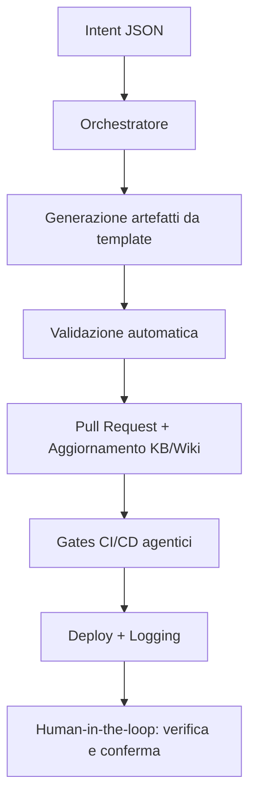

## Visione
Portale governabile da agenti e da umani non esperti, con piani chiari e scelte confermabili.

## Principi
- Human-in-the-loop
- Trasparenza (piani, esiti, log)
- Idempotenza
- Documentazione viva (KB + Wiki)
- Policy & gates comprensibili
- Parametrizzazione
- Osservabilità

## Implementazione
- Wrapper: `scripts/ewctl.ps1` (engine `ps|ts`)
- Orchestratore: `agents/core/orchestrator.js` (carica manifest, KB, `agents/goals.json`)
- Agenti: `scripts/agent-docs-review.ps1`, `scripts/agent-governance.ps1`
- Memoria obiettivi: `agents/goals.json`

## Flusso Consigliato
1) Pianifica (TS): `pwsh scripts/ewctl.ps1 --engine ts --intent <intent>`
2) Esegui (PS): `pwsh scripts/ewctl.ps1 --engine ps --intent <intent> --noninteractive`
3) Verifica gates (Checklist/DB Drift/KB Consistency)
4) Aggiorna KB + Wiki

---

## Workflow agentici

Per realizzare workflow agentici efficaci in EasyWayDataPortal, segui questi principi e passi operativi:

1. **Definisci gli obiettivi e le azioni agentiche**
   - Usa un file machine-readable (es. agents/goals.json) dove ogni agente trova obiettivi, regole e parametri operativi.
   - Ogni workflow deve partire da un “intent” chiaro (es. creazione tabella, aggiornamento KB, deploy).

2. **Usa orchestratori e manifest**
   - Centralizza la logica di orchestrazione in uno script (es. agents/core/orchestrator.js) che carica manifest, goals e knowledge base.
   - Ogni agente deve avere un manifest.json che dichiara permessi, allowed_paths, e azioni disponibili.

3. **Workflow tipico agentico**
   1. **Intent:** L’agente riceve un input strutturato (JSON mini-DSL) che descrive l’azione da compiere.
   2. **Generazione artefatti:** L’agente genera i file necessari (DDL, SP, documentazione) usando template con segnaposto.
   3. **Validazione automatica:** L’agente esegue lint, check di idempotenza, verifica naming e policy.
   4. **Proposta PR:** L’agente crea una pull request con i file generati e aggiorna la KB/Wiki.
   5. **Gates CI/CD:** La pipeline esegue i gates agentici (Checklist, DB Drift, KB Consistency) e logga gli eventi.
   6. **Deploy e auditing:** Se i gates sono verdi, l’agente esegue il deploy e aggiorna i log di esecuzione.

4. **Human-in-the-loop e trasparenza**
   - Ogni azione deve essere tracciata e confermabile da un umano, con log, piani e esiti visibili.
   - La documentazione (Wiki, KB) deve essere aggiornata automaticamente e sempre allineata.

5. **Sicurezza e reversibilità**
   - Usa parametri sicuri (Key Vault/App Config), nessuna credenziale hard-coded.
   - Ogni modifica deve essere reversibile tramite migrazione o rollback.

6. **Strumenti consigliati**
   - Wrapper di orchestrazione: scripts/ewctl.ps1
   - Template SQL e SP: docs/agentic/templates/
   - Logging: agents/logs/events.jsonl
   - Validazione: lint SQL, check naming, gates CI/CD

**Esempio di workflow agentico:**

