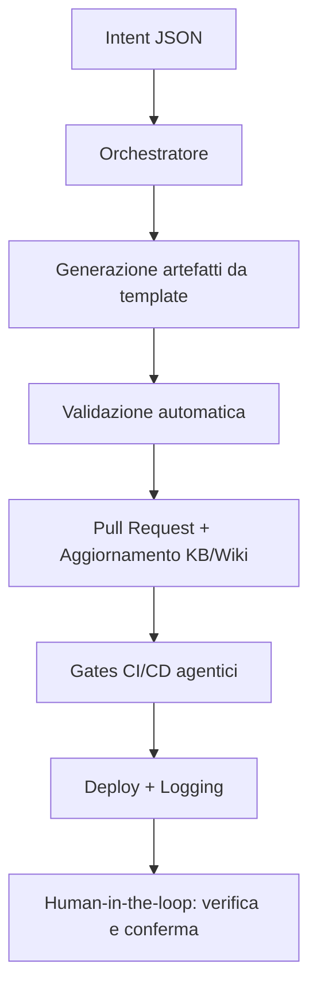

## Visione
Portale governabile da agenti e da umani non esperti, con piani chiari e scelte confermabili.

## Principi
- Human-in-the-loop
- Trasparenza (piani, esiti, log)
- Idempotenza
- Documentazione viva (KB + Wiki)
- Policy & gates comprensibili
- Parametrizzazione
- Osservabilità

## Implementazione
- Wrapper: `scripts/ewctl.ps1` (engine `ps|ts`)
- Orchestratore: `agents/core/orchestrator.js` (carica manifest, KB, `agents/goals.json`)
- Agenti: `scripts/agent-docs-review.ps1`, `scripts/agent-governance.ps1`
- Memoria obiettivi: `agents/goals.json`

## Flusso Consigliato
1) Pianifica (TS): `pwsh scripts/ewctl.ps1 --engine ts --intent <intent>`
2) Esegui (PS): `pwsh scripts/ewctl.ps1 --engine ps --intent <intent> --noninteractive`
3) Verifica gates (Checklist/DB Drift/KB Consistency)
4) Aggiorna KB + Wiki

---

## Workflow agentici

Per realizzare workflow agentici efficaci in EasyWayDataPortal, segui questi principi e passi operativi:

1. **Definisci gli obiettivi e le azioni agentiche**
   - Usa un file machine-readable (es. agents/goals.json) dove ogni agente trova obiettivi, regole e parametri operativi.
   - Ogni workflow deve partire da un “intent” chiaro (es. creazione tabella, aggiornamento KB, deploy).

2. **Usa orchestratori e manifest**
   - Centralizza la logica di orchestrazione in uno script (es. agents/core/orchestrator.js) che carica manifest, goals e knowledge base.
   - Ogni agente deve avere un manifest.json che dichiara permessi, allowed_paths, e azioni disponibili.

3. **Workflow tipico agentico**
   1. **Intent:** L’agente riceve un input strutturato (JSON mini-DSL) che descrive l’azione da compiere.
   2. **Generazione artefatti:** L’agente genera i file necessari (DDL, SP, documentazione) usando template con segnaposto.
   3. **Validazione automatica:** L’agente esegue lint, check di idempotenza, verifica naming e policy.
   4. **Proposta PR:** L’agente crea una pull request con i file generati e aggiorna la KB/Wiki.
   5. **Gates CI/CD:** La pipeline esegue i gates agentici (Checklist, DB Drift, KB Consistency) e logga gli eventi.
   6. **Deploy e auditing:** Se i gates sono verdi, l’agente esegue il deploy e aggiorna i log di esecuzione.

4. **Human-in-the-loop e trasparenza**
   - Ogni azione deve essere tracciata e confermabile da un umano, con log, piani e esiti visibili.
   - La documentazione (Wiki, KB) deve essere aggiornata automaticamente e sempre allineata.

5. **Sicurezza e reversibilità**
   - Usa parametri sicuri (Key Vault/App Config), nessuna credenziale hard-coded.
   - Ogni modifica deve essere reversibile tramite migrazione o rollback.

6. **Strumenti consigliati**
   - Wrapper di orchestrazione: scripts/ewctl.ps1
   - Template SQL e SP: docs/agentic/templates/
   - Logging: agents/logs/events.jsonl
   - Validazione: lint SQL, check naming, gates CI/CD

**Esempio di workflow agentico:**

---

## Esperienza utente per non esperti: proposte e spunti

Per rendere il portale davvero accessibile anche a chi non ha background tecnico, senza sacrificare la potenza agentica, si propongono i seguenti spunti:

- **Wizard e interfacce guidate:**  
  Step-by-step per le operazioni complesse, con spiegazioni in linguaggio naturale, domande a risposta multipla, tooltips e validazioni in tempo reale.

- **Assistente AI conversazionale:**  
  Un assistente che traduca richieste in intent agentici, spieghi i piani generati e aiuti l’utente a capire le implicazioni delle scelte, con possibilità di chiedere spiegazioni su ogni step.

- **Preview e simulazione (WhatIf):**  
  Mostrare sempre una preview delle azioni, simulando le conseguenze e permettendo di annullare o modificare prima dell’esecuzione reale. Evidenziare chiaramente le azioni rischiose.

- **Dashboard visuali e feedback immediato:**  
  Stato degli agenti, piani in corso, gates superati/falliti e log eventi mostrati in modo visuale (timeline, semafori, badge). Notifiche chiare in caso di errori o azioni richieste.

- **Template e suggerimenti contestuali:**  
  Template precompilati per le operazioni più comuni, con parametri già impostati e spiegazioni inline. Checklist e best practice suggerite in base al contesto.

- **Documentazione integrata e ricerca semantica:**  
  Ogni schermata con link diretto alla documentazione, FAQ e video tutorial. Ricerca semantica nella knowledge base accessibile dalla UI.

- **Ruoli e permessi semplificati:**  
  Ruoli utente mappati su set di azioni agentiche predefinite, con modalità “base” e “avanzata” per adattare la UI al livello di esperienza.

Questi spunti possono guidare la progettazione di nuove funzionalità e interfacce, mantenendo l’equilibrio tra accessibilità e potenza agentica.

Nota organizzativa sulla collocazione della documentazione UX
- Capisco la tua preoccupazione: idealmente la documentazione UX e le linee guida operative dovrebbero essere facilmente reperibili all'interno della Wiki principale del progetto (Wiki/EasyWayData.wiki) perché è lì che la maggior parte degli agenti e dei lettori cerca il contesto e le istruzioni operative.
- Attualmente abbiamo creato le pagine in Wiki/UX/ per mantenere separate le bozze e i materiali di lavoro; questo non è un errore, ma solo una scelta temporanea per iterare più rapidamente. Tuttavia, per chiarezza operativa e per l'allenamento futuro degli LLM, è consigliabile avere:
  1. Un link diretto nella pagina di visione (questa stessa pagina) verso le guide UX.
  2. Una copia stabilizzata o una versione canonica delle linee guida UX collocata dentro Wiki/EasyWayData.wiki/UX/ (oppure spostare i file da Wiki/UX/ nella EasyWayData.wiki) affinché gli agenti trovino tutto in un unico posto.
- Se vuoi, posso:
  - aggiungere qui i link diretti alle pagine UX già create (Wiki/UX/agentic-ux.md e Wiki/UX/agentic-ux-guidelines.md), e
  - creare una copia/trasferimento dei file nella directory Wiki/EasyWayData.wiki/UX/ per rendere il contenuto parte integrante della Wiki del progetto.
- Raccomandazione pratica: per l'allenamento degli LLM mantieni una versione "canonica" nella Wiki principale e usa le copie di lavoro per bozze; versiona e marca la pagina canonica come "LLM‑readable" (es. aggiungendo meta JSON all'inizio del file) in modo che gli agenti sappiano quale file usare come fonte primaria.
