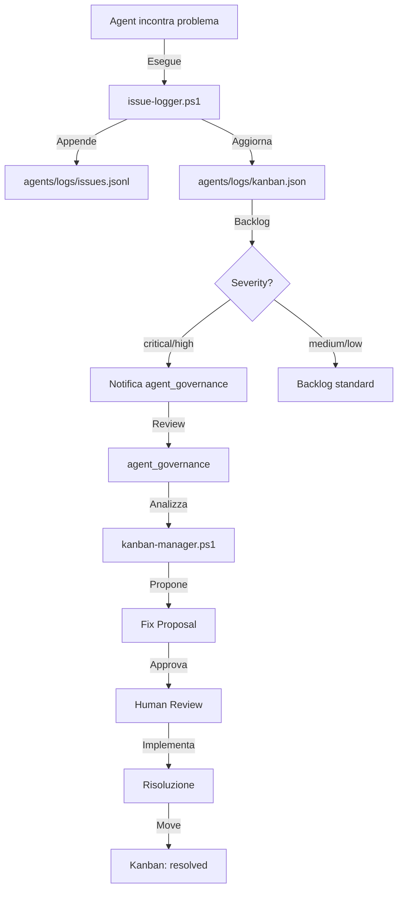

# Agent Issue Tracking System

> **Sistema di tracciamento issue e governance automatica per agenti autonomi**

## 🎯 Vision

Quando un agente incontra un problema, **non deve fallire silenziosamente**. Il sistema di Issue Tracking garantisce che:

1. ✅ **Ogni problema è tracciato** - Log strutturato in JSONL
2. ✅ **Governance automatica** - `agent_governance` propone fix
3. ✅ **Continuous Improvement** - Pattern di errori → miglioramenti sistemici
4. ✅ **Audit Trail completo** - Storico di issue e risoluzioni

---

## 📐 Architettura



---

## 🧩 Componenti

### 1. Issue Log Schema

**File**: `agents/core/schemas/issue-log.schema.json`

Schema JSON completo per issues strutturati:

```json
{
  "id": "ISSUE-YYYYMMDD-XXX",
  "timestamp": "2026-01-18T20:00:00Z",
  "agent": "agent_dba",
  "severity": "high",
  "category": "execution_failed",
  "description": "Human-readable description",
  "context": {
    "user_input": "...",
    "intent": "...",
    "error_message": "..."
  },
  "suggested_fix": "Agent's suggestion",
  "status": "open",
  "assigned_to": "agent_governance"
}
```

**Categorie supportate**:
- `execution_failed` - Esecuzione fallita
- `validation_error` - Errore di validazione
- `missing_dependency` - Dipendenza mancante
- `configuration_error` - Errore di configurazione
- `knowledge_gap` - Gap nella knowledge base
- `tool_unavailable` - Tool non disponibile
- `permission_denied` - Permessi insufficienti
- `timeout` - Timeout

---

### 2. Issue Logger Script

**File**: `scripts/pwsh/issue-logger.ps1`

Script PowerShell per registrare issue da qualsiasi agente.

**Esempio utilizzo**:

```powershell
pwsh scripts/pwsh/issue-logger.ps1 `
  -Agent "agent_dba" `
  -Severity "high" `
  -Category "missing_dependency" `
  -Description "db/migrations/ directory not found" `
  -UserInput "create migration for users table" `
  -Intent "db:migration.create" `
  -ActionAttempted "create_migration_file" `
  -ErrorMessage "Directory not found: db/migrations/" `
  -SuggestedFix "Create db/migrations/ directory with README"
```

**Output**:
```
✅ Issue logged: ISSUE-20260118-001
   Agent: agent_dba
   Severity: high
   Category: missing_dependency
✅ Added to Kanban backlog
⚠️  High-priority issue - agent_governance will be notified
```

---

### 3. Kanban Manager Script

**File**: `scripts/pwsh/kanban-manager.ps1`

Gestisce la Kanban board con 5 colonne:

| Colonna | Descrizione |
|---------|-------------|
| **backlog** | Issue nuovi, da triaggiare |
| **in_review** | agent_governance sta analizzando |
| **planned** | Fix approvato, da implementare |
| **in_progress** | Implementazione in corso |
| **resolved** | Risolto e verificato |

**Actions disponibili**:

#### View Kanban

```powershell
# Console view
pwsh scripts/pwsh/kanban-manager.ps1 -Action view

# Markdown export
pwsh scripts/pwsh/kanban-manager.ps1 -Action view -Format markdown
```

**Output**:
```
=== AGENT ISSUE KANBAN ===

[backlog] (3)
  🔴 ISSUE-20260118-001 - agent_dba - db/migrations/ directory not found...
  🟠 ISSUE-20260118-002 - agent_frontend - Build failed: missing dependencies...
  🟡 ISSUE-20260118-003 - agent_api - OpenAPI validation warning...

[in_review] (1)
  🟠 ISSUE-20260117-005 - agent_backend - Connection timeout to SQL Server...

[planned] (2)
[in_progress] (1)
[resolved] (15)
```

#### Move Issue

```powershell
pwsh scripts/pwsh/kanban-manager.ps1 `
  -Action move `
  -IssueId ISSUE-20260118-001 `
  -Column in_review
```

#### Propose Fix (agent_governance)

```powershell
pwsh scripts/pwsh/kanban-manager.ps1 `
  -Action propose-fix `
  -IssueId ISSUE-20260118-001 `
  -ProposedFix "Add pre-check in agent_dba manifest..."
```

#### Export Report

```powershell
pwsh scripts/pwsh/kanban-manager.ps1 -Action export
```

Genera `out/issues-report.md` con:
- Summary (totale, open, critical)
- Issues by severity
- Issues by agent
- Issues by category
- Recent issues (last 10)

---

## 🔄 Workflow Completo

### Scenario: agent_dba trova directory mancante

#### Step 1: Agent logs issue

```powershell
# In agent-dba.ps1
if (-not (Test-Path "db/migrations/")) {
    $issueId = pwsh scripts/pwsh/issue-logger.ps1 `
      -Agent "agent_dba" `
      -Severity "high" `
      -Category "missing_dependency" `
      -Description "db/migrations/ directory not found" `
      -SuggestedFix "Create directory with README"
    
    Write-Error "Issue logged: $issueId"
    exit 1
}
```

#### Step 2: Issue in Kanban backlog

```json
// agents/logs/kanban.json
{
  "columns": {
    "backlog": [
      {
        "issue_id": "ISSUE-20260118-001",
        "agent": "agent_dba",
        "severity": "high",
        "added_at": "2026-01-18T20:05:00Z"
      }
    ]
  }
}
```

#### Step 3: agent_governance notified

```jsonl
// agents/agent_governance/notifications.jsonl
{"type":"high_priority_issue","issue_id":"ISSUE-20260118-001","action_required":"Review and propose improvement"}
```

#### Step 4: agent_governance proposes fix

```powershell
pwsh scripts/pwsh/kanban-manager.ps1 `
  -Action propose-fix `
  -IssueId "ISSUE-20260118-001" `
  -ProposedFix "
## Proposed Solution

### 1. Add Pre-Check to Manifest
Update agents/agent_dba/manifest.json:
- Add directory_exists check
- On fail: auto_create_with_readme

### 2. Implement Auto-Fix
Add to scripts/agent-dba.ps1:
- Create db/migrations/ if missing
- Generate README.md

### 3. Update Documentation
- Note auto-creation in db-migrations.md

### Impact
- ✅ Prevents 100% of similar issues
- ✅ Improves UX (auto-fix)
- ✅ Reduces support burden

### Recommendation
**APPROVE** - High impact, low effort
"
```

#### Step 5: Human reviews & approves

```powershell
# Move to planned
pwsh scripts/pwsh/kanban-manager.ps1 `
  -Action move `
  -IssueId "ISSUE-20260118-001" `
  -Column planned
```

#### Step 6: Implementation → Resolution

```powershell
# Durante implementazione
pwsh scripts/pwsh/kanban-manager.ps1 `
  -Action move `
  -IssueId "ISSUE-20260118-001" `
  -Column in_progress

# Dopo testing
pwsh scripts/pwsh/kanban-manager.ps1 `
  -Action move `
  -IssueId "ISSUE-20260118-001" `
  -Column resolved
```

---

## 🔌 Integrazione con Agenti

### Pattern 1: Global Try/Catch

**Esempio: agent-dba.ps1**

```powershell
try {
  switch ($Action) {
    'db-user:create' { ... }
    'db-user:rotate' { ... }
  }
} catch {
  $err = $_
  if (Test-Path "scripts/pwsh/issue-logger.ps1") {
    pwsh "scripts/pwsh/issue-logger.ps1" `
      -Agent "agent_dba" `
      -Severity "high" `
      -Category "execution_failed" `
      -Description "DBA Action '$Action' failed: $($err.Exception.Message)" `
      -ErrorMessage $err.Exception.Message
  }
  throw $err
}
```

### Pattern 2: Explicit Error Handling

**Esempio: agent-dba.ps1 (db-user:create)**

```powershell
try {
  Invoke-SqlcmdExec -server $server -database $db ...
  $executed = $true
} catch {
  $errorMsg = $_.Exception.Message
  
  # Log issue
  if (Test-Path "scripts/pwsh/issue-logger.ps1") {
    pwsh "scripts/pwsh/issue-logger.ps1" `
      -Agent "agent_dba" `
      -Severity "high" `
      -Category "execution_failed" `
      -Description "Failed to create user $username: $errorMsg" `
      -ErrorMessage $errorMsg `
      -Intent "db-user:create"
  }
}
```

### Pattern 3: Validation Errors

```powershell
if (-not (Test-Path $requiredPath)) {
    pwsh scripts/pwsh/issue-logger.ps1 `
      -Agent $agentName `
      -Severity "medium" `
      -Category "validation_error" `
      -Description "Required path not found: $requiredPath" `
      -SuggestedFix "Create path or update configuration"
}
```

---

## 🎛️ agent_governance Integration

**File**: `scripts/pwsh/agent-governance.ps1`

Aggiunto nuovo task (Id 7) per review automatica:

```powershell
$tasks += [pscustomobject]@{
  Id = 7
  Name = 'Review Agent Issues'
  Description = 'Visualizza la Kanban board degli issue degli agenti e propone fix.'
  Recommended = $true
  Enabled = $true
  Action = {
    pwsh "scripts/pwsh/kanban-manager.ps1" -Action view
    
    if ($Interactive) {
      $ans = Read-Host "Vuoi gestire un issue? (IssueID)"
      if ($ans) {
        $action = Read-Host "Azione (move/propose-fix)"
        # ... gestione interattiva
      }
    }
  }
}
```

**Esecuzione**:

```powershell
# Review automatica (non-interactive)
pwsh scripts/pwsh/agent-governance.ps1

# Review interattiva
pwsh scripts/pwsh/agent-governance.ps1 -Interactive
```

---

## 📊 Metriche & Reporting

### Daily Report

```powershell
pwsh scripts/pwsh/kanban-manager.ps1 -Action export
```

**Output**: `out/issues-report.md`

**Contiene**:
- Total issues
- Open issues
- Critical issues
- Issues by severity
- Issues by agent
- Issues by category
- Recent issues (last 10)
- Top categories

### Dashboard Console

```powershell
pwsh scripts/pwsh/kanban-manager.ps1 -Action view
```

### Metrics per Agent

```powershell
# Analisi pattern
cat agents/logs/issues.jsonl | ConvertFrom-Json | 
  Group-Object -Property agent | 
  Sort-Object Count -Descending
```

---

## ✨ Benefici

| Beneficio | Prima | Dopo |
|-----------|-------|------|
| **Tracciabilità** | ❌ Nessuna | ✅ Completa (JSONL log) |
| **Governance** | ❌ Manuale | ✅ Automatica (agent_governance) |
| **Prioritizzazione** | ❌ Ad-hoc | ✅ Kanban board |
| **Continuous Improvement** | ❌ Reattivo | ✅ Proattivo |
| **Metrics** | ❌ Nessuna | ✅ Report + dashboard |
| **Audit Trail** | ❌ Limitato | ✅ Completo |
| **Pattern Detection** | ❌ Manuale | ✅ Automatizzabile |

---

## 🚀 Roadmap

### ✅ Completed (Week 1)

- [x] Issue Log Schema
- [x] issue-logger.ps1
- [x] kanban-manager.ps1
- [x] Integration agent-governance
- [x] Integration agent-dba
- [x] End-to-end testing
- [x] Documentation

### 📝 Short Term (Week 2-4)

- [ ] CI integration (fail build if critical > threshold)
- [ ] Slack/Teams notifications
- [ ] Auto-fix implementation for common issues
- [ ] Integration in top 5 agents

### 🔄 Long Term (Month 2-3)

- [ ] ML analysis for pattern detection
- [ ] Predictive issue prevention
- [ ] Auto-resolution for known issues
- [ ] Metrics dashboard (PowerBI/Grafana)

---

## 📚 Riferimenti

### Documentazione Core

- [Agent Architecture Standard](../standards/agent-architecture-standard.md)
- [Agents Governance](../agents-governance.md)
- [Agent Manifest Audit](../control-plane/agents-manifest-audit.md)
- [Agentic Portal Vision](../agentic-portal-vision.md)

### Scripts

- `scripts/pwsh/issue-logger.ps1`
- `scripts/pwsh/kanban-manager.ps1`
- `scripts/pwsh/agent-governance.ps1`
- `scripts/pwsh/agent-dba.ps1`

### Schemas

- `agents/core/schemas/issue-log.schema.json`

### Logs

- `agents/logs/issues.jsonl` - Issue log (append-only)
- `agents/logs/kanban.json` - Kanban board state
- `agents/agent_governance/notifications.jsonl` - Governance notifications

---

## 🎓 Best Practices

### 1. Severity Guidelines

| Severity | Quando usare |
|----------|--------------|
| **critical** | Sistema down, data loss risk, security breach |
| **high** | Feature broken, user blocked, performance degraded |
| **medium** | Warning, deprecation, minor bug |
| **low** | Info, suggestion, optimization opportunity |

### 2. Category Selection

- **execution_failed**: Azione fallita durante esecuzione
- **validation_error**: Input/output non valido
- **missing_dependency**: File, directory, tool mancante
- **configuration_error**: Config errata o mancante
- **knowledge_gap**: KB non aggiornata, recipe mancante
- **tool_unavailable**: Tool esterno non disponibile
- **permission_denied**: Permessi insufficienti
- **timeout**: Operazione timeout

### 3. Suggested Fix Quality

✅ **Good**:
```
"Add pre-check to manifest for db/migrations/ directory.
Implement auto-creation with README if missing.
Update documentation to note auto-fix behavior."
```

❌ **Bad**:
```
"Fix it"
```

### 4. Issue Description

✅ **Good**:
```
"Failed to create user 'portal_reader' in database 'EasyWayDB': 
Connection timeout after 30s. Server: sql-prod.database.windows.net"
```

❌ **Bad**:
```
"Error"
```

---

## 🧪 Testing

### Test Scenario 1: Forced Failure

```powershell
# Create test intent
@{
  params = @{
    username = "testuser"
    database = "TestDB"
  }
} | ConvertTo-Json | Set-Content test-intent.json

# Force failure (bad connection)
$env:DB_ADMIN_CONN_STRING = "Server=invalid;Database=Test;User=admin;Password=wrong"
pwsh scripts/pwsh/agent-dba.ps1 -Action "db-user:create" -IntentPath "test-intent.json"

# Verify issue logged
cat agents/logs/issues.jsonl | Select-Object -Last 1 | ConvertFrom-Json
```

### Test Scenario 2: Governance Review

```powershell
# Run governance
pwsh scripts/pwsh/agent-governance.ps1 -Interactive:$false

# Verify kanban displayed
# Expected: Issue appears in backlog
```

### Test Scenario 3: Issue Resolution

```powershell
# Move through workflow
pwsh scripts/pwsh/kanban-manager.ps1 -Action move -IssueId ISSUE-XXX -Column in_review
pwsh scripts/pwsh/kanban-manager.ps1 -Action propose-fix -IssueId ISSUE-XXX -ProposedFix "..."
pwsh scripts/pwsh/kanban-manager.ps1 -Action move -IssueId ISSUE-XXX -Column planned
pwsh scripts/pwsh/kanban-manager.ps1 -Action move -IssueId ISSUE-XXX -Column in_progress
pwsh scripts/pwsh/kanban-manager.ps1 -Action move -IssueId ISSUE-XXX -Column resolved
```

---

## 🏆 Success Metrics

**Obiettivi Q1 2026**:

- ✅ 100% degli agenti core integrati
- ✅ <24h tempo medio di risoluzione per critical issues
- ✅ >80% issue con proposed fix da agent_governance
- ✅ Zero issue critici non tracciati
- ✅ Report settimanale automatico

---

## 📞 Support

Per domande o problemi:

1. Consulta questa documentazione
2. Verifica `agents/core/ISSUE_TRACKING.md`
3. Esegui `pwsh scripts/pwsh/kanban-manager.ps1 -Action view`
4. Contatta team governance

---

**Versione**: 1.0  
**Ultima modifica**: 2026-01-18  
**Autore**: Agent System Team  
**Status**: ✅ Production Ready

