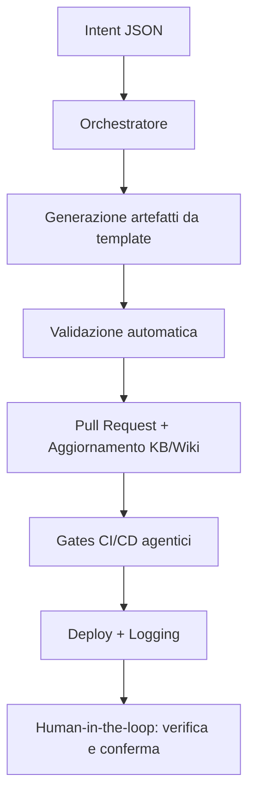

# Agentic Readiness — Linee guida per sviluppo 100% agentico

Obiettivo: permettere ad agenti (LLM/tooling) di creare e aggiornare, in modo sicuro e ripetibile, tabelle e store procedure del Portale, aderendo agli standard EasyWay.

## Principi chiave
- Idempotenza: ogni DDL/SP deve poter essere rieseguito senza effetti collaterali (IF NOT EXISTS, CREATE OR ALTER, sequenze standard).
- Solo Store Procedure per DML: mutazioni dati passano da SP con auditing/logging centralizzati.
- Logging obbligatorio: ogni SP aggiorna `PORTAL.STATS_EXECUTION_LOG` (e `STATS_EXECUTION_TABLE_LOG` quando rilevante).
- Variante DEBUG: per ogni SP “di produzione” esiste una versione `_DEBUG` con sequence/NDG separati.
- Naming e metadata: prefissi schema `PORTAL.`, extended properties per colonne chiave, NDG generati da sequence standard.
- Sicurezza: nessuna credenziale hard-coded; parametri via Key Vault/App Config; validazioni input lato API.

## Convenzioni di naming (estratto)
- Schema: `PORTAL`
- Tabelle: `PORTAL.<NOME>` (singolare, CamelCase opzionale evitata in SQL)
- SP produzione: `PORTAL.sp_<azione>_<oggetto>` (es: `sp_register_tenant_and_user`)
- SP debug: `PORTAL.sp_debug_<azione>_<oggetto>`
- Sequence: `PORTAL.SEQ_<ENTITY>_ID[(_DEBUG)]`

## Template pronti all’uso
- DDL tabella: `docs/agentic/templates/ddl/template_table.sql`
- SP INSERT/UPDATE/DELETE: `docs/agentic/templates/sp/template_sp_insert.sql`, `docs/agentic/templates/sp/template_sp_update.sql`, `docs/agentic/templates/sp/template_sp_delete.sql`
- SP DEBUG: `docs/agentic/templates/sp/template_sp_debug_insert.sql`

I template includono segnaposto (`{{...}}`) che gli agenti devono sostituire. Ogni SP include struttura TRY/CATCH, TRANSACTION, auditing, logging.

## Specifica input per agenti (mini‑DSL)
Esempio JSON che un agente può usare per generare DDL+SP da template:
```json
{
  "entity": "USERS",
  "schema": "PORTAL",
  "columns": [
    {"name": "user_id", "type": "NVARCHAR(50)", "constraints": ["UNIQUE", "NOT NULL"]},
    {"name": "tenant_id", "type": "NVARCHAR(50)", "constraints": ["NOT NULL"]},
    {"name": "email", "type": "NVARCHAR(255)", "constraints": ["NOT NULL"]}
  ],
  "ndg": {"sequence": "SEQ_USER_ID", "prefix": "CDI", "width": 9},
  "sp": {
    "insert": {"name": "sp_insert_user"},
    "update": {"name": "sp_update_user"},
    "delete": {"name": "sp_delete_user"},
    "debug":  {"name": "sp_debug_insert_user"}
  }
}
```

## Processo consigliato (agent workflow)
1. L'agente propone il JSON (mini-DSL) e genera i file SQL dai template.
2. Validazione automatica: lint SQL, check idempotenza, confronto con convenzioni.
3. PR con le migrazioni in `db/flyway/sql/` e aggiornamento Wiki.
4. Pipeline applica le migrazioni su ambiente di test; esegue smoke test SP.
5. Approvazione e promozione verso UAT/PROD.

## Guardrail
- Niente DML diretti in API; solo SP.
- Ogni nuova SP deve scrivere su `STATS_EXECUTION_LOG` con `proc_name`, impatti, status, tempi.
- NDG e sequence solo dentro SP (mai lato API).
- Ogni modifica al modello dati deve essere reversibile o controllata tramite migrazione.

## Collegamenti
- DDL di riferimento (canonico, corrente): `db/flyway/sql/` (migrazioni incrementali)
- Bootstrap dev/local: `db/provisioning/apply-flyway.ps1` (wrapper; applica Flyway con conferma)
- Archivio storico: `old/db/` (non canonico)
- Linee guida SP (Wiki): `Wiki/EasyWayData.wiki/.../PORTAL/programmability/stored-procedure.md`
- Nota infrastruttura: `docs/infra/azure-architecture.md`

---

## Workflow agentici

Per realizzare workflow agentici efficaci in EasyWayDataPortal, segui questi principi e passi operativi:

1. **Definisci gli obiettivi e le azioni agentiche**
   - Usa un file machine-readable (es. agents/goals.json) dove ogni agente trova obiettivi, regole e parametri operativi.
   - Ogni workflow deve partire da un “intent” chiaro (es. creazione tabella, aggiornamento KB, deploy).

2. **Usa orchestratori e manifest**
   - Centralizza la logica di orchestrazione in uno script (es. agents/core/orchestrator.js) che carica manifest, goals e knowledge base.
   - Ogni agente deve avere un manifest.json che dichiara permessi, allowed_paths, e azioni disponibili.

3. **Workflow tipico agentico**
   1. **Intent:** L’agente riceve un input strutturato (JSON mini-DSL) che descrive l’azione da compiere.
   2. **Generazione artefatti:** L’agente genera i file necessari (DDL, SP, documentazione) usando template con segnaposto.
   3. **Validazione automatica:** L’agente esegue lint, check di idempotenza, verifica naming e policy.
   4. **Proposta PR:** L’agente crea una pull request con i file generati e aggiorna la KB/Wiki.
   5. **Gates CI/CD:** La pipeline esegue i gates agentici (Checklist, DB Drift, KB Consistency) e logga gli eventi.
   6. **Deploy e auditing:** Se i gates sono verdi, l’agente esegue il deploy e aggiorna i log di esecuzione.

4. **Human-in-the-loop e trasparenza**
   - Ogni azione deve essere tracciata e confermabile da un umano, con log, piani e esiti visibili.
   - La documentazione (Wiki, KB) deve essere aggiornata automaticamente e sempre allineata.

5. **Sicurezza e reversibilità**
   - Usa parametri sicuri (Key Vault/App Config), nessuna credenziale hard-coded.
   - Ogni modifica deve essere reversibile tramite migrazione o rollback.

6. **Strumenti consigliati**
   - Wrapper di orchestrazione: scripts/ewctl.ps1
   - Template SQL e SP: docs/agentic/templates/
   - Logging: agents/logs/events.jsonl
   - Validazione: lint SQL, check naming, gates CI/CD

**Esempio di workflow agentico:**



