# Anatomy of a Thought: The EasyWay Data Flow 🧠

## 1. The Components (Il Trio)
Per non perdersi, immagina una biblioteca:

1.  **MinIO (Storage)** = **Lo Scaffale**. 📚
    *   Contiene i libri fisici (PDF, Excel).
    *   Se vuoi *leggere*, devi prendere il libro da qui.
2.  **ChromaDB (RAG DB)** = **L'Indice del Bibliotecario**. 📇
    *   NON contiene il libro intero.
    *   Contiene solo "riassunti matematici" (Vettori).
    *   Serve per trovare *quale* libro parla di "configurazione server".
3.  **n8n (The Arm)** = **Il Bibliotecario**. 🤖
    *   Prende il libro, lo legge, scrive l'indice, e lo rimette a posto.

## 2. The Process Flow (Il Flusso Completo)

Ecco cosa succede quando trascini un file su EasyWay One:

```mermaid
sequenceDiagram
    autonumber
    participant User as 👤 User (Pulse)
    participant N8N as 🤖 n8n (Orchestrator)
    participant MinIO as 🎒 MinIO (Storage)
    participant Chroma as 🧠 ChromaDB (Memory)
    participant LLM as 🤖 AI (Intelligence)

    Note over User, N8N: PASE 1: INGESTION (Memorizzazione)
    User->>N8N: 1. Drag & Drop PDF
    N8N->>MinIO: 2. Salva il PDF originale (Safe Keeping)
    MinIO-->>N8N: Conferma salvataggio (Link)
    
    N8N->>N8N: 3. Legge il testo (OCR/Extraction)
    N8N->>Chroma: 4. Crea Vettori ("Di cosa parla questo file?")
    Chroma-->>N8N: Memorizzato nell'indice

    Note over User, N8N: PHASE 2: RECALL (Domanda)
    User->>N8N: 5. "Come configuro il firewall?"
    N8N->>Chroma: 6. "Chi parla di firewall?"
    Chroma-->>N8N: "Pagina 4 del manuale X"
    
    N8N->>MinIO: 7. Recupera il testo esatto da Pagina 4
    N8N->>LLM: 8. "Usa questo testo per rispondere all'utente"
    LLM-->>User: 9. "Ecco la configurazione..." (+ Link al PDF)
```

## 3. FAQ Rapide

### "Serve un disco dedicato?" 💾
**No.**
I "Docker Volumes" (`minio-data` e `chroma-data` nel `docker-compose.infra.yml`) sono cartelle virtuali gestite da Docker.
Fisicamente stanno sul disco principale del server (`/var/lib/docker/volumes`).
Non devi comprare o formattare nulla.

### "Il DB RAG è diverso dal Data Lake?"
Sì.
*   **Data Lake (MinIO)**: Tiene i file interi. Pesante.
*   **RAG DB (Chroma)**: Tiene i concetti. Leggerissimo.
Lavorano insieme: Chroma dice *dove* guardare, MinIO *ha* il contenuto.

