# Infrastructure Documentation (`docs/infra/`)

## 📚 Overview

This directory contains **infrastructure and server management documentation** for EasyWay Data Portal.

---

## 🗂️ Documentation Index

### 🔒 Security & Access Control

| Document | Description | When to Use |
|----------|-------------|-------------|
| **[SECURITY_FRAMEWORK.md](../../../../../scripts/docs/infra/SECURITY_FRAMEWORK.md)** 🌟 | **LA BIBBIA** - Enterprise RBAC model, ACLs, audit compliance | **START HERE** for all security questions |
| [SERVER_STANDARDS.md](SERVER_STANDARDS.md) | User roles, directory structure (FHS), basic permissions | Server setup overview |

### 🖥️ Server Setup & Deployment

| Document | Description | When to Use |
|----------|-------------|-------------|
| [SERVER_BOOTSTRAP_PROTOCOL.md](../../../../../scripts/docs/infra/SERVER_BOOTSTRAP_PROTOCOL.md) | Step-by-step server provisioning protocol | New server setup |
| [ORACLE_ENV_DOC.md](../../../../../scripts/docs/infra/ORACLE_ENV_DOC.md) | Oracle Cloud specific configuration | Setting up Oracle Cloud VM |
| [ORACLE_QUICK_START.md](../../../../../scripts/docs/infra/ORACLE_QUICK_START.md) | Quick reference for Oracle Cloud | Fast access to Oracle commands |

### ☁️ Cloud Provider Guides

| Document | Description | When to Use |
|----------|-------------|-------------|
| [azure-architecture.md](azure-architecture.md) | Azure architecture overview | Azure deployment |
| [hetzner/](hetzner/) | Hetzner-specific setup | Hetzner Cloud deployment |
| [oracle/](oracle/) | Oracle Cloud specific docs | Oracle Cloud deployment |

---

## 🚀 Quick Start

### For AI Agents

If you are an AI agent setting up security on a server:

1. **Read the framework**: [SECURITY_FRAMEWORK.md](../../../../../scripts/docs/infra/SECURITY_FRAMEWORK.md)
2. **Check prerequisites**: Ensure `/opt/easyway` structure exists ([SERVER_STANDARDS.md](SERVER_STANDARDS.md))
3. **Execute scripts**:
   ```bash
   cd /path/to/EasyWayDataPortal
   sudo ./scripts/infra/setup-easyway-server.sh  # Create users, groups, directories
   sudo ./scripts/infra/apply-acls.sh            # Apply ACLs
   sudo ./scripts/infra/security-audit.sh        # Verify
   ```
4. **Update documentation**: Update current environment doc (e.g., [`../ORACLE_CURRENT_ENV.md`](../../../../../scripts/docs/infra/ORACLE_CURRENT_ENV.md))

### For Humans

**Setting up a new server?**
1. Start with [SERVER_BOOTSTRAP_PROTOCOL.md](../../../../../scripts/docs/infra/SERVER_BOOTSTRAP_PROTOCOL.md)
2. Apply security framework: [SECURITY_FRAMEWORK.md](../../../../../scripts/docs/infra/SECURITY_FRAMEWORK.md)
3. Verify with scripts in `../../scripts/infra/tests/`

**Need to audit security?**
- Go directly to [SECURITY_FRAMEWORK.md](../../../../../scripts/docs/infra/SECURITY_FRAMEWORK.md) → "Audit Compliance Guide"

**Need to add a new user?**
- [SECURITY_FRAMEWORK.md](../../../../../scripts/docs/infra/SECURITY_FRAMEWORK.md) → "Maintenance Procedures"

---

## 🔗 Related Resources

- **Scripts**: [`../../scripts/infra/`](../../scripts/infra/) - Automation scripts
- **Operational Scripts**: [`../../scripts/ops/`](../../scripts/ops/) - Day-to-day maintenance
- **Current Production**: [`../ORACLE_CURRENT_ENV.md`](../../../../../scripts/docs/infra/ORACLE_CURRENT_ENV.md) - Live environment details

---

## 📊 Document Relationships

```mermaid
graph TD
    A[SECURITY_FRAMEWORK.md<br/>🌟 LA BIBBIA] -->|References| B[SERVER_STANDARDS.md]
    A -->|Applied to| C[ORACLE_CURRENT_ENV.md]
    B -->|Used by| D[SERVER_BOOTSTRAP_PROTOCOL.md]
    D -->|Configures| C
    E[scripts/infra/setup-easyway-server.sh] -->|Implements| B
    F[scripts/infra/apply-acls.sh] -->|Implements| A
    G[scripts/infra/security-audit.sh] -->|Verifies| A
```



---

**Tip for Agents**: When in doubt, refer to [SECURITY_FRAMEWORK.md](../../../../../scripts/docs/infra/SECURITY_FRAMEWORK.md) - it's the authoritative source for all security decisions.


