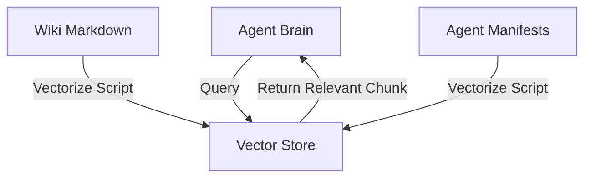

# Concept: Vector Memory Store (The Cortex)

## Overview
Traditional Agent Memory relies on reading full Markdown files (`manifest.json`, `Wiki/*.md`) into the **Context Window**.
This is:
1.  **Slow**: Reading 100k tokens takes time.
2.  **Expensive**: Costs scale with token count.
3.  **Noisy**: "Lost in the Middle" phenomenon reduces reasoning accuracy.

**Vector Memory** solves this by storing knowledge as **Mathematical Embeddings** in a high-performance database.

## Architecture

## Components

### 1. The Store (ChromaDB / LanceDB)
A lightweight, open-source Vector Database running locally (in the "Gift" Container).
It stores:
*   **Knowledge Chunks**: Paragraphs from the Wiki.
*   **Entity Profiles**: Summary of what each Agent does.
*   **Past Memories**: Important OODA decisions.

### 2. The Embedder
A model that converts text to numbers.
*   **Local Mode**: `all-MiniLM-L6-v2` (Free, Fast, Runs on CPU).
*   **Cloud Mode**: `text-embedding-3-small` (OpenAI).

### 3. The Retrieval Flow
1.  **Ingestion**: `scripts/pwsh/vectorize-knowledge.ps1` scans the `Wiki/` and `agents/` folders. It splits text into chunks and pushes to the Store.
2.  **Retrieval**: When `agent_retrieval` runs, it embeds the User Query and finds the Top-3 most similar chunks.
3.  **Generation**: Only those 3 chunks are sent to the LLM.

## Impact
*   **Speed**: < 100ms retrieval.
*   **Cost**: 90% reduction in Input Tokens.
*   **Accuracy**: Less noise = Better decisions.

## "The Gift" Strategy
This architecture is critical for the SMB/Non-Profit donation strategy as it enables high performance on low-cost hardware (or standard Cloud tiers) by minimizing token usage.

## Technical Implementation (How it works)
The vectorization system relies on a Python Bridge to communicate with ChromaDB from PowerShell.

### 1. The Bridge (`scripts/python/chroma_bridge.py`)
A lightweight Python script that exposes `upsert` and `query` commands. It uses the official `chromadb` client library to talk to the local database or the `easyway-cortex` container.

### 2. The Ingestor (`scripts/pwsh/vectorize-knowledge.ps1`)
Orchestrates the learning process:
1.  **Scans**: `Wiki/**/*.md`
2.  **Chunks**: Splits text by headers (`##`).
3.  **Embeds**: Sends text to the Bridge for storage.

### 3. The Retriever (`LocalMemoryProvider.psm1`)
When an agent needs context:
1.  Calls `Search-LocalMemoryVector -Query "..."`.
2.  The Provider delegates to the Bridge.
3.  Returns standard PowerShell objects (Content + Metadata).

## Strategic Rationale: Why RAG? (vs Fine-Tuning) ⚖️

We explicitly chose **RAG (Vector Search)** over Fine-Tuning ("training a model on docs") for the EasyWay Framework.

| Feature | RAG (Chosen Strategy) | Fine-Tuning (Rejected) |
| :--- | :--- | :--- |
| **Freshness** | **Instant**. Update a Wiki page, run `vectorize`, and agents know it immediately. | **Slow**. Requires hours/days of re-training to learn new rules. |
| **Hardware** | **Lightweight**. Runs on CPU (ChromaDB) inside a standard container. | **Heavy**. Requires powerful GPU (VRAM > 8GB) for inference. |
| **Cost** | **Near Zero**. Uses efficient embeddings. | **High**. Energy and hardware costs for training and serving. |
| **Portability** | **High**. The database is just a folder of files. | **Low**. Models are multi-gigabyte files hard to distribute. |

> **Verdict**: For the "Gift" strategy (SMBs/Associations), RAG provides the agility and low barrier to entry required. Fine-tuning is reserved for behavioral adaptation, not knowledge storage.

