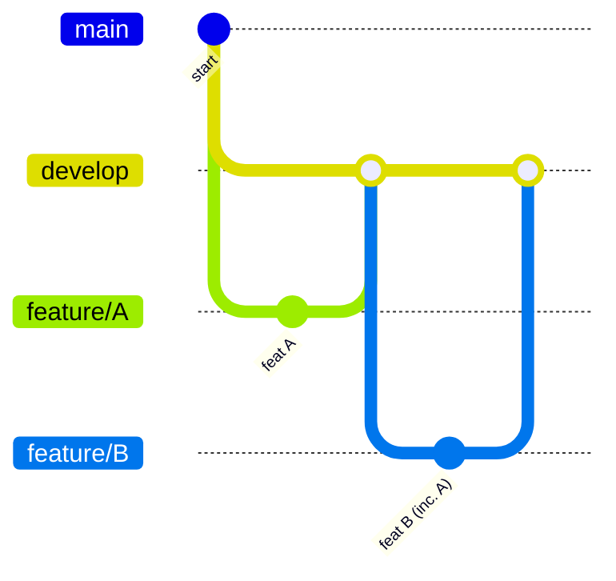

# Concept: Local Stacked Workflow

**Tag**: `#workflow` `#git` `#agent-pattern`

## 1. Definizione
Il **Local Stacked Workflow** è una strategia di sviluppo utilizzata da agenti AI (o team veloci) per concatenare sequenzialmente più feature branch in un ambiente locale prima del push remoto.

## 2. Il Problema
In uno scenario standard distribuito:
1. Dev A lavora su Feature A.
2. Dev B lavora su Feature B (ignaro di A).
3. Merge conflict o regressioni si scoprono solo al merge su `develop` remoto.

Per un Agente che opera ad alta velocità su task correlati (es. "Security Hardening" che tocca più moduli), attendere il ciclo CI/CD remoto per ogni feature introduce latenza inutile.

## 3. La Soluzione Stacked
L'Agente applica le feature a cascata sul branch `develop` locale:

### Vantaggi
1.  **Integrazione Continua Locale**: La Feature B viene testata immediatamente in un ambiente che ha già la Feature A.
2.  **Regression Testing Immediato**: Se B rompe A, l'Agente lo scopre subito (`npm test` fallisce in locale).
3.  **Clean History**: Ogni feature ha il suo branch dedicato che può essere spinto e PR-ato individualmente (o cumulativamente).

## 4. Rischio e Mitigazione
*   **Rischio**: Se Feature A viene rifiutata in PR, Feature B (che dipende da A) deve essere rifatta (rebase).
*   **Mitigazione**: Usare questo pattern solo per task ad alta confidenza o tecnicamente sequenziali (es. Refactoring -> Security -> Test).

## 5. Istruzioni per RAG/Agenti
Quando analizzi lo stato del repo locale:
*   Il branch `develop` locale è la **Single Source of Truth** più aggiornata.
*   Contiene feature non ancora presenti su `origin/develop`.
*   Per allineare il remoto: Pushare i singoli feature branch e aprire PR in sequenza.
