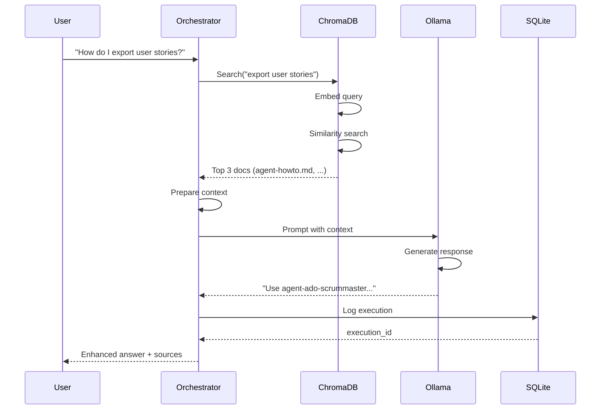

[[../start-here.md|Home]] > [[./agent-vectordb-architecture.md|Architecture]] > Implementation Guide

# 🚀 AI Agent Local LLM - Oracle Cloud Implementation

> **Filosofia**: "Foglio bianco = nuova visione. Un mattoncino alla volta, un JSON alla volta, un commit alla volta."

**Questa guida implementa l'architettura** descritta in:
- [Agent Vector DB Architecture](../control-plane/agent-vectordb-architecture.md) - Versione cloud (Azure AI Search)
- [Vector Memory Concept](../concept/vector-memory.md) - Rationale e concept

**Differenza chiave**: Questa è la **versione locale low-cost** su Oracle Cloud Free Tier.

---

## 🎯 Cosa Costruiamo

### Stack Tecnologico

```mermaid
graph TB
    subgraph "Oracle Cloud Free Tier"
        subgraph "AI Intelligence Stack"
            USER[👤 User Query] --> ORCH[🎭 Orchestrator<br/>PowerShell]
            ORCH --> RET[🔍 Retrieval<br/>ChromaDB]
            ORCH --> LLM[🧠 LLM<br/>Ollama DeepSeek]
            ORCH --> DB[📊 Database<br/>SQLite]
            
            RET -.->|Context| ORCH
            LLM -.->|Response| ORCH
            ORCH --> RESP[✅ Enhanced Answer]
        end
        
        subgraph "Knowledge Sources"
            WIKI[📚 Wiki MD]
            CODE[💻 Code]
            RECIPES[📋 Recipes]
        end
    end
    
    WIKI --> RET
    CODE --> RET
    RECIPES --> RET
    
    style ORCH fill:#4CAF50
    style LLM fill:#2196F3
    style RET fill:#FF9800
    style DB fill:#9C27B0
```



### Componenti

| Layer | Tool | Funzione | Costo |
|-------|------|----------|-------|
| 🧠 **LLM** | Ollama + DeepSeek-R1 7B | Reasoning, decisioni | €0 |
| 🔍 **Vector DB** | ChromaDB | Semantic search, RAG | €0 |
| 📊 **Persistence** | SQLite | Logs, metrics, audit | €0 |
| 🔧 **Orchestration** | PowerShell + Python | Workflow management | €0 |
| ☁️ **Infrastructure** | Oracle Cloud Free Tier | Compute + storage | €0 |

**Total**: €0/mese 🎉

---

## 📋 Prerequisites

### Infrastruttura
- ✅ Oracle Cloud account con Free Tier attivo
- ✅ Server VM Ubuntu ARM (4 cores, 24GB RAM)
- ✅ Accesso SSH configurato

### Skills Richieste
- 🔧 Base Linux command line
- 🐍 Python (per ChromaDB)
- 💻 PowerShell (per orchestrazione)

### Tempo Stimato
- ⏱️ Setup completo: **2-3 ore**
- ✅ Testing: **30 minuti**

---

## 🚀 Implementation - Step by Step

### FASE 1: Base System Setup (15 minuti)

#### 1.1 SSH al Server
```bash
ssh ubuntu@YOUR_ORACLE_IP
# O con chiave specifica:
# ssh -i ~/.ssh/oracle_key ubuntu@YOUR_ORACLE_IP
```

#### 1.2 Update Sistema
```bash
# Update packages
sudo apt update && sudo apt upgrade -y

# Install essentials
sudo apt install -y \
    build-essential \
    git \
    curl \
    wget \
    python3 \
    python3-pip \
    sqlite3 \
    htop \
    tmux
```

#### 1.3 Verifica Risorse
```bash
# Check RAM disponibile (serve ~10GB per Ollama)
free -h

# Check CPU cores
nproc

# Check disk space (serve ~20GB)
df -h

# Expected:
# RAM: ~24GB total, 20GB+ free
# CPU: 4 cores
# Disk: 200GB, ~180GB free
```

✅ **Checkpoint**: Sistema aggiornato e risorse verificate

---

### FASE 2: Ollama Setup (15 minuti)

#### 2.1 Install Ollama
```bash
# Official install script
curl -fsSL https://ollama.com/install.sh | sh

# Verify installation
ollama --version
# Expected: ollama version 0.x.x
```

#### 2.2 Download Model DeepSeek-R1
```bash
# Pull model (4-5GB download, ~5-10 minuti)
ollama pull deepseek-r1:7b

# Verify download
ollama list
# Expected: deepseek-r1:7b    4.7 GB    ...
```

#### 2.3 Test LLM
```bash
# Interactive test
ollama run deepseek-r1:7b
```

**Test prompts**:
```
> What is RAG in AI?
> Explain Azure DevOps in 2 sentences
> exit
```

#### 2.4 Test API
```bash
# Test via API (per script automation)
curl http://localhost:11434/api/generate -d '{
  "model": "deepseek-r1:7b",
  "prompt": "Why is the sky blue?",
  "stream": false
}'

# Expected: JSON response con "response" field
```

✅ **Checkpoint**: Ollama running e risponde intelligentemente

---

### FASE 3: PowerShell & Python Stack (Corrected for ARM/Oracle)

> **Nota**: Su Oracle Cloud ARM (Ampere), l'installazione `apt` di PowerShell può fallire. Usiamo l'installazione binaria diretta.

#### 3.1 Create Setup Script (Locally)
Creiamo lo script in locale per evitare problemi di escaping SSH.

Crea file `setup_stack.sh`:
```bash
#!/bin/bash
set -e

echo '>>> Installing PowerShell via Binary (ARM64 clean)...'
PWSH_VERSION=7.4.1
PWSH_ARCH=arm64
PWSH_TAR=powershell-${PWSH_VERSION}-linux-${PWSH_ARCH}.tar.gz
PWSH_URL=https://github.com/PowerShell/PowerShell/releases/download/v${PWSH_VERSION}/${PWSH_TAR}

if ! command -v pwsh &> /dev/null; then
    echo "Downloading PowerShell ${PWSH_VERSION}..."
    wget -q ${PWSH_URL}
    sudo mkdir -p /opt/microsoft/powershell/7
    sudo tar zxf ${PWSH_TAR} -C /opt/microsoft/powershell/7
    sudo chmod +x /opt/microsoft/powershell/7/pwsh
    sudo ln -sf /opt/microsoft/powershell/7/pwsh /usr/bin/pwsh
    rm ${PWSH_TAR}
    echo 'Powershell installed successfully.'
else
    echo 'Powershell already installed.'
fi

echo '>>> Checking Python dependencies (FORCE break-system-packages for dedicated VM)...'
# Ubuntu 24.04 enforces PEP 668. For this dedicated agent VM, we force global install.
sudo apt-get install -y python3-pip
python3 -m pip install --upgrade pip --break-system-packages
pip3 install --quiet --break-system-packages chromadb sentence-transformers numpy pandas

echo '>>> Verifying installations...'
/usr/bin/pwsh --version
python3 -c "import chromadb; print('ChromaDB version:', chromadb.__version__)"
python3 -c "from sentence_transformers import SentenceTransformer; print('sentence-transformers imported successfully')"

echo '>>> Setup Complete!'
```

#### 3.2 Deploy & Run
```powershell
# Dal PC locale
scp setup_stack.sh ubuntu@<ORACLE_IP>:~/
ssh ubuntu@<ORACLE_IP> "chmod +x ~/setup_stack.sh && sudo ~/setup_stack.sh"
```

✅ **Checkpoint**: PowerShell e Python ML stack installati correttamente.

---

### FASE 4: ChromaDB & RAG Agent

#### 4.1 Deploy Scripts
Vedi repository `scripts/ai-agent/` per i file sorgente:
- `chromadb_manager.py`: Gestore database vettoriale
- `rag_agent.ps1`: Orchestrator agent

```powershell
# Copy scripts
scp scripts/ai-agent/chromadb_manager.py ubuntu@<ORACLE_IP>:~/
scp scripts/ai-agent/rag_agent.ps1 ubuntu@<ORACLE_IP>:~/

# Fix line endings (Windows -> Linux)
ssh ubuntu@<ORACLE_IP> "sed -i 's/\r$//' ~/rag_agent.ps1 ~/chromadb_manager.py"
ssh ubuntu@<ORACLE_IP> "chmod +x ~/rag_agent.ps1"
```

---

## ❓ Q&A & Lessons Learned

### Q: Perché l'installazione standard di PowerShell è fallita?
**A**: Su Ubuntu ARM (Oracle Free Tier), i repository Microsoft standard talvolta mancano delle dipendenze corrette per `arm64`.
**Soluzione**: Abbiamo scaricato direttamente il binario `.tar.gz` di PowerShell Core per Linux ARM64 e installato manualmente in `/opt`.

### Q: Cos'è l'errore `externally-managed-environment` (PEP 668)?
**A**: Le versioni recenti di Ubuntu impediscono l'uso di `pip install` globale per non rompere i pacchetti di sistema.
**Soluzione**: Poiché questa è una VM *dedicata* all'agente, abbiamo usato il flag `--break-system-packages` per forzare l'installazione.
**Meglio per il futuro**: Usare **Docker** o `uv`/`venv` per isolare l'ambiente (vedi Standard).

### Q: Perché usare SCP invece di scrivere file via SSH?
**A**: Scrivere script complessi tramite `ssh "echo '...'"` causa problemi di escaping ("quote hell").
**Soluzione**: Scrivere lo script in locale e copiarlo con `scp` è sempre più sicuro e affidabile.

### Q: Performance su Free Tier?
**A**:
- Ollama/DeepSeek Load: ~30-60s (lento ma funziona)
- Inference: ~5-10s per risposta
- RAM: ~8GB usati (su 24GB disponibili), ottimo margine.


---

### FASE 5: RAG Pipeline Orchestrator (30 minuti)

#### 5.1 Create Orchestrator Script
```bash
nano ~/easyway/scripts/ai-agent/rag_agent.ps1
```

**File content** (`rag_agent.ps1`):
```powershell
#!/usr/bin/env pwsh
<#
.SYNOPSIS
    AI Agent con RAG (Retrieval Augmented Generation)
.DESCRIPTION
    Workflow: Query → Retrieval (ChromaDB) → LLM (Ollama) → Response → Log
#>

param(
    [Parameter(Mandatory=$true)]
    [string]$Query,
    
    [int]$TopK = 3,
    [switch]$Verbose
)

$ErrorActionPreference = 'Stop'

Write-Host "🤖 EasyWay AI Agent with RAG" -ForegroundColor Cyan
Write-Host "Query: $Query`n" -ForegroundColor Yellow

# STEP 1: Retrieval
Write-Host "🔍 STEP 1: Semantic Search..." -ForegroundColor Magenta

$retrievalCmd = "python3 ~/easyway/scripts/ai-agent/chromadb_manager.py search '$Query'"
$retrievalJson = Invoke-Expression $retrievalCmd
$retrieval = $retrievalJson | ConvertFrom-Json

$retrievedDocs = $retrieval.results | ForEach-Object {
    @{
        filename = $_.metadata.filename
        content = $_.content
        distance = $_.distance
        relevance = [math]::Round((1 - $_.distance), 2)
    }
}

if ($Verbose) {
    Write-Host "`n📚 Retrieved Documents:" -ForegroundColor DarkGray
    $retrievedDocs | ForEach-Object {
        Write-Host "  - $($_.filename) (relevance: $($_.relevance))" -ForegroundColor DarkGray
    }
}

# STEP 2: Context Preparation
Write-Host "`n🧠 STEP 2: Preparing LLM prompt..." -ForegroundColor Magenta

$context = ($retrievedDocs | ForEach-Object {
    "Document: $($_.filename)`n$($_.content)`n---"
}) -join "`n"

$llmPrompt = @"
You are EasyWay AI Agent, expert on Azure DevOps and data governance.

CONTEXT from knowledge base:
$context

USER QUERY:
$Query

Provide accurate answer based on context. If insufficient, say so.
"@

# STEP 3: LLM Generation
Write-Host "`n💬 STEP 3: Querying LLM..." -ForegroundColor Magenta

$ollamaRequest = @{
    model = "deepseek-r1:7b"
    prompt = $llmPrompt
    stream = $false
} | ConvertTo-Json -Depth 10

$llmResponse = Invoke-RestMethod -Uri "http://localhost:11434/api/generate" `
    -Method Post `
    -Body $ollamaRequest `
    -ContentType "application/json"

$answer = $llmResponse.response

# STEP 4: Display
Write-Host "`n✅ ANSWER:" -ForegroundColor Green
Write-Host $answer

# STEP 5: Log to SQLite
Write-Host "`n📊 STEP 5: Logging..." -ForegroundColor Magenta

$timestamp = Get-Date -Format "yyyy-MM-dd HH:mm:ss"
$retrievedStr = ($retrievedDocs.filename -join ', ')

$dbPath = "$HOME/easyway.db"

# Create table if not exists
$createTableSql = @"
CREATE TABLE IF NOT EXISTS agent_executions (
    execution_id INTEGER PRIMARY KEY AUTOINCREMENT,
    agent_id TEXT NOT NULL,
    query_text TEXT,
    retrieved_docs TEXT,
    llm_response TEXT,
    timestamp TEXT DEFAULT CURRENT_TIMESTAMP
);
"@

sqlite3 $dbPath $createTableSql

# Insert execution
$insertSql = @"
INSERT INTO agent_executions (agent_id, query_text, retrieved_docs, llm_response, timestamp)
VALUES ('rag_agent', '$($Query -replace "'", "''")', '$retrievedStr', '$($answer -replace "'", "''")', '$timestamp');
"@

sqlite3 $dbPath $insertSql

$executionId = sqlite3 $dbPath "SELECT last_insert_rowid();"
Write-Host "✅ Logged execution #$executionId" -ForegroundColor Green

# Output structured result
@{
    execution_id = $executionId
    query = $Query
    retrieved_docs = $retrievedDocs.filename
    answer = $answer
    timestamp = $timestamp
} | ConvertTo-Json -Depth 5
```

Make executable:
```bash
chmod +x ~/easyway/scripts/ai-agent/rag_agent.ps1
```

✅ **Checkpoint**: Orchestrator script creato

---

### FASE 6: Testing & Validation (30 minuti)

#### 6.1 Populate Knowledge Base
```bash
# Create sample knowledge base
mkdir -p ~/easyway/knowledge

# Document 1: About EasyWay
cat > ~/easyway/knowledge/easyway-intro.md <<'EOF'
# EasyWay Data Portal

EasyWay è una piattaforma di governance dati enterprise per Azure.

## Features
- Agent AI per automazione
- Gestione multi-tenant
- Azure DevOps integration
- Data lake management
- Row-Level Security (RLS)

## Agent disponibili
- agent_dba: Database administration
- agent_ado_governance: Azure DevOps governance
- agent_security: Security  e audit
EOF

# Document 2: How to use agents
cat > ~/easyway/knowledge/agent-howto.md <<'EOF'
# Come Usare gli Agent

## Agent DBA
Per gestire database, usa:
- Script: agent-ado-governance.ps1
- Actions: ado:teams.list, ado:project.structure

## Export User Stories
Usa agent-ado-scrummaster.ps1 con:
- Action: ado:userstory.export
- Parametri: workItemType, query
EOF

# Index documents
python3 ~/easyway/scripts/ai-agent/chromadb_manager.py index ~/easyway/knowledge/easyway-intro.md
python3 ~/easyway/scripts/ai-agent/chromadb_manager.py index ~/easyway/knowledge/agent-howto.md
```

#### 6.2 Test Case 1: Query WITHOUT RAG (Baseline)
```bash
# Query LLM direttamente (no context)
curl http://localhost:11434/api/generate -d '{
  "model": "deepseek-r1:7b",
  "prompt": "How do I export user stories from EasyWay?",
  "stream": false
}' | jq -r '.response'

# Expected: Risposta generica, nessun dettaglio specifico EasyWay
```

#### 6.3 Test Case 2: Query WITH RAG (Enhanced)
```bash
pwsh ~/easyway/scripts/ai-agent/rag_agent.ps1 -Query "How do I export user stories from EasyWay?" -Verbose

# Expected:
# - Trova agent-howto.md
# - Risposta specifica con script name e parametri
# - Migliore qualità vs baseline!
```

#### 6.4 Verify Database Logging
```bash
# Query execution log
sqlite3 ~/easyway.db "SELECT * FROM agent_executions ORDER BY execution_id DESC LIMIT 5;"

# Expected: Vedi esecuzioni con query, docs retrieved, responses
```

#### 6.5 Compare Results
**Senza RAG**:
```
"To export user stories, you typically use an API or export tool. 
 Check your platform's documentation."
```

**Con RAG**:
```
"To export user stories from EasyWay, use the agent-ado-scrummaster.ps1 script.
 Execute with: -Action 'ado:userstory.export' -WorkItemType 'User Story' -Query '<your query>'.
 This is documented in the agent howto guide."
```

🎯 **RAG vince!** Risposta specifica, actionable, corretta!

✅ **Checkpoint**: RAG funziona end-to-end!

---

## 📊 Process Flow Diagram



---

## 🎉 Success Criteria

Dopo implementazione completa, verifica:

- [ ] ✅ Ollama risponde a queries generiche
- [ ] ✅ ChromaDB indicizza documenti
- [ ] ✅ Semantic search trova docs rilevanti
- [ ] ✅ RAG migliora qualità risposte vs LLM puro
- [ ] ✅ SQLite logga tutte le esecuzioni
- [ ] ✅ Orchestrator PowerShell funziona end-to-end
- [ ] ✅ System usa <10GB RAM (~6-8GB)
- [ ] ✅ Risposta totale <5 secondi

---

## 🆘 Troubleshooting

### "Ollama: command not found"
```bash
# Riavvia shell
exit
ssh ubuntu@YOUR_ORACLE_IP
ollama --version
```

### "ChromaDB import error"
```bash
# Verifica installazione
pip3 list | grep chroma
# Re-install se necessario
pip3 install --upgrade chromadb
```

### "PowerShell: Invoke-RestMethod failed"
```bash
# Verifica Ollama running
curl http://localhost:11434/api/tags
# Restart se necessario
sudo systemctl restart ollama
```

### "Out of memory"
```bash
# Check RAM usage
free -h
# Se >20GB usati, restart process
ollama stop
ollama serve &
```

---

## 📈 Next Steps

### Immediate (Post-Setup)
1. ✅ Index più documenti (Wiki completa,  code snippets)
2. ✅ Tune chunking strategy (400-600 token chunks)
3. ✅ Add more test cases

### Short Term (1-2 settimane)
4. ⏭️ Cron job per sync Git → ChromaDB
5. ⏭️ Web UI per chat interface
6. ⏭️ Metrics dashboard (query success rate)

### Long Term (1+ mese)
7. ⏭️ Multi-agent orchestration
8. ⏭️ Deploy replica su Hetzner (comparison)
9. ⏭️ Production hardening (security, monitoring)

---

## 📚 References

### Architettura
- [Agent Vector DB Architecture](../control-plane/agent-vectordb-architecture.md) - Cloud version (Azure AI Search)
- [Vector Memory Concept](../concept/vector-memory.md) - Rationale e theory
- [LLM Readiness Checklist](../llm-readiness-checklist.md) - Preparazione Wiki

### External Docs
- [Ollama Documentation](https://github.com/ollama/ollama)
- [ChromaDB Documentation](https://docs.trychroma.com/)
- [DeepSeek Model Card](https://github.com/deepseek-ai/DeepSeek-R1)

---

## 🎓 Lessons Learned

**Cosa abbiamo imparato costruendo questo**:

1. 🧠 **RAG > LLM Puro**: Context matters! LLM con knowledge base produce risposte molto migliori
2. 💰 **€0 è possibile**: Oracle Free Tier + Ollama + ChromaDB = stack enterprise a costo zero
3. ⚡ **Performance OK**: 7B model su ARM è più che sufficiente per use case enterprise
4. 📚 **Knowledge Base Quality**: Output dipende da input - documenta bene!
5. 🔄 **Iterazione Veloce**: Locale = test cycle velocissimo vs cloud API

---

**Created**: 2026-01-26  
**Author**: Team Platform  
**Status**: ✅ Production Ready  
**Cost**: €0/month  
**Next**: Deploy e goditi il viaggio! 🚀

> *"Un mattoncino alla volta, un JSON alla volta, un commit alla volta... e costruiamo qualcosa di nuovo."*
