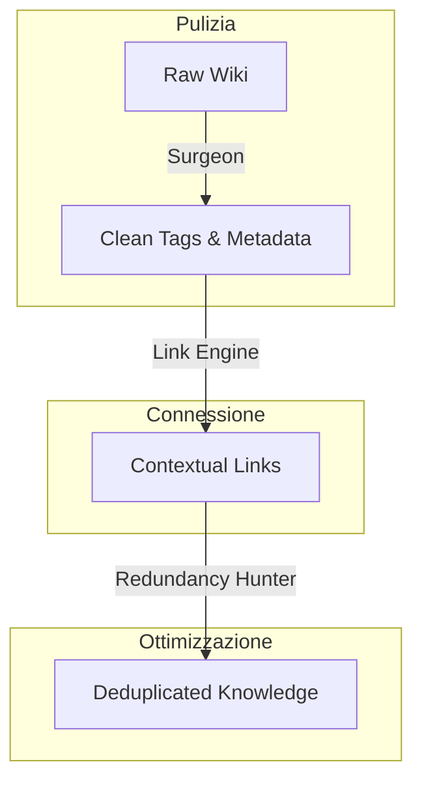
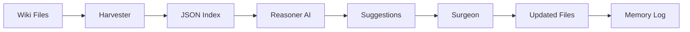

# DQF Workflow - Guida Completa

## Overview

Il **DQF (Data Quality Framework)** è un sistema in 3 fasi per mantenere la qualità della documentazione Wiki attraverso automazione intelligente.

**Fasi**: Harvester → Reasoner → Surgeon

---

**Fasi**: Harvester → Reasoner → Surgeon

---

## 📉 Strategic Pipeline (Order of Operations)

Per garantire la massima qualità, le fasi devono essere eseguite in questo ordine specifico:



1.  **Prima i Tag**: Senza tag puliti, le relazioni sono deboli.
2.  **Poi i Link**: Usiamo i tag puliti per calcolare le similarità (TF-IDF).
3.  **Infine la Ridondanza**: Solo con link e similarità calcolati possiamo identificare i duplicati.

---

## 🔄 Technical Workflow (Architecture)



---

## Fase 1: HARVESTER 📊

**Scopo**: Scansionare i file `.md` e creare un indice strutturato.

**Input**: Cartella Wiki  
**Output**: Array di `WikiPage` objects

**Cosa Fa**:
1. Attraversa ricorsivamente la directory
2. Legge ogni file `.md`
3. Estrae frontmatter YAML
4. Estrae tag
5. Calcola fingerprint (MD5)
6. Crea indice JSON

**Codice**: [`packages/dqf-agent/src/batch/node-harvester.ts`](file:///c:/old/EasyWayDataPortal/packages/dqf-agent/src/batch/node-harvester.ts)

**Esempio Output**:
```json
{
  "path": "agents/agent-example.md",
  "frontmatter": { "type": "guide", "status": "draft" },
  "tags": ["layer/tool", "domain/ai"],
  "fingerprint": "abc123..."
}
```

---

## Fase 2: REASONER 🤖

**Scopo**: Analizzare i file con AI e suggerire miglioramenti.

**Input**: JSON Index + World View (tutti i file)  
**Output**: Suggerimenti strutturati

**Cosa Fa**:
1. Carica il World Index (tutti i file disponibili)
2. Per ogni file:
   - Invia a AI (DeepSeek-R1) con contesto
   - Chiede: tag mancanti, link suggeriti, metadata da aggiungere
3. Riceve suggerimenti strutturati
4. Valida suggerimenti (no allucinazioni)

**Prompt Template**:
```
WORLD INDEX:
- agents/agent-example.md
- standards/tag-taxonomy.md
...

FILE TO ANALYZE:
Path: agents/agent-dqf.md
Content: [...]
Frontmatter: [...]

TASK:
1. Suggest missing tags from taxonomy
2. Suggest wikilinks to related pages
3. Identify missing required metadata
```

**Codice**: Integrato in `cli-v2.ts` (handleAnalyze)

---

## Fase 3: SURGEON 🔧

**Scopo**: Applicare automaticamente i fix suggeriti dall'AI.

**Input**: Array di `FileFix` objects  
**Output**: File modificati + Report

**Cosa Fa**:
1. Legge il file originale
2. Applica fix al frontmatter:
   - **Tag Fixes**: Add, remove, replace
   - **Metadata Fixes**: Add missing fields
   - **Link Fixes**: Insert wikilinks
3. Salva il file aggiornato
4. Genera report con statistiche

**Codice**: [`packages/dqf-agent/src/batch/surgeon.ts`](file:///c:/old/EasyWayDataPortal/packages/dqf-agent/src/batch/surgeon.ts)

**Esempio Fix**:
```typescript
{
  filePath: "agents/agent-example.md",
  tags: [
    { action: 'replace', oldValue: 'layer-spec', newValue: 'layer/spec' }
  ],
  metadata: [
    { field: 'status', value: 'draft' }
  ]
}
```

---

## 🎯 Modalità di Utilizzo

### Modalità 1: Validate (TOOL)
```powershell
dqf-agent-v2.ps1 "Valida i file nella cartella agents"
```
- Usa: Harvester
- Output: Lista file con errori

### Modalità 2: Analyze (RAG)
```powershell
dqf-agent-v2.ps1 "Analizza i primi 3 file"
```
- Usa: Harvester + Reasoner (AI)
- Output: Suggerimenti intelligenti

### Modalità 3: Fix (TOOL)
```powershell
dqf-agent-v2.ps1 "Correggi i file nella cartella standards"
```
- Usa: Harvester + Surgeon
- Output: File modificati + Report

### Modalità 4: Full Pipeline
```powershell
# 1. Valida
dqf-agent-v2.ps1 "Valida tutti i file"

# 2. Analizza (con AI)
dqf-agent-v2.ps1 "Analizza i file con errori"

# 3. Correggi
dqf-agent-v2.ps1 "Correggi tutti i file"

# 4. Verifica
dqf-agent-v2.ps1 "Valida tutti i file"
```

---

## 🧠 Intelligenza del Sistema

### Router Decision Logic

Il **Router** decide quale modalità usare:

| Intent | Keywords | Mode | Fasi Usate |
|--------|----------|------|------------|
| `validate` | valida, check | TOOL | Harvester |
| `analyze` | analizza, suggerisci | RAG | Harvester + Reasoner |
| `fix` | correggi, ripara | TOOL | Harvester + Surgeon |
| `chat` | (domande) | CHAT/RAG | Interpreter + Memory |

### Memory Integration

Ogni esecuzione viene salvata in `memory.db`:
- **Conversations**: Storico comandi
- **Events**: Log operazioni (per tuning)
- **Preferences**: Impostazioni utente

---

## 📊 Metriche di Qualità

**Obiettivi DQF**:
- ✅ 100% file con `type` e `status`
- ✅ 0 tag malformati (`layer-spec` → `layer/spec`)
- ✅ Tutti i link interni validi
- ✅ Tassonomia rispettata

**Monitoraggio**:
```powershell
# Report qualità
dqf-agent-v2.ps1 "Valida tutti i file"

# Output:
# Found 50 files
# ❌ 5 files with missing metadata
# ❌ 2 files with malformed tags
```

---

## 🔮 Estensioni Future

### 1. AI-Powered Reasoner (Completo)
Attualmente il Reasoner è integrato ma può essere migliorato:
- Vector DB per semantic search
- RAG su documentazione esistente
- Suggerimenti contestuali

### 2. Workflow Automation
```powershell
dqf-agent-v2.ps1 "Prima valida, poi correggi, infine genera report"
```
→ Router: WORKFLOW mode

### 3. Observability Dashboard
- Visualizzare trend qualità nel tempo
- Feedback loop (👍/👎)
- Auto-tuning dei prompt

### 4. Link Intent (In Progress)
- **Script**: `wiki-related-links.ps1` (già disponibile)
- **Goal**: Suggerire link "Vedi anche" basati su TF-IDF
- **Stato**: Generazione JSON index attiva (`out/link-suggestions.json`)
- **Next**: Integrazione completa in `handleLink()` del CLI

### 5. Redundancy Hunter (Concept)
- **Problem**: Documenti "assonanti" o duplicati che frammentano la conoscenza.
- **Solution**: Script che identifica overlap semantico (>90%).
- **Output**: *Remediation Plan* automatico:
  - Suggerimento Merge (A + B → C)
  - Suggerimento Archive (A → Archive/A)
  - Diff semantica per decisione umana

---

## 🛡️ Safety Features

### Dry Run Mode
```powershell
dqf-agent-v2.ps1 "Correggi i file preview"
```
→ Mostra cosa farebbe senza modificare

### Backup Automatico
Prima di ogni modifica, Surgeon può creare backup:
```typescript
const surgeon = new Surgeon(false, { backup: true });
```

### Validation Rules
- Non inventare file paths
- Non rimuovere metadata esistenti
- Rispettare tassonomia

---

## 📚 Riferimenti

- **Architettura**: [`standards/agent-hybrid-architecture.md`](file:///c:/old/EasyWayDataPortal/Wiki/EasyWayData.wiki/standards/agent-hybrid-architecture.md)
- **User Guide**: [`tools/dqf-agent-v2-guide.md`](file:///c:/old/EasyWayDataPortal/Wiki/EasyWayData.wiki/tools/dqf-agent-v2-guide.md)
- **Codice**: [`packages/dqf-agent/`](file:///c:/old/EasyWayDataPortal/packages/dqf-agent/)

---

## ❓ FAQ

**Q: Posso usare un LLM esterno (es. OpenAI)?**  
A: Sì! Basta modificare `OllamaClient` per supportare API esterne. Il sistema è LLM-agnostic.

**Q: Come funziona il dry-run?**  
A: Il Surgeon legge e processa i file ma non scrive su disco. Utile per preview.

**Q: Posso estendere le regole di fix?**  
A: Sì! Modifica `handleFix()` in `cli-v2.ts` per aggiungere nuove logiche.

**Q: Quanto è veloce?**  
A: Harvester: ~100 file/sec. Reasoner (AI): 5-30s per file. Surgeon: ~50 file/sec.

---

## ⏳ Componenti Opzionali (Da Fare)

Questi componenti migliorerebbero ulteriormente il sistema ma **non sono necessari** per il funzionamento base:

### 1. Prompt Engineering Avanzato

**Obiettivo**: Separare System, Policy, e User prompts per maggiore controllo.

**Struttura Proposta**:
```typescript
// packages/dqf-agent/src/core/prompts.ts
export const SYSTEM_PROMPT = `
You are a Data Quality Architect for EasyWay.
Language: {language}
Output Format: {format}
`;

export const POLICY_PROMPT = `
GUARDRAILS:
1. Never invent file paths
2. Ask for clarification if uncertain
3. Follow taxonomy strictly
4. Admit when you don't know
`;

export const buildUserPrompt = (intent: IntentObject, context: any) => {
    return `
Context: ${JSON.stringify(context)}
Task: ${intent.clean_message}
`;
};
```

**Vantaggi**:
- Maggiore controllo sul comportamento AI
- Facile A/B testing dei prompt
- Separazione concerns (system vs policy vs task)

**Quando implementare**: Quando si nota che l'AI sbaglia spesso o non rispetta le regole.

---

### 2. Observability & Feedback Loop

**Obiettivo**: Dashboard per monitorare performance e raccogliere feedback.

**Componenti**:

**A. Event Logging** (già implementato in Memory Manager):
```typescript
memory.logEvent({
    timestamp: new Date().toISOString(),
    event_type: 'ai_call',
    payload: JSON.stringify({ 
        model: 'deepseek-r1:7b', 
        latency_ms: 5000,
        tokens_used: 1500
    })
});
```

**B. Feedback Collection**:
```typescript
// Aggiungere thumbs up/down dopo ogni risposta
memory.updateEventFeedback(eventId, 1); // 👍
memory.updateEventFeedback(eventId, -1); // 👎
```

**C. Dashboard** (esempio con simple HTML):
```html
<!-- dashboard.html -->
<h1>DQF Agent V2 - Observability</h1>

<div class="metrics">
    <div>Total Executions: 150</div>
    <div>Success Rate: 95%</div>
    <div>Avg Latency: 8s</div>
    <div>Positive Feedback: 85%</div>
</div>

<div class="charts">
    <!-- Chart.js per visualizzare trend -->
</div>
```

**Vantaggi**:
- Identificare pattern di errore
- Misurare miglioramenti nel tempo
- Tuning continuo senza retraining

**Quando implementare**: Dopo 1 mese di uso in produzione, quando hai dati sufficienti.

---

### 3. Package Extraction (`@easyway/agent-core`)

**Obiettivo**: Creare package riusabile per tutti gli agenti.

**Struttura**:
```
packages/agent-core/
  src/
    interpreter.ts      # Riusabile
    memory-manager.ts   # Riusabile
    router.ts           # Riusabile
    surgeon.ts          # Specifico DQF (opzionale)
    prompts.ts          # Template base
  
  tests/
    *.test.ts           # Unit tests
  
  README.md             # Guida uso
  package.json          # npm package
  tsconfig.json
```

**Come Estrarre**:
1. Copia moduli core in `packages/agent-core/`
2. Rimuovi dipendenze specifiche DQF
3. Pubblica su npm interno
4. Aggiorna `dqf-agent` per usare `@easyway/agent-core`

**Esempio Uso**:
```typescript
// In un nuovo agente
import { Interpreter, MemoryManager, Router } from '@easyway/agent-core';

const interpreter = new Interpreter();
const memory = new MemoryManager('./my-agent-memory.db');
const router = new Router();

// Custom logic per il tuo agente
```

**Vantaggi**:
- Tutti gli agenti usano stessa base
- Aggiornamenti centrali
- Standard condiviso
- Meno duplicazione codice

**Quando implementare**: Dopo validazione 1 settimana, se DQF Agent V2 funziona bene (accuracy >80%).

---

## 🎯 Roadmap Implementazione Opzionali

### Fase 1: Validazione (1 settimana) - **ADESSO**
- [ ] Usare DQF Agent V2 quotidianamente
- [ ] Raccogliere feedback
- [ ] Misurare accuracy Router (target >80%)

### Fase 2: Prompt Engineering (1-2 giorni) - **Se accuracy <80%**
- [ ] Implementare `prompts.ts`
- [ ] Separare System/Policy/User
- [ ] A/B testing prompt variants
- [ ] Misurare miglioramento

### Fase 3: Observability (3-4 giorni) - **Dopo 1 mese uso**
- [ ] Creare dashboard HTML
- [ ] Implementare feedback collection
- [ ] Analizzare trend
- [ ] Identificare pattern errori

### Fase 4: Package Extraction (1 settimana) - **Se validazione OK**
- [ ] Estrarre `agent-core`
- [ ] Scrivere README
- [ ] Pubblicare npm interno
- [ ] Migrare 1-2 agenti pilota
- [ ] Rollout graduale

---

### 5. Redundancy Hunter (Concept)
- **Problem**: Documenti "assonanti" o duplicati che frammentano la conoscenza.
- **Solution**: Script che identifica overlap semantico (>90%).
- **Output**: *Remediation Plan* automatico:
  - Suggerimento Merge (A + B → C)
  - Suggerimento Archive (A → Archive/A)
  - Diff semantica per decisione umana

---

## 📚 Riferimenti
```
