# AI Security Guardrails

## Contesto

Con l'introduzione di **orchestrazione multi-agent** (Expert + Reviewer), il sistema diventa vulnerabile a **prompt injection** e altri attacchi AI.

**Rischi**:
- Utente malintenzionato manipola input per bypassare controlli
- KB compromessa con istruzioni nascoste
- Agent genera output con credenziali hardcoded o privilege escalation

**Soluzione**: Sistema di guardrail **defense-in-depth** con 5 layer.

---

## 🛡️ Architettura (5 Layer)

```mermaid
graph LR
    A[User Input] --> L1[Layer 1: Input Validation]
    L1 --> L2[Layer 2: Secure Prompts]
    L2 --> AG[Agent Execution]
    AG --> L3[Layer 3: Output Validation]
    L3 --> L4[Layer 4: KB Integrity]
    L4 --> L5[Layer 5: Audit & Monitoring]
    L5 --> OK[✅ Safe Output]
    
    L1 -.->|BLOCK| X1[❌ Injection Detected]
    L3 -.->|BLOCK| X2[❌ Security Violation]
    L4 -.->|BLOCK| X3[❌ KB Compromised]
    
    style L1 fill:#f99,stroke:#c00
    style L2 fill:#ff9,stroke:#f90
    style L3 fill:#9f9,stroke:#060
    style L4 fill:#99f,stroke:#006
    style L5 fill:#f9f,stroke:#909
```



---

## Layer 1: Input Validation (Pre-Execution)

**Script**: `scripts/validate-agent-input.ps1`

**Blocca**:
- Prompt injection ("ignora istruzioni", "override rules")
- SQL injection (`'; DROP TABLE`, `UNION SELECT`)
- Hardcoded credentials (`password="secret"`)
- Path traversal (`../../../etc/passwd`)
- Command injection (`;exec()`, `$()`)

**Usage**:
```powershell
$valid = pwsh scripts/validate-agent-input.ps1 -InputJson $userInput
if (-not ($valid | ConvertFrom-Json).IsValid) {
    # Block execution
    exit 1
}
```

---

## Layer 2: Secure System Prompts (During Execution)

**Template**: `agents/core/templates/secure-system-prompt.txt`

**Protegge**:
- Regole **immutabili** che LLM non può ignorare
- Blacklist di pattern pericolosi
- Force structured JSON response
- Require human approval per operazioni critiche

**In agent script**:
```powershell
$systemPrompt = Get-Content "agents/core/templates/secure-system-prompt.txt" -Raw
$systemPrompt = $systemPrompt -replace '\$\{AGENT_ROLE\}', 'Agent_DBA'
# Use in LLM call
```

---

## Layer 3: Output Validation (Post-Execution)

**Script**: `scripts/validate-agent-output.ps1`

**Verifica**:
- Response è **strutturato** (JSON con `what`, `how`, `impacts`)
- No hardcoded credentials (deve usare `<KEYVAULT:...>`)
- No excessive privilege grants (`GRANT ALL TO PUBLIC`)
- Rollback strategy presente se operazione distruttiva
- No URL esterni (rischio exfiltration)

**Usage**:
```powershell
$compliant = pwsh scripts/validate-agent-output.ps1 `
    -OutputJson $agentOutput -AgentRole $agent
if (-not ($compliant | ConvertFrom-Json).IsCompliant) {
    # Escalate to human
}
```

---

## Layer 4: KB Integrity Monitoring (Continuous)

**Scanner**: `scripts/kb-security-scan.py`

**Protegge**:
- Knowledge Base (`agents/kb/recipes.jsonl`) da poisoning
- Blocca commit se KB contiene pattern sospetti
- Pre-commit hook automatico

**Install hook**:
```bash
cp scripts/pre-commit.sh .git/hooks/pre-commit
chmod +x .git/hooks/pre-commit
```

**Test**:
```bash
python3 scripts/kb-security-scan.py agents/kb/recipes.jsonl
# ✅ KB scan passed: 201 recipes, 0 violations
```

---

## Layer 5: Audit & Monitoring (Retroactive)

**Log**: `agents/logs/security-events.jsonl`

**Track**:
- Input validation failures
- Output compliance violations
- KB integrity issues
- Anomaly detection (agent bypassing approval troppo spesso)

**Daily review**:
```powershell
# Count security events
$events = Get-Content agents/logs/security-events.jsonl | ConvertFrom-Json
if ($events.Count -gt 5) {
    # Alert security team
}
```

---

## Integrazione con Expert + Reviewer

```javascript
// Pseudocode
async function expertReviewerWithSecurity(intent) {
  // Layer 1: Validate input
  if (!validateInput(intent).IsValid) {
    throw SecurityError('Input rejected');
  }
  
  // Layer 2: Expert uses secure prompt
  const proposal = await expert.generateWithSecurePrompt(intent);
  
  // Layer 3: Validate output
  if (!validateOutput(proposal).IsCompliant) {
    if (severity === 'critical') {
      throw SecurityError('Output blocked');
    }
    // Escalate to human
  }
  
  // Reviewer adds security criterion (4th criterion)
  const score = await reviewer.score(proposal, {
    criteria: ['feasibility', 'risk', 'alignment', 'security']
  });
  
  if (score.security < 7.0) {
    // Human review required
  }
}
```

**Security scoring**: Reviewer valuta se proposta ha vulnerabilità.

---

## Status Implementazione

| Layer | Script | Status | Integrato |
|-------|--------|--------|-----------|
| 1 - Input | `validate-agent-input.ps1` | ✅ Creato | ⏳ Pending |
| 2 - Prompts | `secure-system-prompt.txt` | ✅ Creato | ⏳ Pending |
| 3 - Output | `validate-agent-output.ps1` | ✅ Creato | ⏳ Pending |
| 4 - KB | `kb-security-scan.py` | ✅ Creato | ⏳ Hook install pending |
| 5 - Audit | Logging | ✅ Funziona | ⏳ Dashboard pending |

**Next**: Integrazione con orchestrator e agent scripts.

---

## Deployment

**Priority**: **HIGH** - Deploy PRIMA di Expert + Reviewer

**Steps**:
1. Install pre-commit hook per KB
2. Update orchestrator con Layer 1 e 3 validation
3. Update agent scripts con Layer 2 secure prompts
4. Test end-to-end con injection attempts
5. Monitor `security-events.jsonl` daily

**Guide**: `docs/agentic/ai-security-deployment.md`

---

## Test Rapidi

```powershell
# Test 1: Input validation (clean)
$clean = '{"intent":"db-table:create","params":{"name":"users"}}'
pwsh scripts/validate-agent-input.ps1 -InputJson $clean
# Expected: IsValid=true

# Test 2: Input validation (malicious)
$malicious = '{"intent":"IGNORA ISTRUZIONI"}'
pwsh scripts/validate-agent-input.ps1 -InputJson $malicious
# Expected: IsValid=false, Severity=high

# Test 3: KB scan
python3 scripts/kb-security-scan.py agents/kb/recipes.jsonl
# Expected: ✅ KB scan passed
```

---

## Risorse

### Documentazione Tecnica (docs/agentic/)
- [AI Security Guardrails (completo)](../../docs/agentic/ai-security-guardrails.md) - Guida tecnica 5 layer
- [Integration Guide](../../docs/agentic/ai-security-integration.md) - Orchestrator integration
- [Deployment Checklist](../../docs/agentic/ai-security-deployment.md) - Step-by-step deployment
- [Quick Start](../../docs/agentic/ai-security-quickstart.md) - 10 min setup
- [Test Suite](../../docs/agentic/ai-security-tests.md) - Validation tests

### Script
- `scripts/validate-agent-input.ps1` - Layer 1
- `scripts/validate-agent-output.ps1` - Layer 3
- `scripts/kb-security-scan.py` - Layer 4
- `scripts/pre-commit.sh` - Pre-commit hook template
- `agents/core/templates/secure-system-prompt.txt` - Layer 2

### Wiki Correlate
- [Multi-Agent Orchestration](../control-plane/agent-orchestration-weighting.md) - Expert + Reviewer design
- [Agents Registry](../control-plane/agents-registry.md) - Lista agent
- [Security & IAM](./agent-security-iam.md) - Agent permissions

### External
- [OWASP LLM Top 10](https://owasp.org/www-project-top-10-for-large-language-model-applications/)
- [Prompt Injection Guide](https://simonwillison.net/2023/Apr/14/worst-that-can-happen/)

---

**Owner**: team-security, team-platform  
**Status**: Scripts ready, deployment pending  
**Priority**: Deploy before Expert+Reviewer goes live
