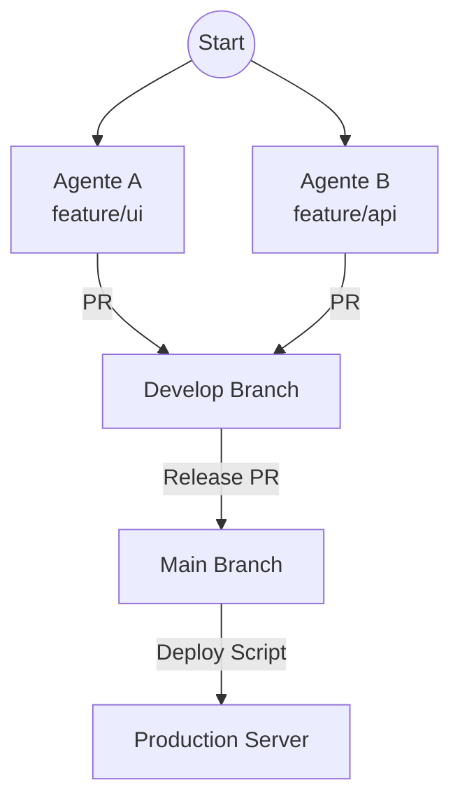

# Workflow Agentico & Deployment

> **Principio Sacro**: L'Agente sviluppa e *propone* (apre la PR). L'Umano controlla e *approva*. Il Server esegue solo ciò che è "Main".

## 1. Il Ciclo di Sviluppo (The Factory)

Ogni modifica segue rigorosamente questo percorso. Nessuna eccezione.

### Fase 1: Sviluppo Agentico
1.  **Start**: L'Umano assegna un task (PBI o Bug).
2.  **Branch**: L'Agente crea un branch semantico:
    -   `feature/nome-feature` (per PBI)
    -   `bug/nome-fix` (per Bug)
3.  **Work**: L'Agente implementa, testa e committa (usando `EasyWay Hybrid Core` per diff e messaggi).
4.  **Proposal (PR)**:
    -   ⚠️ **L'Agente DEVE creare la Pull Request.**
    -   Titolo e Descrizione sono generati dall'Agente (via `system_describe.md`).
    -   Target: `develop` (mai `main` diretto).

### Fase 2: Controllo Umano (Governance)
1.  **Review**: L'Umano riceve la notifica della PR.
2.  **Approval**: L'Umano verifica la conformità e approva su Azure DevOps.
    -   *Nota*: L'Agente non ha il permesso di approvarsi da solo (Self-Approval bloccato).
3.  **Merge**: La PR viene completata e il codice entra in `develop`.

---

## 2. Il Ciclo di Rilascio (The Release)

Come il codice arriva in Produzione (Server).

### Regola d'Oro: "Main-Only"
Il server di produzione è configurato per fidarsi **solo** del branch `main`.
Non è permesso deployare branch visuali (`feature/*`) o instabili (`develop`) in produzione.

1.  **Release PR**: Da `develop` a `main`.
2.  **Tag**: Il merge su `main` genera una versione (es. `v1.2.0`).
3.  **Deploy**:
    -   Lo script `deploy_easyway.ps1` sul server scarica `main`.
    -   Riavvio dei servizi (Docker Compose).

---

## 3. Comandi Operativi

### Per l'Agente
-   **Inizio Lavoro**: `git checkout -b feature/nuova-cosa`
-   **Fine Lavoro**: `az repos pr create --source-branch feature/nuova-cosa --target-branch develop --title "[PBI] Nuova Cosa" --description ... --open`

### Per l'Umano
-   **Approva PR**: Tasto "Approve" & "Complete" su ADO.
-   **Deploy Manuale (se necessario)**:
    ```powershell
    # Solo da Main!
    pwsh .\scripts\infra\remote\deploy_easyway.ps1
    ```

---

## 4. Scenario: The Swarm (Multi-Agent Parallel Work)

Il sistema supporta nativamente il lavoro in parallelo di più agenti (es. Codex su UI, ClaudeCode su Backend, Windsurf su Refactoring).

### Il Flow Parallelo
1.  **Agente A (UI)**: Crea `feature/ui-dashboard`.
2.  **Agente B (API)**: Crea `feature/api-endpoints`.
3.  **Agente C (Fix)**: Crea `bug/login-error`.

Tutti lavorano in isolamento. Ognuno apre la sua PR su `develop`.

### La Convergenza (The Merge)
-   **L'Umano approva PR A**: `develop` avanza.
-   **L'Umano approva PR B**: `develop` avanza (include A + B).
-   **L'Umano approva PR C**: `develop` avanza (include A + B + C).

### Gestione Conflitti
Se Agente A e Agente B modificano lo stesso file:
-   La seconda PR segnalerà "Merge Conflict".
-   **Risoluzione**: L'Agente B (o un Agente D "Resolver") deve fare `git merge develop` nel suo branch, risolvere il conflitto, e pushare di nuovo.



---

## 5. Governance & Guardrails (`.cursorrules`)

Il comportamento degli Agenti è regolato dal file `.cursorrules` presente nella root del repository.
Questo file viene distribuito a tutti via Git e definisce le **Legge**:

1.  **Branch Safety**: Mai committare su `develop`/`main`.
2.  **Local-First**: La verità è locale, non remota.
3.  **Clean Working Tree**: Un task non è finito se `git status` non è pulito.
    > *Rule*: "Before declaring a task DONE, run git status. Verification is incomplete if there are uncommitted changes."

Tutti gli Agenti (Copilot, Cursor, Windsurf, Antigravity) devono rispettare queste regole.


