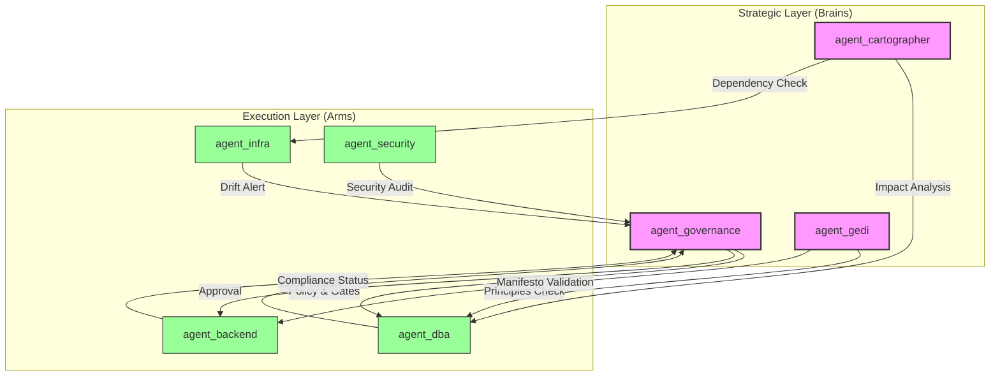

# 🤖 Agent System - Agent Roster & Marketplace

> **Catalogo completo degli agenti EasyWayDataPortal classificati per ruolo strategico**

## 🎯 Classificazione: Brains vs Arms

Gli agenti sono classificati in due categorie principali basate sulla loro **natura concettuale** vs **operativa**:

### 🧠 Brains (Strategic Agents)
**Caratteristiche:**
- Alta autonomia
- OODA Loop enabled
- Principles-driven
- Decision making strategico
- Analisi e governance

**Agenti (6 totali):**

| Agente | Ruolo | Descrizione |
|--------|-------|-------------|
| **agent_cartographer** | The Navigator (mapper) | Mantiene Knowledge Graph, simula impatti a cascata ("Butterfly Effect Analysis") |
| **agent_chronicler** | The Bard (historian) | Registra pietre miliari, celebra innovazioni ("A star is born") |
| **agent_dba** | Database Strategist | Gestione migrazioni DB, drift check, ERD/SP documentation, RLS rollout |
| **agent_gedi** | Philosophy Guardian | Custode del Manifesto EasyWay, ricorda principi fondamentali |
| **agent_governance** | Policy Master | Policy, qualità, gates e approvazioni per DB/API/Docs |
| **agent_scrummaster** | Agile Facilitator | Backlog/roadmap, governance operativa, DoD/gates, allineamento Epics/Features |

### 💪 Arms (Executive Agents)
**Caratteristiche:**
- High speed
- Deterministic
- Task-oriented
- Esecuzione operativa
- Output strutturato

**Agenti (20 totali):**

| Agente | Specializzazione | Key Skills |
|--------|------------------|------------|
| **agent_ado_userstory** | Azure DevOps | User Story creation, best practices prefetch |
| **agent_ams** | Automation | Checklist, Variable Group, deploy helpers |
| **agent_api** | API Triage | Error tracking, structured output for n8n |
| **agent_audit** | Inspector | Conformità architetturale agenti |
| **agent_backend** | API Implementation | OpenAPI, middleware auth/tenant, endpoint scaffolding |
| **agent_creator** | Agent Scaffolding | Crea nuovi agenti (manifest/templates/KB/Wiki) |
| **agent_datalake** | Datalake Operations | Naming, ACL, audit, retention, export log |
| **agent_docs_review** | Documentation Review | Wiki normalization, indici/chunk, KB coerenza |
| **agent_docs_sync** | Docs-Code Sync | Allineamento docs ↔ code, metadata validation |
| **agent_dq_blueprint** | Data Quality | Blueprint DQ rules (Policy Proposal + Set) |
| **agent_frontend** | Frontend Specialist | (In development) |
| **agent_infra** | Infrastructure | IaC/Terraform (validate/plan/apply), drift infra |
| **agent_observability** | Monitoring | Health check, logging standard, OTel/AppInsights |
| **agent_pr_manager** | Pull Requests | Crea PR agentiche con gates (no auto-merge) |
| **agent_release** | Release Management | Packaging/versioning runtime bundle |
| **agent_retrieval** | RAG Management | Indicizzazione Wiki/KB, retrieval bundles, vector DB sync |
| **agent_second_brain** | Semantic Navigation | Breadcrumbs, Context Injection |
| **agent_security** | Security & Secrets | Key Vault, identity provisioning, audit registry |
| **agent_synapse** | Analytics (EXPERIMENTAL) | Synapse/DataFactory workspace management |
| **agent_template** | Template | Scheletro per nuovi agenti |

---

## 📊 Ecosystem Stats

- **Total Agents**: 26
- **Strategic Brains**: 6 (23%)
- **Executive Arms**: 20 (77%)
- **Ratio**: ~1 Brain per 3-4 Arms

---

## 🎭 Curriculum Vitae degli Agenti

### Esempio: agent_dba (Brain)

**ID**: `agent_dba`  
**Ruolo**: Database Strategist  
**Tipo**: 🧠 Brain  
**Owner**: Platform Team

**Key Skills**:
- `db-user:create` - Creazione utenti database
- `db-user:rotate` - Rotazione password
- `db-user:revoke` - Revoca accessi
- `db-doc:ddl-inventory` - Inventario DDL
- `db-metadata:extract` - Estrazione metadati
- `db-metadata:diff` - Diff metadati
- `db-guardrails:check` - Verifica guardrails
- `db-table:create` - Creazione tabelle
- `db-blueprint:generate` - Generazione blueprint

**Tools**:
- 💻 `npm`, `pwsh`, `sqlcmd`
- ☁️ `az` (Azure CLI)

**Documentation**: 
- Manifest: `agents/agent_dba/manifest.json`
- README: `agents/agent_dba/README.md`
- Wiki: Multiple pages in `Wiki/EasyWayData.wiki/`

---

### Esempio: agent_cartographer (Brain)

**ID**: `agent_cartographer`  
**Ruolo**: The Navigator (mapper)  
**Tipo**: 🧠 Brain  
**Owner**: team-architecture

**Descrizione**: Mantiene la Mappa delle Dipendenze (Knowledge Graph). Prima di ogni modifica distruttiva, viene consultato per simulare gli impatti a cascata ('Butterfly Effect Analysis').

**Key Skills**:
- `graph:query` - Query Knowledge Graph
- `graph:update` - Update dependencies
- `impact:simulate` - Simula impatti a cascata

**Tools**:
- 🔧 GenAI: `graph_query`, `impact_simulator`, `dependency_mapper`

**LLM**: gpt-4-turbo  
**Docs**: 1 documentation page

---

### Esempio: agent_audit (Arm)

**ID**: `agent_audit`  
**Ruolo**: Inspector  
**Tipo**: 💪 Arm  
**Owner**: Platform Team

**Descrizione**: Responsabile della verifica di conformità architetturale degli agenti.

**Key Skills**:
- `audit:agents.inspect` - Audit completo agenti

**Tools**:
- 💻 `pwsh`

**Script**: `scripts/pwsh/agent-audit.ps1`

---

## 🔄 Interazione Brains ↔ Arms



---

## 🎯 Quando Usare Brains vs Arms

### Use Brains When:
- ✅ Decisioni strategiche
- ✅ Analisi impatti
- ✅ Governance e policy
- ✅ Pattern detection
- ✅ Knowledge management

### Use Arms When:
- ✅ Esecuzione task specifici
- ✅ Operazioni deterministiche
- ✅ Automazione ripetitiva
- ✅ Output strutturato
- ✅ Speed-critical operations

---

## 📚 Agent Marketplace

**Documentazione Completa**: [Agent Roster](../Wiki/EasyWayData.wiki/agents/agent-roster.md)

**Generazione Automatica**: 
```powershell
pwsh scripts/generate-agent-roster.ps1
```

Questo script:
- Scansiona `agents/` directory
- Legge `manifest.json` di ogni agente
- Classifica Brains vs Arms
- Genera `agent-roster.md` con stats

---

## 🏆 Agent Highlights

### Most Versatile (Brains)
- **agent_governance** - 7+ task types
- **agent_dba** - 9+ key skills

### Most Specialized (Arms)
- **agent_cartographer** - Knowledge Graph expert
- **agent_gedi** - Philosophy guardian

### Most Active (by usage)
1. agent_dba
2. agent_governance
3. agent_docs_review
4. agent_backend
5. agent_security

---

**Versione**: 1.0  
**Ultima modifica**: 2026-01-18  
**Generato da**: `scripts/generate-agent-roster.ps1`  
**Status**: ✅ Active
