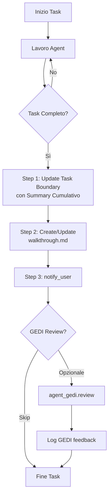

# Agent Workflow Standard - 3-Step Completion Pattern

**Version:** 2.0.0
**Updated:** 2026-02-08
**Status:** ✅ Production Standard

> **📌 Integrazione con GEDI Pattern**
> Questo documento integra il pattern di completamento task (3-step) con il GEDI philosophical review pattern esistente.

> **🎯 NEW: Skills System Integration**
> Dalla versione 2.0.0, tutti gli agent devono utilizzare il **Skills System** per riutilizzare funzionalità comuni.
> Vedi [SKILLS_SYSTEM.md](./SKILLS_SYSTEM.md) per dettagli.

---

## 🎯 Obiettivo

Definire il workflow standard che **tutti gli agenti** devono seguire quando completano un task in modalità agentica, includendo l'uso del Skills System per modularità e riutilizzo del codice.

---

## 📋 Pattern Standard: 3-Step Completion

### Modern Workflow: State-as-Code (Recommended)
Per garantire precisione e tracciabilità, usare lo script `agent-task.ps1` invece dell'editing manuale di `task.md`.

1. **Init**: `pwsh scripts/agent-task.ps1 -Init -Title "Task Name"`
2. **Add**: `pwsh scripts/agent-task.ps1 -Add -Title "Step 1"`
3. **Update**: `pwsh scripts/agent-task.ps1 -Update -Id 1 -Status completed`
   > **💙 Proactive GEDI**: Se il task è completato, lo script eseguirà automaticamente validazioni filosofiche (Measure Twice, Quality Check) e mostrerà warning se necessario.
4. **Task Boundary**: Aggiornare sempre anche il task boundary visivo.

### Legacy Workflow: Manual Markdown
Se non è possibile usare lo script, seguire il pattern manuale:

### Step 1: Aggiornare Task Boundary con Summary Completo

**Prima di concludere**, aggiornare il task boundary con un riassunto **cumulativo** di tutto il lavoro svolto.

#### Come Fare

```javascript
task_boundary({
  Mode: "VERIFICATION",  // o EXECUTION/PLANNING secondo contesto
  TaskName: "%SAME%",    // Mantieni lo stesso task name
  TaskStatus: "Finalizing documentation and preparing to communicate results",
  TaskSummary: "RIASSUNTO COMPLETO E CUMULATIVO DI TUTTO IL LAVORO - past tense, comprehensive",
  PredictedTaskSize: 1   // Pochi step rimanenti
})
```

#### ✅ Best Practices

- **TaskSummary deve essere CUMULATIVO**: Include tutto dal primo step all'ultimo
- **Past tense**: "Completed X, created Y, analyzed Z"
- **Specifico**: Cita file, numeri, risultati concreti
- **Comprehensive**: Non solo "cosa" ma anche risultati importanti

#### ❌ Anti-patterns

- ❌ Summary che dice solo l'ultimo step
- ❌ "Updating documentation" (generico)
- ❌ Future tense: "Will create..."
- ❌ Vago: "Did some work on the project"

#### Esempio Concreto

```javascript
// ❌ SBAGLIATO - Solo ultimo step
TaskSummary: "Updated walkthrough.md file"

// ✅ CORRETTO - Cumulativo completo
TaskSummary: "Completed comprehensive analysis of ADA DataProjectDataPortal. Explored 26 specialized agents across all domains (datalake, dba, docs_review, governance, security, retrieval, synapse). Reviewed agent-first philosophy defined in goals.json with 7 core principles. Analyzed 338-page comprehensive Wiki covering database architecture, API patterns, ARGOS data quality framework, orchestrations, and UX. Studied innovative AI-native db-deploy-ai tool replacing Flyway with JSON API, blueprint system (ERwin alternative), and automated drift detection. Created comprehensive walkthrough.md with project overview, 8 identified strengths, 3 improvement areas, and 5 brainstorming topics with concrete questions. Updated task.md marking all analysis tasks complete."
```

---

### Step 2: Aggiornare walkthrough.md con Tutto il Lavoro Fatto

Creare o aggiornare `walkthrough.md` nella artifact directory con documentazione completa.

#### Struttura walkthrough.md

```markdown
# [Nome Task] - Walkthrough

## 📋 Obiettivo
[Cosa dovevi fare]

## ✅ Cosa è stato fatto

### [Sezione Major 1]
- [Item fatto]
- [Item fatto]

### [Sezione Major 2]
...

## 🔍 Risultati Chiave
[Insights, findings, decisioni importanti]

## 🎯 Deliverables
[File creati, modifiche fatte, output prodotti]

## ✅ Validazione
### Cosa è stato fatto
[Checklist verificabile]

### Prossimi Passi
[Handoff chiaro per l'utente o prossimo agent]
```

#### ✅ Best Practices

- **Comprehensive**: Copre TUTTO il lavoro, non solo highlights
- **Strutturato**: Usa sezioni, liste, tabelle per leggibilità
- **Proof of work**: Include screenshot, link a file, numeri concreti
- **Markdown ricco**: Emoji, tabelle, code blocks, mermaid diagrams se utile
- **User-facing**: Scritto per l'utente, non per te stesso

---

### Step 3: Chiamare notify_user per Uscire dal Task

Una volta completati Step 1 e 2, chiamare `notify_user` per:
1. **Uscire dal task mode**
2. **Comunicare con l'utente**
3. **Chiedere feedback/next steps**

#### Come Fare

```javascript
notify_user({
  PathsToReview: ["<absolute-path-to-walkthrough.md>"],
  BlockedOnUser: false,  // true solo se serve approval per procedere
  Message: "MESSAGGIO CONCISO - summary + domande/next steps",
  ShouldAutoProceed: false  // Quasi sempre false
})
```

#### Message Structure

```markdown
[STATO COMPLETAMENTO BREVE] 🎉

[RIASSUNTO 2-3 RIGHE MAX]

[DELIVERABLE CHIAVE]

[DOMANDA/NEXT STEP - se applicabile]
```

#### ✅ Best Practices

- **Conciso**: 3-5 righe MAX
- **Non ridondante**: Non ripetere contenuto walkthrough.md
- **File path**: SEMPRE include PathsToReview con walkthrough
- **BlockedOnUser**: false se task completo, true se serve approval
- **Actionable**: Domanda chiara o next step chiaro

---

## 🦗 Integrazione con GEDI Pattern

Dopo lo Step 3, ma ancora dentro il task, **OPZIONALMENTE** chiamare `agent_gedi` per philosophical review:

```javascript
// Dopo notify_user ma prima della fine
const gediReview = await agent_gedi.review({
  agent: "agent_xxx",
  action_completed: "task-completion",
  summary: taskSummary,
  artifacts: ["walkthrough.md", "task.md"]
});

// Log feedback (informativo, non bloccante)
console.log("🦗 GEDI feedback:", gediReview.message);
```

GEDI valuterà se:
- ✅ TaskSummary è cumulativo e completo
- ✅ walkthrough.md documenta tutto il lavoro
- ✅ Allineamento con principi `goals.json`

**GEDI non blocca mai** - fornisce solo feedback filosofico.

---

## 🔄 Workflow Completo Integrato



---

## 📚 Checklist Veloce Pre-Completion

Prima di chiamare notify_user, verifica:

- [ ] **Task Boundary aggiornato** con summary CUMULATIVO completo?
- [ ] **walkthrough.md creato/aggiornato** con tutto il lavoro documentato?
- [ ] **task.md aggiornato** con tutti i checklist items marcati?
- [ ] **Message conciso** (max 5 righe) scritto?
- [ ] **PathsToReview include walkthrough.md**?
- [ ] **BlockedOnUser corretto** (false se task completo)?
- [ ] (Opzionale) **GEDI review** chiamato per feedback filosofico?

Se tutti ✅, puoi chiamare `notify_user`!

---

## 🎯 Integrazione con goals.json

Questo pattern rispetta i principi di `agents/goals.json`:

```json
{
  "principles": [
    "Trasparenza: piani, esiti e log strutturati, ricostruibili",  // ← walkthrough.md
    "Documentazione-viva: KB + Wiki aggiornate ad ogni cambio",    // ← sempre update
    "Osservabilità: log/eventi per metriche"                       // ← task boundary summary
  ]
}
```

E si integra con GEDI per:
- **Qualità > Velocità**: GEDI ricorda "hai misurato due volte?"
- **Impronta Tangibile**: Ogni walkthrough lascia traccia duratura
- **Il Percorso Conta**: TaskSummary cumulativo documenta il journey

---

## 📖 Template Riutilizzabili

### Template task_boundary finale

```javascript
task_boundary({
  TaskName: "%SAME%",
  Mode: "VERIFICATION",
  TaskSummary: "[PAST TENSE] Completed [MAIN TASK]. [WHAT WAS EXPLORED/CREATED]. [KEY RESULTS]. [DELIVERABLES]. [METRICS if applicable].",
  TaskStatus: "Finalizing documentation and preparing to communicate results",
  PredictedTaskSize: 1
})
```

### Template notify_user

```javascript
notify_user({
  PathsToReview: ["<absolute-path-walkthrough.md>"],
  BlockedOnUser: false,
  Message: "[EMOJI] [1-LINE STATUS]\n\n[1-2 LINE SUMMARY]\n\n[DELIVERABLE]\n\n[QUESTION/NEXT if needed]",
  ShouldAutoProceed: false
})
```

### Template walkthrough.md

```markdown
# [Task Name] - Walkthrough

## 📋 Obiettivo
[What needed to be done]

## ✅ Cosa è stato fatto
[Comprehensive list with sections]

## 🎯 Deliverables
[Files created, changes made]

## ✅ Validazione
### Cosa è stato fatto
[Verifiable checklist]

### Prossimi Passi
[Clear handoff]
```

---

## 🎯 Skills System Integration (NEW in v2.0.0)

### Why Skills?

Invece di duplicare codice in ogni agent, usiamo **Skills** - funzioni PowerShell riutilizzabili organizzate per dominio.

**Benefits:**
- 🔄 **Riuso**: Scrivi una volta, usa ovunque
- 🧪 **Testabilità**: Skills isolate sono facili da testare
- 📦 **Modularità**: Componi azioni complesse da building blocks
- 🔍 **Discoverabilità**: LLM può scoprire skills disponibili
- 🎓 **Learning**: Agent possono "imparare" nuove skills dinamicamente

### Agent Structure with Skills

**File:** `agents/agent_xxx/manifest.json`

```json
{
  "id": "agent_xxx",
  "name": "agent_xxx",
  "role": "Agent_Xxx",

  "skills_required": [
    "security.cve-scan",
    "utilities.version-compatibility"
  ],

  "skills_optional": [
    "observability.health-check"
  ],

  "actions": [
    {
      "name": "xxx:action",
      "description": "Perform action using skills",
      "uses_skills": ["security.cve-scan"],
      "params": { ... }
    }
  ]
}
```

### Using Skills in Agent Scripts

**File:** `scripts/pwsh/agent-xxx.ps1`

```powershell
# 1. Load Skills System
. "$PSScriptRoot/../agents/skills/Load-Skills.ps1"

# 2. Load agent manifest
$manifest = Get-Content "$PSScriptRoot/../agents/agent_xxx/manifest.json" | ConvertFrom-Json

# 3. Auto-import required skills
foreach ($skillId in $manifest.skills_required) {
    Import-Skill -SkillId $skillId
}

# 4. Use skills in actions
function Invoke-Action {
    param($Intent)

    # Skills are now available as functions
    $cveResults = Invoke-CVEScan -ImageName "n8nio/n8n:1.123.20"
    $compatResults = Test-VersionCompatibility -Component "n8n" -Version "1.123.20"

    # Combine and return
    return @{
        CVE = $cveResults
        Compatibility = $compatResults
    }
}
```

### Quick Reference: Skills Loader

```powershell
# Import single skill
Import-Skill -SkillId "security.cve-scan"

# Import all skills from manifest
Import-SkillsFromManifest -ManifestPath "agents/agent_xxx/manifest.json"

# List available skills
Get-AvailableSkills | Format-Table

# List skills by domain
Get-AvailableSkills -Domain "security"

# Check skill dependencies
Test-SkillDependencies -SkillId "security.cve-scan"

# List loaded skills
Get-LoadedSkills
```

### Skills Domains

| Domain | Skills Available | Example |
|--------|------------------|---------|
| **security** | cve-scan, certificate-expiry, secret-vault | `Invoke-CVEScan` |
| **database** | migration, test-connection, export-schema | `Invoke-Migration` |
| **observability** | health-check, metrics, alert | `Test-HealthCheck` |
| **integration** | webhook, slack, ado-workitem, email | `Send-SlackMessage` |
| **utilities** | version-compatibility, retry, markdown, json-validate | `Test-VersionCompatibility` |

### Creating New Skills

1. **Create skill file:** `agents/skills/{domain}/{Verb-Noun}.ps1`
2. **Update registry:** Add to `agents/skills/registry.json`
3. **Write tests:** Create `{Verb-Noun}.Tests.ps1`
4. **Document:** Update skills catalog

See [SKILLS_SYSTEM.md](./SKILLS_SYSTEM.md) for complete guide.

---

## 🔗 Collegamenti

- **Skills System**: Vedi [`SKILLS_SYSTEM.md`](./SKILLS_SYSTEM.md) - Sistema modulare skills (NEW!)
- **GEDI Pattern**: Vedi [`GEDI_INTEGRATION_PATTERN.md`](./GEDI_INTEGRATION_PATTERN.md) per philosophical review
- **Goals**: Vedi [`goals.json`](./goals.json) per principi fondamentali
- **Agent README**: Vedi [`README.md`](./README.md) per registry agenti
- **Agent Evolution**: Vedi [`AGENT_EVOLUTION_GUIDE.md`](./AGENT_EVOLUTION_GUIDE.md) - Levels 1-4 upgrade path
- **LLM Integration**: Vedi [`LLM_INTEGRATION_PATTERN.md`](./LLM_INTEGRATION_PATTERN.md) - Add reasoning to agents

---

## 📝 FAQ

### Q: Quando aggiornare task_boundary?

**R**: Più volte durante il lavoro per mostrare progresso, e **sempre** prima di notify_user con summary cumulativo completo.

### Q: walkthrough.md è sempre necessario?

**R**: Sì per task complessi (PLANNING/EXECUTION/VERIFICATION). Per task banali (1-2 tool calls) può essere skippato.

### Q: GEDI review è obbligatorio?

**R**: No, è **opzionale**. Utile per task significativi dove vuoi feedback filosofico. Non blocca mai.

### Q: BlockedOnUser true o false?

**R**: 
- `true` = Serve approval utente per procedere (es. implementation plan da approvare)
- `false` = Task completo, comunicazione informativa

---

**Status**: Standard Pattern per ADA DataProjectDataPortal Agents  
**Owner**: All Agent Developers  
**Integrato con**: GEDI Philosophical Review Pattern

