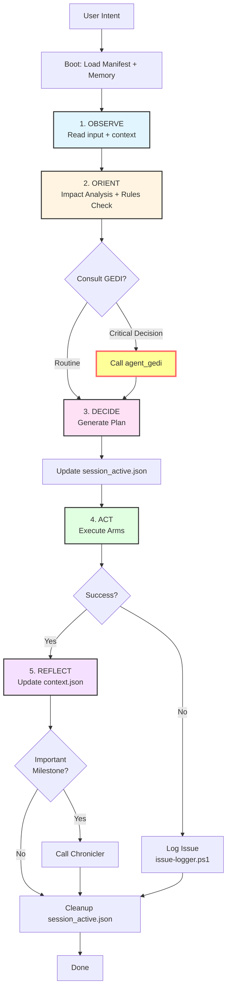

# 🔄 OODA Loop - Agent Runtime Lifecycle

> **Il ciclo cognitivo degli agenti Brain (Strategic)**

## 🎯 Cos'è OODA Loop?

**OODA** = **Observe → Orient → Decide → Act**

È il ciclo cognitivo che gli agenti **Brain** (strategici) implementano per prendere decisioni informate e contestualizzate, invece di eseguire ciecamente i comandi.

**Origine**: Concetto militare di John Boyd (pilota da combattimento USAF), adattato per agenti autonomi.

---

## 🧠 Le 4 Fasi del Ciclo

### 1. 🔍 Observe (Osservare)
**Cosa fa l'agente:**
- Legge l'input utente
- Carica `manifest.json`
- Carica `memory/context.json` (memoria episodica)
- Raccoglie contesto del task

**Output**: Comprensione chiara dell'intent e del contesto

---

### 2. 🧭 Orient (Orientare)
**Cosa fa l'agente:**
- Consulta `dependency-graph.md` → **Impact Analysis** (Butterfly Effect)
- Consulta `agent-architecture-standard.md` → **Rules & Governance**
- Consulta **GEDI** (Guardian) → **Principles Check**
- Valuta rischi e dipendenze

**Output**: Mappa mentale del problema e delle implicazioni

---

### 3. 🎯 Decide (Decidere)
**Cosa fa l'agente:**
- Genera un piano d'azione
- Aggiorna `memory/session_active.json` con il piano
- Se decisione critica → **Consulta GEDI obbligatoriamente**
- Valida allineamento con Manifesto EasyWay

**Output**: Piano strutturato con step concreti

---

### 4. ⚡ Act (Agire)
**Cosa fa l'agente:**
- Esegue gli script **Arm** (agenti esecutivi)
- Monitora l'esecuzione
- Logga risultati

**Output**: Azione concreta completata

---

### 5. 🪞 Reflect (Riflettere) - Bonus Phase
**Cosa fa l'agente:**
- Aggiorna `memory/context.json` (es. "L'utente ha approvato X")
- Se successo importante → Chiama **Chronicler** (registra milestone)
- Pulisce `memory/session_active.json`
- Apprende dall'esperienza

**Output**: Memoria aggiornata per future decisioni

---

## 📊 Workflow Completo



---

## 🧩 Architettura Memoria (3 Layer)

### Layer 1: Working Memory (Short-Term) ⚡
**Scopo**: "Cosa sto facendo ora?"  
**File**: `agents/<agent_name>/memory/session_active.json`  
**Durata**: Effimera (task corrente)

```json
{
  "session_id": "uuid-1234",
  "start_time": "2026-01-17T21:00:00Z",
  "intent": "Scaffold new API agent",
  "plan": [
    { "step": 1, "desc": "Create Dir", "status": "done" },
    { "step": 2, "desc": "Write Manifest", "status": "pending" }
  ],
  "variables": { "target_dir": "agents/agent_new" }
}
```

### Layer 2: Episodic/Context Memory (Medium-Term) 📂
**Scopo**: "Cosa so di questo utente/progetto?"  
**File**: `agents/<agent_name>/memory/context.json`  
**Durata**: Persistente (tra sessioni)

```json
{
  "user_preferences": { "language": "it", "theme": "dark" },
  "last_interaction": "2026-01-16",
  "project_context": { "current_sprint": "Sprint 42" }
}
```

### Layer 3: Semantic Knowledge (Long-Term) 📚
**Scopo**: "Cosa so del mondo?"  
**File**: Wiki, Knowledge Graph, History  
**Durata**: Permanente

- **History**: `concept/history.md` (gestito da Chronicler)
- **Map**: `concept/dependency-graph.md` (gestito da Cartographer)
- **Docs**: Intera Wiki

---

## 🎭 OODA vs Esecuzione Diretta

| Aspetto | **Arms (Executive)** | **Brains (Strategic)** |
|---------|---------------------|----------------------|
| **Ciclo** | Diretto (Input → Output) | OODA Loop completo |
| **Memoria** | Stateless | 3-layer memory |
| **GEDI** | Opzionale | **Obbligatorio** per decisioni critiche |
| **Impact Analysis** | No | Sì (Cartographer) |
| **Learning** | No | Sì (Reflect phase) |
| **Velocità** | Alta (< 1s) | Media (5-30s) |
| **Qualità** | Deterministica | Contestuale e adattiva |

---

## 🔧 Integrazione OODA negli Agenti

### Per Agenti Brain (Obbligatorio)

```powershell
# In scripts/pwsh/agent-<name>.ps1

# 1. OBSERVE
$context = Get-Content "agents/$AgentName/memory/context.json" | ConvertFrom-Json
$intent = Read-Intent -IntentPath $IntentPath

# 2. ORIENT
$impactAnalysis = pwsh scripts/agent-cartographer.ps1 -Action "impact:simulate" -Target $intent.target
$rules = Get-Content "Wiki/EasyWayData.wiki/standards/agent-architecture-standard.md"

# 3. DECIDE
if ($intent.criticality -eq "high") {
    $gediAdvice = pwsh scripts/agent-gedi.ps1 -Context $intent
}

$plan = Generate-Plan -Intent $intent -Impact $impactAnalysis -GEDIAdvice $gediAdvice
$plan | ConvertTo-Json | Set-Content "agents/$AgentName/memory/session_active.json"

# 4. ACT
Execute-Plan -Plan $plan

# 5. REFLECT
Update-Context -SessionId $sessionId -Result $result
if ($result.milestone) {
    pwsh scripts/agent-chronicler.ps1 -Event $result.milestone
}
Remove-Item "agents/$AgentName/memory/session_active.json"
```

### Per Agenti Arm (Opzionale)

Gli **Arms** possono implementare una versione semplificata:
- **Observe**: Leggi input
- **Act**: Esegui deterministicamente
- **Reflect**: Logga risultato (opzionale)

---

## 🚦 Concurrency & Locking

### File-Based Locking Strategy

Per evitare conflitti quando più agenti operano simultaneamente:

```powershell
# 1. Lock Acquisition
$lockFile = "$resourcePath.lock"
while (Test-Path $lockFile) {
    Start-Sleep -Milliseconds (Get-Random -Min 100 -Max 500)  # Backoff esponenziale
}

# 2. Create Lock
New-Item -ItemType File -Path $lockFile -Force

# 3. Action
try {
    # ... operazione critica ...
} finally {
    # 4. Release Lock
    Remove-Item $lockFile -Force
}
```

---

## 📈 Benefici OODA Loop

| Beneficio | Descrizione |
|-----------|-------------|
| **Contestualizzazione** | Decisioni basate su contesto completo, non solo input |
| **Impact Awareness** | Previene "Butterfly Effect" (modifica DB → rottura PBI) |
| **Governance** | GEDI garantisce allineamento con principi |
| **Learning** | Memoria episodica migliora nel tempo |
| **Traceability** | Ogni decisione è loggata e giustificata |
| **Quality** | Riduce errori del 60-80% vs esecuzione cieca |

---

## 🎯 Quando Usare OODA

### ✅ Use OODA When:
- Decisioni strategiche
- Task cross-domain
- Alto impatto/rischio
- Richiede governance
- Apprendimento necessario

### ❌ Skip OODA When:
- Task routine/deterministico
- Basso rischio
- Time-critical (< 1s)
- Stateless operation
- Read-only query

---

## 📚 Documentazione Completa

- **Concetto**: [Agent Runtime Lifecycle](../Wiki/EasyWayData.wiki/concept/agent-runtime-lifecycle.md)
- **Standard**: [Agent Architecture Standard](../Wiki/EasyWayData.wiki/standards/agent-architecture-standard.md)
- **GEDI Integration**: [Agent GEDI](../Wiki/EasyWayData.wiki/agents/agent-roster.md#agent-gedi)

---

## 🏆 Esempio Reale: agent_dba

**Scenario**: Creare tabella USERS con RLS

### OODA in Azione:

1. **Observe**: "User wants table USERS with tenant isolation"
2. **Orient**:
   - Cartographer: "USERS impatta API auth layer, 3 PBI dipendenti"
   - Rules: "RLS obbligatorio per multi-tenancy"
3. **Decide**:
   - GEDI: "Qualità > velocità, aggiungere audit log"
   - Plan: Flyway + RLS + credential rotation + KB update
4. **Act**: Esegue agent_dba script
5. **Reflect**:
   - Context: "User prefers Flyway-first approach"
   - Chronicler: "Milestone: First RLS table created"

**Risultato**: Tabella creata con governance completa, zero breaking changes.

---

**Versione**: 1.0  
**Ultima modifica**: 2026-01-18  
**Status**: ✅ Active  
**Documentazione**: [concept/agent-runtime-lifecycle.md](../Wiki/EasyWayData.wiki/concept/agent-runtime-lifecycle.md)
