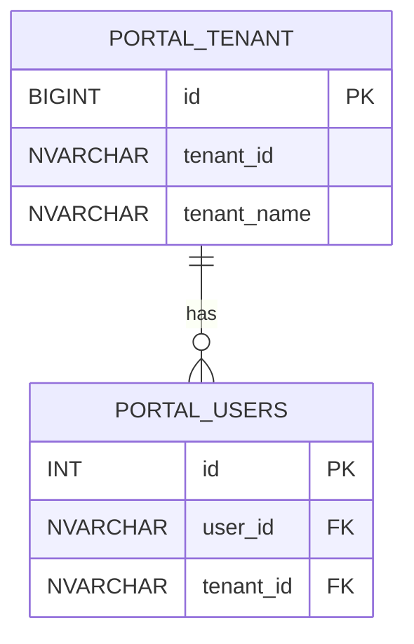

# Schema Visualization Guide

## 🎨 Visualizza il Database

Hai **3 modi** per visualizzare lo schema delle tabelle:

### 1. Mermaid ER Diagram (Raccomandato)
```bash
npm run visualize:mermaid
# Output: schema-diagram.mmd
```

**Come visualizzare:**
1. Copia contenuto di `schema-diagram.mmd`
2. Vai su https://mermaid.live
3. Incolla → vedi diagramma interattivo
4. Export PNG/SVG se serve

**Pro**: Interattivo, facile da condividere, integrato in GitHub/Markdown

### 2. HTML Documentation
```bash
npm run visualize:html
# Output: schema-docs.html
```

**Come visualizzare:**
- Apri `schema-docs.html` in browser
- Documentazione completa con tutte le colonne, tipi, constraint

**Pro**: Completo, stampabile, nessun tool esterno

### 3. D2 Diagram (Avanzato)
```bash
npm run visualize:d2
# Output: schema-diagram.d2

# Renderizza (richiede d2 CLI installato)
d2 schema-diagram.d2 schema.svg
```

**Pro**: Diagrammi molto belli, customizzabili

---

## 📊 EsempioOutput Mermaid

Il file `schema-diagram.mmd` contiene:


**Visualizza subito**: Copia questo in https://mermaid.live

---

## 🔍 Altre Opzioni

### Azure Data Studio
1. Connetti a `repos-easyway-dev.database.windows.net`
2. Espandi database → Tables
3. Click destro → "Design"

### SQL Server Management Studio (SSMS)
1. Connetti al database
2. Database Diagrams → New Diagram
3. Aggiungi tabelle

### Azure Portal
1. Portal → SQL Database → Query Editor
2. Esegui:
```sql
SELECT 
  TABLE_SCHEMA,
  TABLE_NAME,
  COLUMN_NAME,
  DATA_TYPE
FROM INFORMATION_SCHEMA.COLUMNS
ORDER BY TABLE_NAME, ORDINAL_POSITION;
```

---

## 💡 Integrazione con AI

L'AI può leggere direttamente il blueprint JSON:
```javascript
const schema = JSON.parse(
  await readFile('schema/easyway-portal.blueprint.json')
);

// AI può navigare lo schema programmaticamente
const tables = schema.tables.map(t => t.name);
const tenant_table = schema.tables.find(t => t.name === 'TENANT');
```

---

## 📝 Quick Commands

```bash
# Genera tutti i formati
npm run visualize:mermaid
npm run visualize:html
npm run visualize:d2

# Apri HTML in browser (Windows)
start schema-docs.html

# Copia Mermaid negli appunti (Windows)
Get-Content schema-diagram.mmd | clip
```

---

**File creato**: `schema-diagram.mmd` - già pronto da visualizzare su https://mermaid.live!
