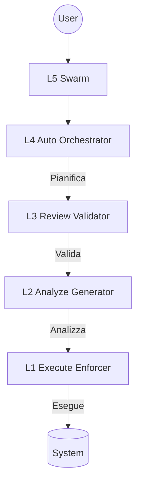
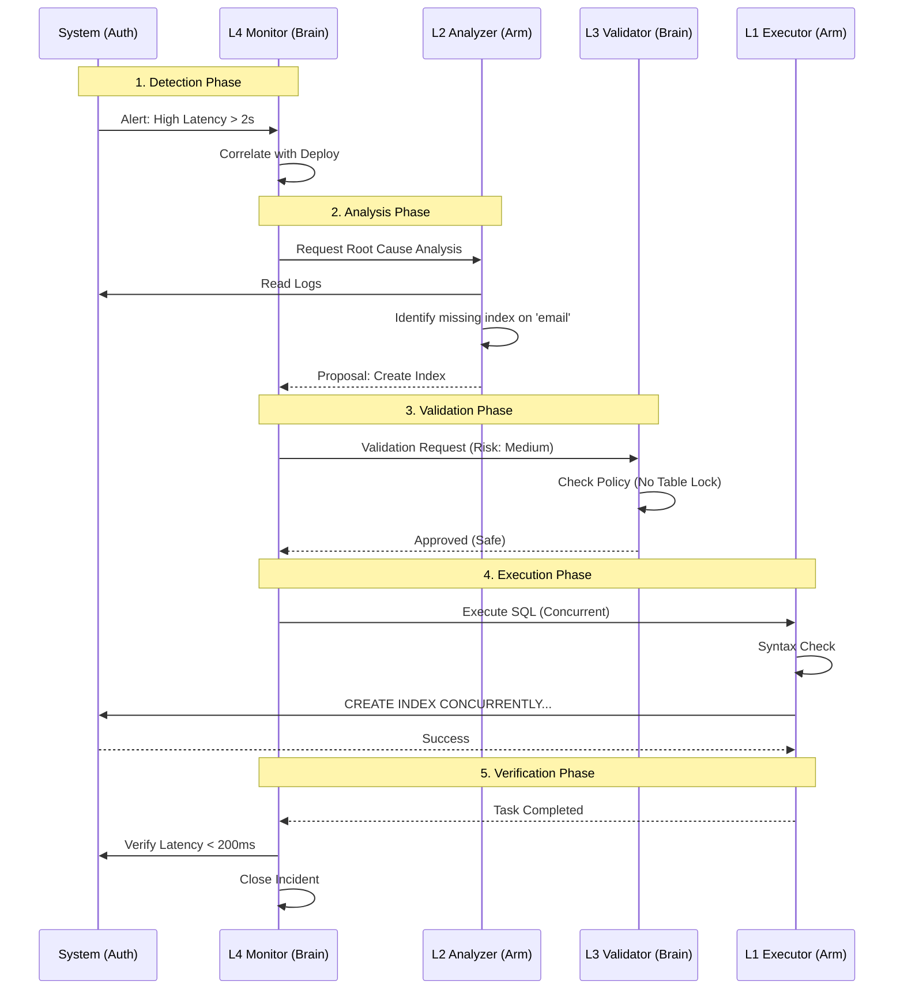

# AGENTIC_ARCHITECTURE_ENTERPRISE_STANDARD.md
## Enterprise Product Requirements Document
### Multi-Layer Agentic System

## 1. Executive Summary

Questo documento definisce in modo chiaro, strutturato e definitivo lo Standard Architetturale per sistemi agentici di livello Enterprise.
Stabilisce:
1.  **Definizione**: Cosa distingue un Agente da un'Automazione.
2.  **Tassonomia**: Classificazione universale per Ruolo (Brain/Arm) e Livello (L1-L5).
3.  **Governance**: Regole ferree di ingaggio, promozione e controllo.
4.  **KPI & Risk**: Framework di misurazione e mitigazione rischi.

**Obiettivo**: Costruire un sistema agentico enterprise-grade, stratificato, sicuro, auditabile e misurabile.
Questo documento è la “Bibbia” architetturale del modello.

---

## 2. Definizione di Agente Enterprise

Un **Agente** è un sistema software che:
1.  Riceve un input (task, evento, obiettivo)
2.  Prende decisioni (logica deterministica o probabilistica)
3.  Produce un’azione o un output

| Caratteristica | Automazione (Script) | Agente (AI) |
| :--- | :--- | :--- |
| **Input** | Strutturato e Rigido | Ambiguo (Linguaggio Naturale) |
| **Logica** | Deterministica (If/Then) | Probabilistica (Ragionamento + Contesto) |
| **Adattabilità** | Zero (Fail on Error) | Alta (Retry, Self-Correction, Alternative) |

### ⚠️ Reality Check: La Natura dell'LLM
> **Cruciale da capire**: Sotto il cofano, un Agente è guidato da un LLM (Large Language Model).
> *   Un LLM **NON è un database di verità**. È un motore probabilistico addestrato per **prevedere il prossimo token** (parola) in una sequenza.
> *   Il suo obiettivo primario è **completare il pattern** a qualsiasi costo. Se la risposta corretta non esiste nel suo training set o nel contesto fornito, l'LLM cercherà statisticamente il token più plausibile, rischiando di **inventarlo** ("Hallucination").
> *   Per questo motivo, un Agente **non può mai essere lasciato "libero"**. Deve essere ingabbiato da Prompt di Sistema, RAG (Retrieval Augmented Generation) e Guardrails deterministici.
> *   **L'AI non "sa", l'AI "genera".**

**Prova Concreta (The Seahorse Paradox):**
Se non ci credi, chiedi a un LLM: *"Mi dai l'emoji del cavalluccio marino?"*
Risposta tipica (Hallucinated):
> Certo! Ecco un po’ di cavallucci marini 🥰
> 🦔➡️ (ops no 😄)
> 🦭 (quasi…)
> Ecco quello giusto: 🦞… ancora no 😂
> Purtroppo non esiste un emoji ufficiale del cavalluccio marino 😢
> Però possiamo improvvisare così: 🌊🐴

Il modello *inventa* un percorso narrativo per giustificare l'assenza del token esatto, invece di rispondere semplicemente "Non esiste".
[Fonte: Reddit - Why ChatGPT hallucinates on Seahorse Emoji](https://www.reddit.com/r/de_EDV/comments/1o6taqk/wieso_hat_chatgpt_einen_anfall_wenn_man_nach/?tl=it)

**Non tutto ciò che viene chiamato “agent” è davvero un agente.**

---

## 3. Le Due Dimensioni Fondamentali

Per evitare confusione distinguiamo:
*   **3.1 Ruolo** = “Cosa Fa”
*   **3.2 Livello** = “Quanto È Evoluto”

Sono dimensioni indipendenti.

### 4. Ruolo (Classification)

#### **🧠 Brain (Strategico)**
*   **Responsabilità**: Decisioni, Pianificazione, Governance, Gestione conflitti.
*   **Output**: Policy, Direttive, Approvazioni, Piani.
*   **Esempi**: `agent_governance`, `agent_scrummaster`, `agent_cartographer`.

#### **💪 Arm (Esecutivo)**
*   **Responsabilità**: Scrivere codice, Deployare infrastruttura, Eseguire controlli, Applicare fix.
*   **Output**: Codice, Terraform, Report, Azioni operative.
*   **Esempi**: `agent_backend`, `agent_infra`, `agent_audit`.

---

## 5. Livelli Evolutivi (Con Esempi Concreti)

### **L1 — Scripted Agent (Il "Robot")**
*   **Logica**: Deterministica (100%). Nessuna intelligenza/memoria.
*   **Uso Ideale**: Enforcement, Validazioni, Controlli critici.
*   **📝 Esempio Concreto**:
    > *Scenario: Pre-Deploy Check.*
    > L'agente riceve il comando `deploy`. Controlla se `package.json` esiste e se i test passano. Se manca un file, blocca tutto ed esce con errore.
    > *"Non penso, eseguo regole."*

### **L2 — LLM-Augmented Agent (Lo "Stagista")**
*   **Logica**: Probabilistica (LLM + RAG). Ragiona una volta (Single Shot).
*   **Limite**: Non si auto-corregge. La qualità dipende dal primo tentativo.
*   **Uso Ideale**: Analisi log, Generazione codice, Classificazione.
*   **📝 Esempio Concreto**:
    > *Scenario: Incident Analysis.*
    > L'agente riceve un log di errore "500 Internal Server Error". Legge lo stacktrace, consulta la Wiki (RAG) e suggerisce: *"Sembra mancare la variabile DB_HOST nell'ambiente"*.
    > *"Ho un'intuizione basata sui dati, ma potrei sbagliare."*

### **L3 — Self-Improving Agent (L'"Esperto")**
*   **Logic**: Generate → Evaluate → Refine.
*   **Caratteristiche**: Auto-valutazione, Quality scoring, Working memory.
*   **Uso Ideale**: Revisione codice, Validazione soluzioni, QA.
*   **📝 Esempio Concreto**:
    > *Scenario: Bug Fix.*
    > L'agente scrive una patch per un bug. Prima di darti il codice, scrive un test unitario e lo esegue.
    > *Tentativo 1*: Il test fallisce.
    > *Azione*: L'agente legge l'errore, riscrive la patch.
    > *Tentativo 2*: Il test passa.
    > *"Ti consegno il codice solo ora che sono sicuro funzioni."*

### **L4 — Fully Autonomous Agent (Il "Manager")**
*   **Caratteristiche**: Memoria persistente, Budget awareness, Stop-loss, Trigger automatici (Watchdog).
*   **Uso Ideale**: Ottimizzazione continua, Incident response, Monitoring attivo.
*   **📝 Esempio Concreto**:
    > *Scenario: Cost Optimization.*
    > L'agente monitora i costi AWS per una settimana. Nota che un database RDS è sottoutilizzato di notte.
    > *Azione*: Pianifica uno scale-down automatico ogni sera alle 22:00 e un ripristino alle 07:00. Esegue e monitora il risparmio ($500/mese).
    > *"Gestisco il budget e ottimizzo le risorse proattivamente."*

### **L5 — Collective Intelligence (Lo "Sciame")**
*   **Caratteristiche**: Coordinazione dinamica, Ruoli emergenti, Collaborazione distribuita.
*   **Stato**: Sperimentale.
*   **📝 Esempio Concreto**:
    > *Scenario: Cyber Attack Defense.*
    > Sotto attacco DDoS massivo. 100 micro-agenti si attivano e si coordinano senza un capo.
    > 20 analizzano i pacchetti, 50 aggiornano le regole firewall su nodi diversi, 30 comunicano con gli ISP.
    > *"Agiamo come un organismo unico per sopravvivere."*

---

## 6. Intersezione Ruolo × Livello

| | **L1 (Script)** | **L2 (LLM)** | **L3 (Reflective)** | **L4 (Autonomous)** |
| :--- | :--- | :--- | :--- | :--- |
| **🧠 Brain** | ⚠ **Rigido** | ✅ **Manager** | 👑 **Architetto Evoluto** | 🔮 **Visionario** |
| **💪 Arm** | ✅ **Solido** | ⚡ **Potenziato** | 🚀 **Autonomo Controllato** | 🧞 **Esperto** |

**Regola Fondamentale**: I Brain critici (Governance) non devono rimanere L1.

---

## 7. Architettura Stratificata (Core Design)

Un sistema maturo NON sostituisce i livelli inferiori. Li **orchestra**.

**Regola d'Oro**: L1 è sempre l’ultimo step prima dell’azione.
L'orchestrazione dall'alto fornisce intelligenza; l'esecuzione dal basso fornisce sicurezza.

---

## 8. Flusso Sicuro di Esecuzione (Safe Execution Flow)

Esempio: **Fix automatico su modulo Auth**

**Principio**: Separazione dei poteri. Chi decide non esegue ciecamente.

---

## 9. Anti-Pattern: Il "Super Agent"

**Da EVITARE**: Architettura monolitica.
*   *SuperAgent* che Analizza, Decide, Esegue e si Auto-valida tutto insieme.

**Rischi**:
*   Single point of failure.
*   Nessuna separazione di responsabilità (Conflitto di interessi).
*   Difficile da auditare.
*   Costi incontrollati.
*   Rischio produzione elevato.

---

## 10. Enterprise Governance Framework

### 10.1 RBAC-A (Role-Based Agent Control)
Ogni agente deve avere definiti:
*   Ruolo (Brain/Arm)
*   Livello (L1-L5)
*   Permessi (Read/Write path)
*   Ambiente autorizzato (Dev/Prod)
*   Budget massimo

### 10.2 Deterministic Gatekeeping
Ogni azione irreversibile (Deployment, Delete) richiede check precisi (L1):
*   Verifica ambiente.
*   Verifica backup esistente.
*   Verifica whitelist.
*   Verifica policy.

### 10.3 Budget & Stop-Loss
Ogni Agente Autonomo (L4+) deve avere:
*   Budget massimo (Token/$).
*   Timeout rigido.
*   Max recursion depth.
*   **Kill switch** globale.

---

## 11. Risk & Compliance Matrix

| Categoria Rischio | Descrizione | Mitigazione Mandatoria |
| :--- | :--- | :--- |
| **Operational Risk** | Errori di esecuzione, crash. | **L1 Mandatory**: L'esecuzione finale deve essere deterministica. |
| **Financial Risk** | Costi incontrollati (loop). | **Cost Cap + Rate Limit**: Stop-loss a livello di API Gateway. |
| **Cognitive Risk** | Allucinazioni, logica errata. | **L3 Scoring + Human Escalation**: Se confidence < soglia, ferma. |
| **Compliance Risk** | Violazione dati, GDPR. | **Data Masking + Audit Trail**: Log immutabili di ogni decisione. |

### 11.1 The Human Safety Net (Disclaimer)
> **⚠️ NOTA BENE**: L'architettura a livelli e i guardrails (L1, Stop-Loss, RBAC) mitigano drasticamente i rischi operativi e finanziari, ma **NON eliminano la necessità di supervisione umana**.
> *   L'AI è uno strumento di potenziamento, non di sostituzione della responsabilità.
> *   Il **Giudizio Umano** rimane l'ultima linea di difesa per ambiguità etiche, strategiche o impreviste ("Black Swans").
> *   L'automazione si ferma dove inizia l'incertezza.

---

## 12. KPI Framework (Misurare il Successo)

### Technical KPIs
*   **Accuracy Rate**: % task completati correttamente al primo colpo.
*   **Self-Correction Rate**: % errori corretti autonomamente (L3).
*   **Mean Resolution Time**: Tempo medio per task.
*   **Unsafe Action Block Rate**: Quante azioni pericolose sono state bloccate dai Gatekeeper L1.

### Governance KPIs
*   **Audit Coverage**: 100% (Non negoziabile).
*   **Explainability**: ≥ 95% (Ogni azione deve avere un "Perché").
*   **Rollback Time**: < 15 min.

### Financial KPIs
*   **Cost per Task**: Costo medio ($).
*   **Stop-Loss Activation**: 100% successo nei test di sforamento.

### Safety KPIs
*   **Hallucination Detection**: ≥ 70% rilevate da L3 Validator.
*   **Escalation Accuracy**: ≥ 90% (L'agente chiede aiuto quando serve davvero).

---

## 13. Promotion Criteria (Roadmap di Evoluzione)

### L2 → L3 (The Reliability Jump)
*   ≥ 25% riduzione errori rispetto a L2.
*   ≥ 90% stabilità dello score di auto-valutazione.

### L3 → L4 (The Autonomy Jump)
*   **Budget Compliance**: 100% (Mai sforato budget).
*   **Zero Incidenti Distruttivi**: 7 giorni in Sandbox senza rompere nulla.
*   Miglioramento continuo delle metriche senza intervento umano.

---

## 14. Infrastructure Safeguards

**Mandatory per Enterprise Readiness**:
1.  **Immutable Logs**: Audit trail inalterabile.
2.  **Kill Switch Globale**: Un bottone rosso per fermare tutto.
3.  **Sandbox First Policy**: Nessun L4 in Prod senza certificazione Sandbox.
4.  **Replay Capability**: Possibilità di riprodurre ogni esecuzione per debug.
5.  **Max Parallel Threads**: Limite di concorrenza per evitare DoS interni.

---

## 15. Strategic Roadmap

*   **Phase 1**: Stabilizzare L3 (Focus: Affidabilità e Self-Correction). Formalizzare scoring.
*   **Phase 2**: L4 in Sandbox (Focus: Autonomia e Memoria a Lungo Termine).
*   **Phase 3**: Esperimenti L5 (Focus: Coordinazione Sciame).

---

## 16. Strategic Principles (The Manifesto)

Un sistema agentico maturo:
1.  **Non centralizza potere** (Architettura distribuita).
2.  **Non elimina L1** (Il determinismo è sicurezza).
3.  **Non idolatra L4** (L'autonomia senza controllo è pericolo).
4.  **Non opera senza Audit**.
5.  **Non opera senza Budget**.

---

## 17. Appendice: Glossario

*   **Agente**: Sistema decisionale software.
*   **LLM**: Large Language Model.
*   **RAG**: Retrieval Augmented Generation.
*   **Gatekeeper**: Livello deterministico di controllo (L1).
*   **Stop-loss**: Limite automatico di costo finanziario.
*   **Agentic PRD**: Specifica tecnica per validare Agenti L3.

---

## 18. Final Statement

La maturità agentica non è avere l’agente più intelligente.
È avere:
*   **Architettura**
*   **Stratificazione**
*   **Controllo**
*   **Metriche**
*   **Governance**
*   **Sicurezza**

Un sistema agentico enterprise-ready è un **ecosistema**. Non un Super Agente.