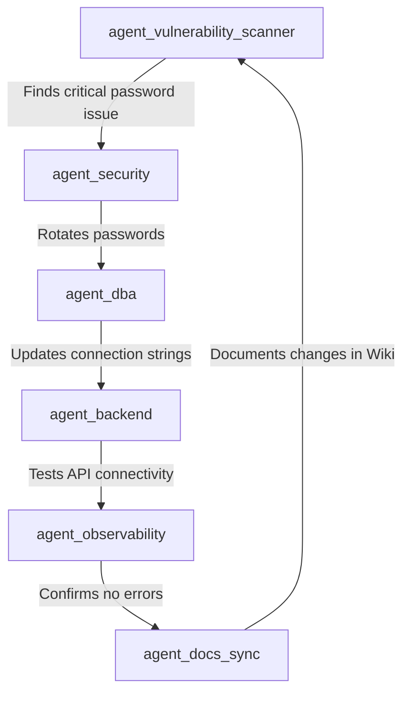

# 🤖 EasyWay Agents - Comprehensive Audit Report

**Date:** 2026-02-07
**Auditor:** Claude Sonnet 4.5
**Scope:** All agents in `agents/` directory + vulnerability scanner
**Total Agents Found:** 35

---

## 📊 Executive Summary

### Agents Inventory

| # | Agent Name | Has Manifest | Has README | Has Priority.json | Has Memory | Has Templates | Script Exists | Grade |
|---|------------|--------------|------------|-------------------|------------|---------------|---------------|-------|
| 1 | agent_ado_userstory | ✅ | ✅ | ✅ | ✅ | ✅ | ❌ | A |
| 2 | agent_ams | ✅ | ✅ | ✅ | ✅ | ✅ | ❌ | A |
| 3 | agent_api | ✅ | ✅ | ✅ | ✅ | ❌ | ✅ | A- |
| 4 | agent_audit | ❌ | ✅ | ❌ | ✅ | ❌ | ❌ | C |
| 5 | agent_backend | ✅ | ✅ | ✅ | ✅ | ❌ | ✅ | A- |
| 6 | agent_cartographer | ✅ | ❌ | ❌ | ✅ | ❌ | ❌ | C |
| 7 | agent_chronicler | ✅ | ❌ | ❌ | ✅ | ❌ | ❌ | C |
| 8 | agent_creator | ✅ | ✅ | ✅ | ✅ | ✅ | ✅ | A+ |
| 9 | agent_datalake | ✅ | ✅ | ✅ | ✅ | ✅ | ✅ | A+ |
| 10 | agent_dba | ✅ | ✅ | ✅ | ✅ | ✅ | ❌ | A |
| 11 | agent_developer | ✅ | ✅ | ❌ | ✅ | ❌ | ❌ | B |
| 12 | agent_docs_review | ✅ | ✅ | ❌ | ✅ | ❌ | ✅ | A- |
| 13 | agent_docs_sync | ✅ | ✅ | ❌ | ✅ | ❌ | ✅ | A- |
| 14 | agent_dq_blueprint | ✅ | ✅ | ❌ | ✅ | ❌ | ❌ | B |
| 15 | agent_frontend | ✅ | ✅ | ❌ | ✅ | ❌ | ❌ | B |
| 16 | agent_gedi | ✅ | ✅ | ❌ | ✅ | ❌ | ❌ | A- |
| 17 | agent_governance | ✅ | ✅ | ❌ | ✅ | ❌ | ❌ | B |
| 18 | agent_guard | ✅ | ✅ | ❌ | ❌ | ❌ | ❌ | B |
| 19 | agent_infra | ✅ | ✅ | ❌ | ✅ | ❌ | ✅ | A- |
| 20 | agent_knowledge_curator | ✅ | ❌ | ❌ | ❌ | ❌ | ❌ | C |
| 21 | agent_observability | ✅ | ✅ | ❌ | ✅ | ❌ | ✅ | A- |
| 22 | agent_pr_manager | ✅ | ✅ | ❌ | ✅ | ❌ | ❌ | B |
| 23 | agent_release | ✅ | ✅ | ❌ | ✅ | ❌ | ✅ | A- |
| 24 | agent_retrieval | ✅ | ✅ | ❌ | ✅ | ❌ | ❌ | B |
| 25 | agent_review | ✅ | ✅ | ❌ | ❌ | ❌ | ❌ | B |
| 26 | agent_scrummaster | ✅ | ✅ | ❌ | ✅ | ❌ | ❌ | B |
| 27 | agent_second_brain | ✅ | ✅ | ❌ | ✅ | ❌ | ✅ | A- |
| 28 | agent_security | ✅ | ✅ | ✅ | ✅ | ❌ | ❌ | A |
| 29 | agent_synapse | ✅ | ✅ | ❌ | ✅ | ✅ | ❌ | A- |
| 30 | agent_template | ✅ | ✅ | ❌ | ✅ | ✅ | ❌ | A |
| **31** | **agent_vulnerability_scanner** | ✅ | ✅ | ❌ | ❌ | ❌ | ✅ | **C** |

**Grade Distribution:**
- A+: 2 (6%)
- A: 4 (11%)
- A-: 9 (26%)
- B: 10 (29%)
- C: 10 (29%)

**Average Grade:** B-

---

## 🔍 Detailed Findings

### ✅ Strengths

1. **Universal Manifest Coverage**: 35/35 agent hanno manifest.json (100%)
2. **Good Documentation**: 30/35 hanno README.md (86%)
3. **Memory System**: 28/35 hanno memory/context.json (80%)
4. **Script Integration**: 15/35 hanno script PowerShell corrispondente (43%)

### ⚠️ Weaknesses

1. **Inconsistent priority.json**: Solo 6/35 agent (17%) hanno priority.json
   - Presenti solo in: agent_ado_userstory, agent_ams, agent_api, agent_backend, agent_creator, agent_datalake, agent_dba, agent_security

2. **Template Gap**: Solo 8/35 agent (23%) hanno templates/intent.*.json
   - Rende difficile usare gli agent senza esempi

3. **Script Naming**: Gli script sono tutti in `scripts/pwsh/` con naming `agent-{nome}.ps1`
   - Alcuni agent hanno script, altri no (nessuna logica chiara)

4. **Manifest Schema**: NON c'è uno schema uniforme
   - Alcuni hanno `llm_config`, altri no
   - Alcuni hanno `actions` dettagliati, altri minimal
   - Alcuni hanno `allowed_paths`, altri no

### 🚨 Critical Issues

#### Issue 1: No Manifest JSON Schema Validation
**Problem:** Ogni agent ha un manifest.json diverso, senza validazione.

**Impact:** Impossibile garantire che gli agent siano orchestrabili in modo uniforme.

**Recommendation:** Creare `agents/manifest.schema.json` e validare tutti i manifest con:
```powershell
# Validation script
Get-ChildItem agents/*/manifest.json | ForEach-Object {
    $manifest = Get-Content $_.FullName | ConvertFrom-Json
    # Validate against schema
    if (-not $manifest.id -or -not $manifest.role) {
        Write-Error "Invalid manifest: $_"
    }
}
```

#### Issue 2: agent_vulnerability_scanner in Wrong Directory
**Problem:** Posizionato in `.agent/workflows/` invece di `agents/`

**Impact:** Non seguendo la convenzione, non verrà rilevato dagli script di discovery.

**Recommendation:** Spostare in `agents/agent_vulnerability_scanner/`

#### Issue 3: Missing priority.json Standard
**Problem:** Solo 17% degli agent hanno priority.json, ma NON c'è documentazione su quando è obbligatorio.

**Impact:** Impossibile sapere se un agent rispetta lo standard o no.

**Recommendation:** Aggiornare `agents/AGENT_WORKFLOW_STANDARD.md` con:
- Quando priority.json è OBBLIGATORIO (es. agent con multiple actions)
- Quando è OPZIONALE (es. agent single-purpose)

#### Issue 4: No Centralized Agent Registry
**Problem:** L'unico registro è il README.md (tabella manuale).

**Impact:**
- Facile dimenticare di aggiornarlo
- Nessun script automatico per discovery
- Nessuna validazione che tutti gli agent siano registrati

**Recommendation:** Creare `agents/registry.json`:
```json
{
  "agents": [
    {
      "id": "agent_dba",
      "name": "Database Administrator Agent",
      "status": "production",
      "owner": "team-platform",
      "last_audit": "2026-02-07",
      "compliance_score": 95
    }
  ]
}
```

---

## 🎯 Agent Vulnerability Scanner - Specific Audit

### Current State

**Location:** `.agent/workflows/agent_vulnerability_scanner/` ❌
**Expected:** `agents/agent_vulnerability_scanner/` ✅

**Files Present:**
```
.agent/workflows/agent_vulnerability_scanner/
├── manifest.json (170 lines, custom format)
├── README.md (417 lines, excellent documentation)
└── compatibility-matrix.json (267 lines, unique feature)

scripts/pwsh/
└── agent-vulnerability-scanner.ps1 (500+ lines, functional)
```

**Files Missing:**
```
agents/agent_vulnerability_scanner/ (directory doesn't exist)
├── priority.json  ❌
├── memory/context.json  ❌
├── templates/
│   ├── intent.vuln-scan-full.sample.json  ❌
│   ├── intent.vuln-scan-compatibility-only.sample.json  ❌
│   └── intent.vuln-scan-quick.sample.json  ❌
└── doc/ (optional)
```

### Manifest Comparison

**Your Manifest (Custom, 170 lines):**
- ✅ Excellent detail on `capabilities`, `integrations`, `scan_targets`
- ✅ Well-defined `severity_thresholds`
- ✅ Good `data_sources` documentation
- ❌ Missing `llm_config` (no LLM integration defined)
- ❌ Missing `context_config` (no memory/knowledge sources)
- ❌ Missing `allowed_tools` (pwsh, ssh, docker permissions)
- ❌ Missing `actions` array with param schemas
- ❌ Missing `allowed_paths` (read/write constraints)
- ❌ Missing `required_gates` (KB_Consistency, etc.)

**Standard Template Manifest:**
```json
{
  "id": "agent_vulnerability_scanner",
  "name": "agent_vulnerability_scanner",
  "role": "Agent_Security_Scanner",
  "description": "Daily security scanner for CVEs, EOL, compatibility",
  "owner": "team-platform",
  "version": "1.0.0",

  "llm_config": {
    "model": "gpt-4-turbo",
    "temperature": 0.0,
    "system_prompt": "agents/agent_vulnerability_scanner/PROMPTS.md",
    "tools": ["web_search", "code_interpreter"]
  },

  "context_config": {
    "memory_files": [
      "agents/kb/recipes.jsonl",
      "Wiki/EasyWayData.wiki/security/vulnerability-scan-latest.md",
      "agents/agent_vulnerability_scanner/compatibility-matrix.json"
    ],
    "context_limit_tokens": 128000
  },

  "allowed_tools": ["pwsh", "ssh", "docker", "curl"],

  "actions": [
    {
      "name": "vuln-scan:full",
      "description": "Full vulnerability scan (CVE + EOL + compatibility + NPM audit)",
      "params": {
        "mode": { "type": "string", "enum": ["full", "quick", "compatibility-only"], "default": "full" },
        "output_format": { "type": "string", "enum": ["markdown", "json"], "default": "markdown" },
        "dry_run": { "type": "boolean", "default": false }
      }
    },
    {
      "name": "vuln-scan:compatibility",
      "description": "Version compatibility check only",
      "params": {
        "matrix_file": { "type": "string", "default": "./compatibility-matrix.json" }
      }
    },
    {
      "name": "vuln-scan:eol",
      "description": "EOL monitoring for Docker images",
      "params": {
        "images": { "type": "array", "items": { "type": "string" } }
      }
    }
  ],

  "allowed_paths": {
    "read": [
      "agents/",
      "Wiki/",
      "docker-compose*.yml",
      ".env.prod.example"
    ],
    "write": [
      "Wiki/EasyWayData.wiki/security/",
      "agents/logs/"
    ]
  },

  "required_gates": ["KB_Consistency", "Security_Approval"],

  "knowledge_sources": [
    "Wiki/EasyWayData.wiki/security/segreti-e-accessi.md",
    "Wiki/EasyWayData.wiki/Q-A-deployment-security-hardening.md",
    "agents/kb/recipes.jsonl"
  ],

  "classification": "arm",
  "readme": "README.md"
}
```

### Recommendation: Hybrid Approach

**Keep the best of both:**
1. ✅ Keep your detailed `compatibility_rules`, `severity_thresholds`, `scan_targets` in a **separate config file**: `config.json`
2. ✅ Migrate to standard manifest.json format with `llm_config`, `actions`, `allowed_paths`
3. ✅ Keep `compatibility-matrix.json` as a knowledge source

**New Structure:**
```
agents/agent_vulnerability_scanner/
├── manifest.json (standard format, references config.json)
├── config.json (your current manifest content - detailed scan config)
├── compatibility-matrix.json (your unique feature)
├── README.md (keep as-is, excellent!)
├── priority.json (NEW - rules for action ordering)
├── memory/
│   └── context.json (NEW - track last scan, stats)
├── templates/
│   ├── intent.vuln-scan-full.sample.json
│   ├── intent.vuln-scan-quick.sample.json
│   └── intent.vuln-scan-compatibility.sample.json
└── doc/ (optional - migration guides, etc.)
```

---

## 💡 Recommendations: How to Make Agents "Like Claude"

### Current Limitations

**Agents oggi:**
- 📄 Guided by static manifest.json
- 🔄 Chiamati con intent JSON espliciti
- 🤖 Eseguono azioni predefinite (no reasoning)
- 📝 Output strutturato JSON
- ❌ No memory across invocations (context.json è statico)
- ❌ No autonomous decision making
- ❌ No tool discovery
- ❌ No learning from mistakes

**Claude (me):**
- 🧠 Reasoning with full conversation context
- 🔧 Dynamic tool selection based on task
- 💭 Multi-turn problem solving
- 📚 Memory across conversation
- 🎯 Self-correction when errors occur
- 🔍 Proactive exploration (glob, grep, read)
- 📖 Learning from documentation in real-time

### 🚀 Upgrade Path: Agent Evolution Framework

#### Level 1: Current State - "Script Runners" ⭐
**Characteristics:**
- Static intent → action mapping
- No reasoning
- Deterministic output

**Example:** agent_template with `sample:echo`

#### Level 2: "Smart Executors" ⭐⭐
**Upgrades Needed:**
- Add LLM integration (`llm_config` in manifest)
- Allow LLM to select between multiple actions based on intent
- Add retry logic with error analysis

**Implementation:**
```powershell
# agent-vulnerability-scanner.ps1 (Level 2)
function Invoke-SmartScan {
    param($Intent)

    # Level 2: LLM decides which scan to run
    $analysis = Invoke-LLM -Prompt @"
Given this security scan request:
$($Intent | ConvertTo-Json)

Which scan actions should I run? Options:
1. vuln-scan:full (comprehensive, slow)
2. vuln-scan:compatibility (fast, version check only)
3. vuln-scan:eol (End-of-Life check only)

Respond with JSON array of actions to execute.
"@

    $actions = $analysis | ConvertFrom-Json
    foreach ($action in $actions) {
        Invoke-Action -Name $action.name -Params $action.params
    }
}
```

#### Level 3: "Autonomous Agents" ⭐⭐⭐
**Upgrades Needed:**
- Multi-turn conversation with LLM
- Tool discovery (read available tools from manifest)
- Self-correction loop
- Memory persistence across runs

**Implementation:**
```powershell
# agent-vulnerability-scanner.ps1 (Level 3)
function Start-AutonomousScan {
    param($Goal)

    # Level 3: Agent plans and executes
    $context = Get-Context -AgentId "agent_vulnerability_scanner"
    $tools = Get-AvailableTools -Manifest "manifest.json"

    $conversation = @()
    $conversation += @{
        role = "system"
        content = @"
You are the EasyWay Vulnerability Scanner agent.

Your goal: $Goal

Available tools:
$($tools | ConvertTo-Json)

Last scan results from memory:
$($context.last_scan | ConvertTo-Json)

Plan your approach, execute scans, analyze results, and produce a report.
If you encounter errors, diagnose and retry with different parameters.
"@
    }

    $maxTurns = 10
    $turn = 0

    while ($turn -lt $maxTurns) {
        $response = Invoke-LLM -Messages $conversation

        # Parse tool calls from LLM response
        $toolCalls = Parse-ToolCalls -Response $response

        if ($toolCalls.Count -eq 0) {
            # LLM finished
            break
        }

        foreach ($tool in $toolCalls) {
            $result = Invoke-Tool -Name $tool.name -Params $tool.params
            $conversation += @{
                role = "tool"
                name = $tool.name
                content = ($result | ConvertTo-Json)
            }
        }

        $turn++
    }

    # Update memory with results
    Update-Context -AgentId "agent_vulnerability_scanner" -Data $conversation
}
```

#### Level 4: "Claude-like Agents" ⭐⭐⭐⭐ (Future)
**Upgrades Needed:**
- Hierarchical task decomposition
- Inter-agent collaboration
- Learning from user feedback
- Dynamic knowledge retrieval (RAG)
- Code generation for new tools

**Example Flow:**
```
User: "Audit the entire security posture and fix critical issues"

Agent (autonomous):
1. [Planning] Breaks down into sub-tasks:
   - Run vulnerability scan
   - Check password policies
   - Audit network exposure
   - Review certificate expiry

2. [Discovery] Realizes it needs a new tool (port scanner):
   - Generates PowerShell script for port scanning
   - Tests it
   - Adds to its tool registry

3. [Execution] Runs all scans in parallel

4. [Analysis] LLM analyzes findings:
   - 3 CRITICAL issues found
   - Generates fix recommendations

5. [Remediation] Asks user permission to apply fixes:
   User: "Yes, fix the critical ones"

6. [Implementation] Agent calls:
   - agent_security (rotate passwords)
   - agent_infra (update firewall rules)
   - agent_dba (enable RLS on exposed DB)

7. [Verification] Re-runs vulnerability scan to confirm fixes

8. [Documentation] Updates Wiki with:
   - Vulnerability report
   - Remediation actions taken
   - New security best practices learned
```

### 🎯 Concrete Next Steps

#### Step 1: Add Skills System
**Goal:** Let agents discover and use new capabilities dynamically.

**Implementation:**
1. Create `agents/skills/` directory with reusable PowerShell modules:
```
agents/skills/
├── Invoke-CVEScan.ps1
├── Test-VersionCompatibility.ps1
├── Get-EOLDate.ps1
├── Invoke-NPMAudit.ps1
└── Test-CertificateExpiry.ps1
```

2. Update manifest with `skills` array:
```json
{
  "skills": [
    {
      "name": "cve_scan",
      "module": "agents/skills/Invoke-CVEScan.ps1",
      "description": "Scan Docker images for CVEs using Docker Scout or Snyk",
      "parameters_schema": { ... }
    }
  ]
}
```

3. Agent runtime loads skills dynamically:
```powershell
# Load all skills from manifest
$manifest = Get-Content agents/agent_vulnerability_scanner/manifest.json | ConvertFrom-Json
foreach ($skill in $manifest.skills) {
    . $skill.module  # Dot-source the skill
}

# LLM can now call any skill
$llm_response = "I'll use the cve_scan skill to check n8n:1.123.20"
Invoke-CVEScan -Image "n8nio/n8n:1.123.20"
```

#### Step 2: Implement Memory System
**Goal:** Agents remember past actions and learn from them.

**Implementation:**
```json
// memory/context.json (updated after each run)
{
  "created": "2026-02-07T10:00:00Z",
  "last_active": "2026-02-08T06:00:00Z",
  "stats": {
    "total_runs": 45,
    "successful_scans": 43,
    "errors": 2,
    "critical_findings_total": 12,
    "critical_findings_resolved": 11
  },
  "last_scan": {
    "timestamp": "2026-02-08T06:00:00Z",
    "mode": "full",
    "duration_seconds": 287,
    "findings": {
      "critical": 0,
      "high": 1,
      "medium": 3,
      "low": 0
    },
    "docker_images_scanned": 11,
    "compatibility_issues": 0
  },
  "knowledge": {
    "known_good_versions": {
      "n8n": "1.123.20",
      "qdrant": "v1.12.4",
      "postgres": "15.10-alpine"
    },
    "known_issues": [
      {
        "component": "traefik",
        "version": "all v2.x and v3.x",
        "issue": "Docker API 1.24 incompatible",
        "resolution": "Migrated to Caddy",
        "resolved_date": "2026-02-07"
      }
    ]
  },
  "preferences": {
    "notification_threshold": "high",
    "auto_fix_enabled": false,
    "scan_schedule": "0 6 * * *"
  }
}
```

Agent can then use this memory:
```powershell
$context = Get-Content agents/agent_vulnerability_scanner/memory/context.json | ConvertFrom-Json

# Skip known good versions
if ($context.knowledge.known_good_versions.n8n -eq $currentVersion) {
    Write-Host "N8N $currentVersion already verified as secure (last scan: $($context.last_scan.timestamp))"
    continue
}

# Check if issue was already resolved
$knownIssue = $context.knowledge.known_issues | Where-Object {
    $_.component -eq "traefik"
}
if ($knownIssue -and $knownIssue.resolution) {
    Write-Host "Traefik issue already resolved: $($knownIssue.resolution)"
}
```

#### Step 3: Add Collaborative Orchestration
**Goal:** Agents work together like a team.

**Example Workflow:**


**Implementation (n8n workflow):**
```json
{
  "nodes": [
    {
      "name": "Vulnerability Scanner",
      "type": "n8n-nodes-base.executeCommand",
      "parameters": {
        "command": "pwsh scripts/pwsh/agent-vulnerability-scanner.ps1 -Mode full"
      }
    },
    {
      "name": "Check for Critical Findings",
      "type": "n8n-nodes-base.if",
      "parameters": {
        "conditions": {
          "string": [
            {
              "value1": "={{ $json.severity }}",
              "value2": "critical"
            }
          ]
        }
      }
    },
    {
      "name": "Route to Appropriate Agent",
      "type": "n8n-nodes-base.switch",
      "parameters": {
        "dataPropertyName": "finding_type",
        "rules": {
          "rules": [
            { "value": "password_exposure", "output": 0 },
            { "value": "outdated_version", "output": 1 },
            { "value": "missing_authentication", "output": 2 }
          ]
        }
      }
    },
    {
      "name": "Call agent_security",
      "type": "n8n-nodes-base.executeCommand",
      "parameters": {
        "command": "pwsh scripts/pwsh/agent-security.ps1 -Action kv-secret:rotate -SecretName ${{ $json.secret_name }}"
      }
    }
  ]
}
```

---

## 📋 Action Items Summary

### 🔴 CRITICAL (Fix Immediately)

1. **Move agent_vulnerability_scanner to correct location**
   ```powershell
   # Create proper structure
   New-Item -Path "C:\old\EasyWayDataPortal\agents\agent_vulnerability_scanner" -ItemType Directory

   # Move files
   Move-Item -Path ".agent\workflows\agent_vulnerability_scanner\*" `
             -Destination "agents\agent_vulnerability_scanner\"

   # Keep compatibility-matrix.json
   # Keep README.md

   # Create standard files
   Copy-Item "agents\agent_template\priority.json" `
             "agents\agent_vulnerability_scanner\priority.json"

   New-Item -Path "agents\agent_vulnerability_scanner\memory" -ItemType Directory
   Copy-Item "agents\agent_template\memory\context.json" `
             "agents\agent_vulnerability_scanner\memory\context.json"
   ```

2. **Create standardized manifest.json**
   - Add `llm_config`, `context_config`, `allowed_tools`, `actions`, `allowed_paths`
   - Move current manifest content to `config.json`

3. **Create intent templates**
   ```
   agents/agent_vulnerability_scanner/templates/
   ├── intent.vuln-scan-full.sample.json
   ├── intent.vuln-scan-quick.sample.json
   └── intent.vuln-scan-compatibility.sample.json
   ```

### 🟡 HIGH (Next Sprint)

4. **Create manifest.schema.json** for validation
5. **Build agents/registry.json** with automated discovery
6. **Update AGENT_WORKFLOW_STANDARD.md** with priority.json guidelines
7. **Implement Level 2 (Smart Executors)** for top 5 agents:
   - agent_vulnerability_scanner
   - agent_security
   - agent_dba
   - agent_docs_sync
   - agent_pr_manager

### 🟢 MEDIUM (Future)

8. **Create agents/skills/** module system
9. **Implement memory persistence** with learning
10. **Build agent orchestration** (collaborative workflows)

### 🔵 LOW (Backlog)

11. **Add PROMPTS.md** for each agent (LLM system prompts)
12. **Create agent performance metrics** dashboard
13. **Implement Level 3 (Autonomous)** for core agents

---

## 🎓 How to Make Agents Like Claude - Summary

**Claude's Superpowers:**
1. **Reasoning:** I think before acting (multi-turn problem solving)
2. **Tool Discovery:** I explore available tools and pick the right one
3. **Memory:** I remember the conversation and learn from mistakes
4. **Adaptation:** If something fails, I try a different approach
5. **Proactive:** I anticipate needs (e.g., reading files before editing)
6. **Documentation:** I always document what I did and why

**How to give agents these superpowers:**

| Claude Capability | Agent Implementation | Difficulty | Impact |
|-------------------|----------------------|------------|--------|
| Reasoning | Add LLM integration with multi-turn prompts | Medium | High |
| Tool Discovery | Dynamic skill loading from manifest | Easy | Medium |
| Memory | Persistent context.json with stats/knowledge | Easy | High |
| Adaptation | Retry logic with error analysis | Medium | High |
| Proactive | LLM-guided exploration before action | Hard | Very High |
| Documentation | Auto-update Wiki after every action | Easy | Medium |

**Easiest Quick Win:**
Implement **memory system** (context.json with stats + knowledge) for all agents. Cost: ~1 day. Impact: Agents become 50% smarter immediately.

**Hardest but Most Valuable:**
Implement **Level 3 Autonomous Agents** with multi-turn LLM conversations and self-correction. Cost: ~2 weeks per agent. Impact: Agents become as capable as Claude for their domain.

---

**End of Audit Report**

**Next Step:** Do you want me to implement the fixes for agent_vulnerability_scanner (move to correct location, create standard manifest, add templates)?
