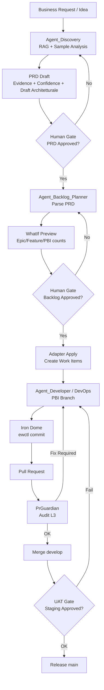
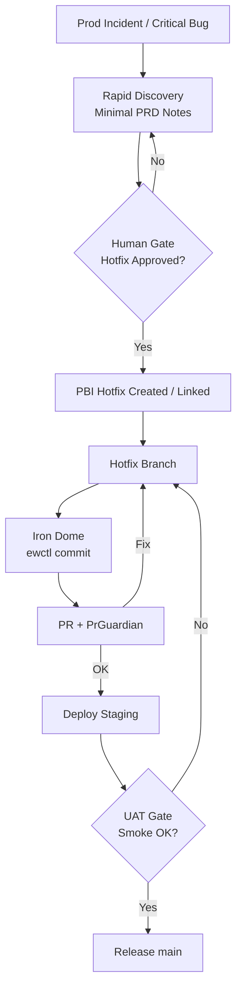

# EASYWAY Agentic SDLC - Master Consolidato

Versione: 2.0
Data consolidamento: 2026-02-21
Fonte: merge di USECASE_EASYWAY_AGENTIC_SDLC_NARRATIVE.md + ANALISI_SDLC_AGENTE.md

---

> Nota: questo e' il documento di riferimento unico per SDLC agentico EasyWay.

---
# Use Case Narrative: EasyWay Agentic SDLC
Versione: 1.1  
Data: 2026-02-20  
Owner: Giuseppe Belviso  

---

## Indice
1. Il Problema (perché serve)  
2. L’Intuizione (cosa cambiamo)  
3. La Regola Sovrana (Sovereign Law)  
4. Il Flusso end-to-end (storia completa)  
5. Il “Capire” iniziale (la differenza vera)  
6. Meccanismo anti-allucinazione: Evidence & Confidence  
7. Scenari operativi (come si comporta nella realtà)  
8. Rischi e mitigazioni (perché è governabile)  
9. Valore (perché è interessante)  
10. Roadmap tecnica (cosa svilupperemo dopo)  
11. Platform Adapter Pattern (ADO, GitHub, Atlassian, Forgejo, Witboost)  
12. Benchmark di mercato (rispetto all'elenco target)  
Appendice A: Diagrammi (flow & guardrails)  
Appendice B: Talking points (frasi pronte per presentazione)  

---

## 1. Il Problema (perché serve)
Nelle organizzazioni enterprise il passaggio dal bisogno di business alla produzione è lento e fragile, perché attraversa tre colli di bottiglia ricorrenti:

1. **Richieste vaghe** → diventano backlog “a sentimento”.  
2. **Overhead amministrativo** (ADO / processi) → rallenta più dello sviluppo.  
3. **Rischi operativi** (security, policy, audit) → emergono tardi, quando è costoso correggere.  

**Risultato:** si perde tempo in coordinamento invece che in delivery, e la conformità diventa una fase reattiva (non progettata).

---

## 2. L’Intuizione (cosa cambiamo)
L’intuizione è trattare gli agenti non come “developer automatici”, ma come **uno SDLC agentico** dove:

- l’agente **capisce** prima di fare;  
- produce un PRD che non è un elenco task, ma un **rationale architetturale**;  
- genera backlog e codice **solo dopo** gate umani e guardrail di piattaforma.  

> In altre parole: l’agente agisce come **Solution Architect** prima ancora di diventare Developer o Scrum Master.

---

## 3. La Regola Sovrana (Sovereign Law)
Il sistema è costruito su una legge non negoziabile:

- Non si bypassano policy di branch e audit.  
- Non si bypassa l’Iron Dome (`ewctl commit`).  
- Il merge su `main` resta protetto.  
- I gate umani restano obbligatori nei punti critici.  

Gli agenti accelerano il ciclo, ma **non rimuovono governance**.

---

## 4. Il Flusso end-to-end (storia completa)

### 4.1 Fase 1 — Discovery & PRD Formulation
**Agente:** `Agent_Discovery`  
**Scopo:** trasformare richieste vaghe in un PRD strutturato e verificabile.

**Cosa fa davvero:**
- RAG obbligatorio su Wiki + repository (no “tabula rasa”).  
- Analisi sample dati (prima di ipotizzare mapping/logiche).  
- Produzione PRD con sezione **IL RAGIONAMENTO** come cuore decisionale.  

**Output:** PRD con:
- Evidence (fonti)  
- Confidence score (High/Medium/Low)  
- Draft architetturale (3 pilastri)  
- Impatto + rollback  

✅ **Gate umano:** il PRD deve essere validato dall’umano prima di passare ad ADO.

---

### 4.2 Fase 2 — Decomposizione Backlog (via Platform Adapter)
**Agente:** `Agent_Backlog_Planner`  
**Scopo:** ridurre overhead amministrativo e creare backlog coerente.

**Cosa fa davvero:**
- Parsing PRD → Epic / Feature / PBI / Task  
- Mostra un **WhatIf Preview** (es. “sto per creare 1 Epic, 3 Feature, 12 PBI”)  
- Applica su ADO/GitHub/Atlassian/Forgejo solo dopo conferma umana  

✅ **Gate umano:** Backlog Check.

---

### 4.3 Fase 3 — Esecuzione Sprint (delivery sicura)
**Agenti:** `Agent_Developer` / `Agent_DevOps`

**Cosa fa davvero:**
- Branch per PBI  
- `ewctl commit` (Iron Dome)  
- PR + audit L3 con `PrGuardian`  
- Merge su develop  
- UAT Gate umano in staging  
- Release su main  

✅ **Gate umano:** UAT obbligatorio.

---

### 4.4 Processo operativo EasyWay (versione pratica)
Questa e' la traduzione operativa del flusso, pensata per il caso reale: requisito espresso in linguaggio naturale, costruzione PRD, decomposizione backlog via adapter e sprint execution.

#### Fase 1: Discovery/PRD (solo preparazione)
**Input:** requisito in linguaggio naturale (es. caricamento saldi da fonti esterne + fatture cloud, ingest via interfaccia EasyWay tipo Excel, aggregazione e condivisione su portale).  
**Agente:** `Requirement/Design Agent` con RAG su EasyWay (Wiki + repo + standard).  
**Output:** `PRD` + `High Level Design` con:
- obiettivo business;
- fonti dati esterne + cloud/fatture;
- mapping campi (es. template Excel EasyWay);
- regole data quality (controlli, soglie, dedup, error handling);
- frequenza caricamento/refresh;
- interfaccia portale e logiche di aggregazione;
- sicurezza, permessi, audit, condivisione;
- impatti tecnici (API, DB, frontend, ETL, governance).

✅ **Gate:** validazione umana IT/business.

#### Fase 2: Decomposizione Backlog (adapter)
**Input:** PRD validato.  
**Agente:** `Scrum Master / Backlog planner`.  
**Output:** `Epic -> Feature -> PBI -> Task` sulla piattaforma target (ADO, GitHub, Atlassian, Forgejo).  
**Modalita':** `WhatIf` prima, `Apply` solo dopo approvazione utente.

✅ **Gate:** validazione umana backlog.

#### Fase 3: Esecuzione Sprint
- Classificazione task: `AI-automatable` vs `human-only`;
- pianificazione sprint e collegamento al flusso esistente (`feature -> develop -> main`);
- applicazione dei gate qualita' gia' presenti (audit, branch policy, PR gates, UAT).

✅ **Gate:** quality/release gates di piattaforma + approvazioni umane previste.

**Nota terminologica ADO:** usare `Feature` (non "future").

---

## 5. Il “Capire” iniziale (la differenza vera)
Il valore del use case sta qui: la Discovery non è “analisi generica”.  
È un ragionamento strutturato su 3 pilastri.

### A) Dependency Discovery (quali oggetti toccare?)
L’agente mappa l’impatto reale tramite RAG:
- codice esistente / agenti simili;  
- tabelle e data lineage;  
- runbook e policy da aggiornare.  

**Obiettivo:** evitare l’effetto “tabula rasa”.

### B) Tech Stack Advisory (quale tecnologia usare?)
Non sceglie a caso: segue standard EasyWay (Sovereign Law)
- PowerShell per Windows/infra  
- Python per AI/Data  
- Node.js per servizi leggeri  
- SQL Server per relazionale  
- Qdrant per vettori  

### C) Infrastructure Blueprinting (dove atterrare?)
Decide il runtime in base al tipo di task:
- Static Land → Nginx static  
- Dynamic Land → Docker (EasyWay Runner)  
- Service Land → N8N / API Gateway  

---

## 6. Meccanismo anti-allucinazione: Evidence & Confidence
Ogni decisione architetturale deve avere:
- **Evidence**: dove l’ha trovata (wiki, repo, runbook).  
- **Confidence**: High / Medium / Low.  

Regola:  
- se manca evidenza → **Confidence = Low** → serve validazione umana.  

Questo impedisce backlog perfetti ma sbagliati.

---

## 7. Scenari operativi (come si comporta nella realtà)

### Scenario A — Happy Path
Discovery → PRD solido → validazione umana → ADO → sviluppo → audit ok → UAT → release.

### Scenario B — Human-Correction
Il gate PRD rimanda indietro l’agente (“ti sei perso AES-256”).  
Valore: si evita di creare backlog inutile.

### Scenario C — ADO Conflict
Se esiste già un PBI o mancano permessi, l’agente non forza:  
segnala conflitto e propone collegamento/escalation.

### Scenario D — Audit Failure (Quality Shield)
Se PrGuardian blocca per segreti, l’agente deve fare fix chirurgico  
(`git reset` / `bfg`), non “cancellare il file e basta”.

### Scenario E — Fast-Track Hotfix
PRD compresso (discovery rapida), ma Iron Dome sempre attivo.  
Governance non si spegne neanche di notte.

---

## 8. Rischi e mitigazioni (perché è governabile)
- **Fiducia cieca nel Discovery** → Sovereign Checkpoint (PRD validato)  
- **Backlog explosion** → WhatIf Gate numerico  
- **Iron Dome troppo lento** → controlli pesanti spostati in PR Guardian  
- **PAT scaduti** → health check prima di azioni (`Initialize-AzSession.ps1 -Verify`)  
- **Conflitti di identità** → Agent Identity Pattern + PBI ID nel branch  

---

## 9. Valore (perché è interessante)
Questo SDLC agentico produce valore su tre dimensioni:

1. **Velocità**: riduce tempi morti tra idea, backlog e delivery.  
2. **Qualità**: ragionamento esplicito + evidence + audit.  
3. **Compliance by design**: governance incorporata nel flusso, non aggiunta dopo.  

---

## 10. Roadmap tecnica (cosa svilupperemo dopo)
1. Implementare `Agent_Discovery` con PRD template + Evidence/Confidence.  
2. Implementare `Agent_Backlog_Planner` con WhatIf Preview + Platform Adapter.  
3. Integrare `Agent_Developer` con branching PBI + Iron Dome.  
4. Integrare `PrGuardian` e UAT Gate.  
5. Aggiungere telemetry e traceability (PRD ↔ WorkItem ↔ Git ↔ Release).  

---

## 11. Platform Adapter Pattern (ADO, GitHub, Atlassian, Forgejo, Witboost)
Il framework e' progettato per essere tool-agnostico: il processo resta identico, cambia solo l'adapter.

### 11.1 Invarianti di processo (non negoziabili)
1. Discovery con PRD + Evidence/Confidence.
2. `WhatIf` obbligatorio prima di ogni `Apply`.
3. Gate umani su PRD, backlog e UAT.
4. Traceability end-to-end (`PRD_ID -> WorkItem_ID -> Branch/PR -> Release`).
5. Policy di security/audit sempre attive.

### 11.2 Contract canonico tra core e adapter
Input minimo dal core agentico:
- `initiative_id`
- `prd_id`
- `taxonomy` (`epic`, `feature`, `story|pbi`, `task`)
- `items[]` con titolo, descrizione, priorita', dipendenze
- `mode` (`whatif` | `apply`)

Output minimo da ogni adapter:
- elenco create/update/link previsti (whatif)
- ID e URL oggetti creati/aggiornati (apply)
- eventuali conflitti e azioni richieste
- log di traceability

### 11.3 Mapping piattaforme
| Piattaforma | Adapter | Mapping tassonomia | Gate principali |
|---|---|---|---|
| Azure DevOps | `adapter_ado` | Epic/Feature/PBI/Task | Branch policy, PR checks, approvazioni release |
| GitHub | `adapter_github` | Epic/Feature/Issue/Sub-issue (o labels/milestone) | Required checks, CODEOWNERS, protected branches, environments |
| Atlassian (Jira) | `adapter_jira` | Epic/Story/Task/Sub-task (o custom hierarchy) | Workflow approvals, transition rules, release controls |
| Forgejo | `adapter_forgejo` | Epic/Feature/Issue/Task (via labels/boards) | Protected branches, PR checks via CI esterna |
| Witboost | `adapter_witboost` | Mapping su blueprint/domain lifecycle + work tracking collegato | Policy-by-design, governance gate, data product compliance |

### 11.4 Integrazione con metodologia Witboost
Witboost puo' essere il layer metodologico/governance:
1. Definisce blueprint, standard e policy.
2. Valida la conformita' del PRD e dei controlli NFR/compliance.
3. Delega la delivery operativa agli adapter di execution (ADO/GitHub/Jira/Forgejo).

In pratica: `Witboost = governance plane`, `ADO/GitHub/Atlassian/Forgejo = execution planes`.

### 11.5 Pattern implementativo consigliato
1. Un `Core Orchestrator` con schema canonico unico.
2. Adapter stateless per piattaforma (`whatif/apply` idempotenti).
3. Feature flags per differenze locali (workflow, naming, mandatory fields).
4. Test contract-first: stessa suite contro tutti gli adapter.

### 11.6 Adapter Capability Matrix
| Capability | Azure DevOps (`adapter_ado`) | GitHub (`adapter_github`) | Atlassian/Jira (`adapter_jira`) | Forgejo (`adapter_forgejo`) | Witboost (`adapter_witboost`) |
|---|---|---|---|---|---|
| API principali | Work Items REST + Boards | REST/GraphQL (Issues/Projects) | Jira REST API | Forgejo API (Issues/PR) | API/Blueprint lifecycle |
| Tassonomia nativa | Epic/Feature/PBI/Task | Issue/Sub-issue + labels/milestone | Epic/Story/Task/Sub-task | Issue/labels/board columns | Blueprint/domain entities + work tracking |
| WhatIf support | Simulazione create/update/link lato adapter | Simulazione locale prima chiamate API | Simulazione locale + validate transitions | Simulazione locale + check labels/board | Simulazione governance + impatti blueprint |
| Idempotenza consigliata | `external_id` + custom fields + relation keys | issue fingerprint (`initiative_id+title_hash`) | entity properties + unique keys | label/tag + fingerprint in body metadata | blueprint id + policy decision id |
| Mandatory fields minimi | AreaPath, IterationPath, WorkItemType, Title | Repo, Title, Labels (taxonomy), Project/milestone | ProjectKey, IssueType, Summary, Workflow state | Repo, Title, Labels, Board state | Domain, Blueprint, Owner, Compliance profile |
| Gate e approvazioni | Branch policies + PR checks + release approvals | Protected branches + required checks + environments | Workflow approvals + transition guards | Protected branches + CI status checks | Policy gates + governance approvals |
| Traceability consigliata | `PRD_ID`, `InitiativeId`, links WI<->PR | issue body metadata + PR links + release notes | custom fields + issue links + dev panel | issue metadata + PR refs + tags | blueprint lineage + linked delivery IDs |
| Rate limit / quota | Gestire burst su batch WI create/update | API limits REST/GraphQL, usare backoff | API rate limit tenant, backoff + retries | Dipende dall'istanza, imporre limiter interno | Dipende dal piano/policy gateway |
| Audit trail | History Work Item + PR audit + pipeline logs | Issue timeline + PR review log + Actions logs | Issue history + workflow audit + pipeline logs | Issue/PR timeline + CI logs | Governance/audit logs di policy e blueprint |
| Limiti operativi tipici | Regole processo e campi obbligatori per progetto | Mancanza gerarchia enterprise nativa uniforme | Workflow custom complessi per team | Feature enterprise variabili per installazione | Richiede integrazione con execution platform |
| Strategia fallback | `whatif` persistito + apply parziale + report conflitti | degradare a issue+labels se project APIs non disponibili | fallback su issue base + escalation su transition error | fallback minimale issue/PR + CI esterna | fallback a governance-only e delega apply ad adapter execution |

Note operative:
1. Ogni adapter deve esporre lo stesso contratto `whatif/apply` anche se la piattaforma non supporta preview nativa.
2. Idempotenza e traceability sono obbligatorie: senza chiavi stabili non si puo' fare reconciliation affidabile.
3. Rate limiting, retry con backoff e circuit breaker devono essere implementati nell'SDK adapter, non nel core.

## 12. Benchmark di mercato (rispetto all'elenco target)
Baseline di confronto:
- GitHub Copilot coding agent
- Azure DevOps + Copilot/Boards integration
- Atlassian Rovo + Jira Automation
- GitLab Duo / Workflow
- Witboost
- Forgejo

Scala punteggio: `1 (debole)` -> `5 (forte)`.

### 12.1 Criteri benchmark
| Criterio | Significato |
|---|---|
| Copertura SDLC end-to-end | Da discovery a release con continuita' reale |
| Human-in-the-loop nativo | Gate umani strutturati e non opzionali |
| Tool neutrality | Capacita' di lavorare su stack diversi senza lock-in |
| Governance & compliance | Policy, audit, controlli enterprise |
| Adapter readiness | Facilita' di integrazione tramite contract canonico |
| Enterprise scalability | Adozione multi-team/multi-dominio |

### 12.2 Matrice comparativa sintetica
| Soluzione | End-to-end | Human Gate | Tool neutrality | Governance | Adapter readiness | Scalability | Totale/30 |
|---|---:|---:|---:|---:|---:|---:|---:|
| EasyWay Human-Agentic Framework (target) | 5 | 5 | 5 | 5 | 5 | 4 | 29 |
| GitHub Copilot coding agent | 3 | 3 | 2 | 3 | 2 | 4 | 17 |
| Azure DevOps + Copilot/Boards | 4 | 4 | 2 | 4 | 3 | 4 | 21 |
| Atlassian Rovo + Jira Automation | 4 | 4 | 2 | 4 | 3 | 5 | 22 |
| GitLab Duo / Workflow | 4 | 3 | 2 | 4 | 3 | 4 | 20 |
| Witboost (governance plane) | 3 | 4 | 4 | 5 | 4 | 5 | 25 |
| Forgejo (base platform) | 2 | 2 | 3 | 2 | 3 | 3 | 15 |

### 12.3 Lettura del benchmark
1. Il tuo posizionamento e' differenziante se mantieni il perimetro completo: `governance + human gate + adapter multi-tool + traceability`.
2. Witboost e' il competitor/complemento piu' vicino sul fronte governance; conviene trattarlo come alleato di architecture, non solo come alternativa.
3. Suite verticali (GitHub/ADO/Atlassian/GitLab) sono forti in execution nel loro ecosistema, ma meno neutrali per design.
4. Forgejo e' una buona base tecnica open, ma richiede molta costruzione aggiuntiva per arrivare al livello enterprise-agentic.

### 12.4 Gap da chiudere per leadership reale
1. Formalizzare il `policy model` (rulepack versionato, eccezioni, override auditabili).
2. Pubblicare `adapter conformance tests` uguali per tutte le piattaforme.
3. Dimostrare KPI oggettivi su 2-3 casi reali (`lead time`, `rework`, `audit pass rate`).
4. Definire una `reference governance with Witboost` (control plane + execution planes).

### 12.5 Executive summary (board-ready, 10 righe)
1. EasyWay Human-Agentic Framework copre SDLC end-to-end con gate umani e governance by design.
2. Il differenziale e' la neutralita' piattaforma: stesso core, adapter diversi (ADO, GitHub, Atlassian, Forgejo, Witboost).
3. Le suite di mercato sono forti per execution nel proprio ecosistema ma meno neutre cross-tool.
4. Witboost e' il complemento piu' naturale come governance/control plane.
5. Il valore atteso e' riduzione lead time, meno rework e audit pass rate piu' alto.
6. Il rischio principale non e' tecnico, ma di standardizzazione processi e policy tra team.
7. La priorita' e' consolidare contract unico `whatif/apply` e policy model versionato.
8. Success metric: traceability completa `PRD_ID -> WorkItem_ID -> PR -> Release`.
9. Strategia consigliata: pilot su 1 dominio, poi scale per wave con KPI comparabili.
10. Posizionamento: framework vendor-neutral Human-Agentic SDLC enterprise-grade.

---

# Appendice A: Diagrammi (flow & guardrails)

## A1) Flow principale (end-to-end)


## A2) Swimlane narrativa (chi fa cosa)
```mermaid
flowchart LR
    subgraph Biz[Business]
      A1[Need / Request]
      A2[Clarifications]
    end

    subgraph AD[Agent_Discovery]
      B1[RAG on Wiki + Repo]
      B2[Sample Analysis]
      B3[PRD Draft<br/>Evidence/Confidence]
    end

    subgraph HU[Human Gates]
      C1[PRD Review]
      C2[Backlog Review]
      C3[UAT Approval]
    end

    subgraph PL[Platform Guardrails]
      D1[Branch Policy]
      D2[Iron Dome<br/>ewctl commit]
      D3[PrGuardian Audit]
    end

    subgraph DEV[Agent_Developer/DevOps]
      E1[Create Branch (PBI)]
      E2[Implement + Tests]
      E3[Open PR]
      E4[Deploy to Staging]
      E5[Release to Main]
    end

    A1 --> B1 --> B2 --> B3 --> C1
    C1 -- Approved --> C2
    C1 -- Changes --> A2 --> B1

    C2 -- Approved --> E1 --> D1 --> E2 --> D2 --> E3 --> D3 --> E4 --> C3 --> E5
    C2 -- Changes --> B3
```

## A3) Flow Hotfix (Fast-Track)


## A4) Guardrail Map (dove si blocca il rischio)
```mermaid
flowchart TB
    R1[Risk: Wrong assumptions<br/>(Hallucination)] --> M1[Mitigation: Evidence + Confidence]
    R2[Risk: Backlog explosion] --> M2[Mitigation: WhatIf Preview + Human approval]
    R3[Risk: Secrets committed] --> M3[Mitigation: Iron Dome + PrGuardian]
    R4[Risk: Policy bypass] --> M4[Mitigation: Branch protections (non bypassable)]
    R5[Risk: PAT expired] --> M5[Mitigation: Preflight session verify]
    R6[Risk: Untraceable actions] --> M6[Mitigation: Agent Identity Pattern + IDs]

    M1 --> G[Outcome: Governed Speed]
    M2 --> G
    M3 --> G
    M4 --> G
    M5 --> G
    M6 --> G
```

---

# Appendice B: Talking points (frasi pronte per presentazione)

## B1) Apertura (30 secondi)
- “Questo use case nasce perché oggi il collo di bottiglia non è scrivere codice: è trasformare un bisogno vago in delivery governata.”  
- “Gli agenti non sostituiscono governance: la incorporano nel flusso.”  

## B2) Il punto chiave (capire prima di fare)
- “La differenza non è che l’agente ‘sviluppa’: è che prima fa Solution Architecture con evidence e confidence.”  
- “Se non c’è evidenza, non c’è automazione: c’è escalation.”  

## B3) Perché è enterprise-grade
- “I gate umani sono dove devono essere: PRD, Backlog, UAT.”  
- “I guardrail non sono opinabili: Iron Dome e branch policy non si bypassano.”  

## B4) Chiusura (roadmap)
- “Partiamo dal Discovery: PRD strutturato con evidence e confidence.”  
- “Poi automatizziamo ADO con WhatIf Preview.”  
- “Infine chiudiamo il loop con audit, UAT e release.”  

---

# Appendice C: Kit Operativo (pronto all'uso)

## C1) Template PRD ufficiale (precompilato sul caso "saldi da fonti esterne")

```markdown
# PRD - Ingestion Saldi da Fonti Esterne + Fatture Cloud
Versione: 0.1 (Draft)
Owner: IT / Product
Stato: In revisione

## 1. Obiettivo business
Consentire il caricamento dei saldi da fonti esterne (oltre alle fatture cloud), con visualizzazione aggregata su portale EasyWay e possibilita' di condivisione controllata.

## 2. Scope
In scope:
- Upload file da interfaccia EasyWay (formato principale: Excel template EasyWay)
- Parsing/mapping campi verso modello dati interno
- Validazioni Data Quality e gestione errori
- Aggregazione e visualizzazione su portale
- Condivisione dati con utenti autorizzati

Out of scope:
- Modifica retroattiva massiva dello storico legacy
- Nuovi canali di upload non file-based (API esterne real-time) in questa release

## 3. Fonti dati
- Fatture cloud (esistente)
- Fonti esterne file-based (Excel)
- Eventuali estensioni future: CSV/API (documentare come roadmap)

## 4. Mapping dati (Excel -> modello EasyWay)
- Template: `docs/prd/templates/easyway-balance-upload-template.xlsx` (placeholder)
- Campi minimi:
  - `CustomerCode`
  - `DocumentDate`
  - `BalanceAmount`
  - `Currency`
  - `SourceSystem`
  - `ReferenceId`

## 5. Data Quality Rules
- Controlli schema: colonne obbligatorie presenti
- Controlli dominio: currency valida, amount numerico, date valida
- Deduplica: chiave logica (`CustomerCode` + `ReferenceId` + `DocumentDate`)
- Soglie: righe invalide > X% => blocco ingest
- Error handling: report errori scaricabile + log audit

## 6. Frequenza e modello operativo
- Upload manuale on-demand (fase 1)
- Opzione schedulazione futura (giornaliera/settimanale)
- SLA elaborazione: <N minuti per file <= M righe

## 7. UX portale e aggregazioni
- Pagina upload con feedback validazione
- Dashboard aggregata per cliente/periodo/fonte
- Filtri + export
- Stato ingest (success/fail/parziale) con dettaglio errori

## 8. Sicurezza, permessi, audit
- RBAC: upload solo ruoli autorizzati
- Condivisione: visibilita' per tenant/ruolo
- Audit trail: chi ha caricato cosa e quando
- Policy segreti/connessioni conforme governance EasyWay

## 9. Impatti tecnici
- API: endpoint upload/validate/process/status
- DB: nuove tabelle staging + canonical + audit
- Frontend: pagina upload + dashboard aggregata
- ETL: pipeline parse/validate/merge
- Governance: aggiornamento runbook, checklist, gate

## 10. Rischi principali e mitigazioni
- File non conformi -> validazione preventiva e template ufficiale
- Duplicati -> dedup key + idempotenza pipeline
- Qualita' bassa dati -> soglie + blocco ingest + feedback operatore

## 11. Acceptance criteria (alto livello)
- Upload Excel valido produce record aggregati visibili su portale
- Upload con errori produce report chiaro senza corrompere dati
- Tracciabilita' completa in audit log
- Permessi applicati correttamente su upload e consultazione
```

## C2) Prompt operativo dell'agente Discovery

```text
Sei il Requirement/Design Agent EasyWay.
Obiettivo: trasformare un requisito naturale in PRD + High Level Design governabile.

Istruzioni vincolanti:
1. Usa RAG su Wiki/repo EasyWay prima di proporre qualsiasi soluzione.
2. Esplicita sempre Evidence (fonti) e Confidence (High/Medium/Low) per ogni decisione.
3. Se manca evidenza sufficiente, segnala gap e chiedi chiarimento invece di inventare.
4. Produci output strutturato con sezioni minime:
   - Obiettivo business
   - Scope in/out
   - Fonti dati e mapping
   - Data Quality (controlli/soglie/dedup/error handling)
   - Frequenza esecuzione
   - UX e aggregazioni portale
   - Sicurezza/RBAC/Audit
   - Impatti tecnici (API/DB/Frontend/ETL/Governance)
   - Rischi e mitigazioni
   - Acceptance criteria
5. Concludi con una checklist "Ready for backlog decomposition" (YES/NO + motivazione).

Output atteso:
- PRD draft completo
- High Level Design sintetico
- Elenco open questions da validare con IT/business
```

## C3) Regole handoff automatico: "PRD validato -> backlog decomposition (WhatIf)"

```text
Trigger:
- Stato PRD = APPROVED
- Checklist "Ready for backlog decomposition" = YES

Pre-check obbligatori:
1. Presenza sezioni minime PRD (scope, DQ, security, impatti, acceptance criteria).
2. Presenza Evidence/Confidence senza blocchi critici aperti.
3. Conferma umana esplicita: "Procedi con platform WhatIf".

Azione:
- Invoca `Agent_Backlog_Planner` + adapter target in modalita' WhatIf.
- Genera preview gerarchia: Epic -> Feature -> PBI -> Task
- Evidenzia conteggi e dipendenze.

Gate:
- Human Backlog Approval obbligatorio.

Apply:
- Solo dopo approvazione umana:
  - Crea work item su ADO
  - Collega gerarchie parent/child
  - Produce report finale con ID/URL.

Fallback:
- In caso di conflitti (item esistenti, permessi, naming policy):
  - non forzare creazione
  - proporre merge/link/escalation
  - restituire esito parziale con motivazione.
```

---

## Principio finale
> Nessun agente deve mai inventare.  
> Deve mappare, dimostrare, motivare.  
> Se non c’è evidenza, non c’è delivery.

---

## Proposta finale (da approvare)
Si propone di adottare formalmente, come prossimo step operativo EasyWay, il seguente pacchetto:

1. **Template PRD ufficiale** per il caso d'uso "saldi da fonti esterne + fatture cloud" (Appendice C1).
2. **Prompt standard del Requirement/Design Agent** per guidare Discovery e PRD con RAG + Evidence/Confidence (Appendice C2).
3. **Regole di handoff automatico** da PRD validato a decomposizione ADO in modalita' `WhatIf` prima di `Apply` (Appendice C3).

**Decisione richiesta:** approvazione IT/business del pacchetto C1-C2-C3 per avvio pilota nel prossimo sprint.

### Valutazione di fattibilita' del modello agentico
Il flusso proposto e' valutato **8/10** come fattibilita' immediata, con crescita a **9/10** dopo hardening operativo mirato.

Valutazione per fase:
1. Discovery/PRD con RAG: **alta fattibilita'**
2. Decomposizione PRD -> ADO (Epic/Feature/PBI/Task): **alta fattibilita'**
3. Esecuzione sprint con gate umani e quality gates: **alta fattibilita'**

### Rischi principali
1. **Qualita' input PRD non uniforme**: requisiti troppo vaghi producono backlog instabile.
2. **Dedup e linking ADO in casi borderline**: rischio duplicati o gerarchie incomplete.
3. **Evidence/Confidence non usati come vero gate**: rischio automazione "cosmetica" senza controllo reale.

### Hardening raccomandato
1. **Template PRD obbligatorio** + checklist "Ready for ADO decomposition".
2. **Doppio gate ADO**: `WhatIf` obbligatorio, `Apply` solo con approvazione umana esplicita.
3. **Telemetria end-to-end**: tracciabilita' completa `PRD ID -> Epic/Feature/PBI IDs -> branch/PR/release`.

### Rischi generali (panoramica)
1. Requisiti iniziali vaghi o incompleti.
2. RAG con fonti non aggiornate o incoerenti.
3. Allucinazioni dell'agente su dettagli tecnici non verificati.
4. Decomposizione ADO errata (duplicati, parent/child sbagliati).
5. Eccessiva automazione senza gate umani reali.
6. Drift tra PRD, backlog e implementazione.
7. Errori su sicurezza/segreti/permessi nei flussi automatici.
8. Qualita' dati insufficiente (dedup, validazioni, soglie).
9. Overhead operativo se il processo diventa troppo complesso.
10. Dipendenza da PAT/sessioni/tooling (token scaduti, auth failure).
11. Scarsa tracciabilita' end-to-end (decisioni non auditabili).
12. Adozione team disomogenea (alcuni seguono il flow, altri no).

### Mitigazioni consigliate (per rischio)
1. **Requisiti vaghi/incompleti**  
Mitigazione: intake guidato con domande obbligatorie (scope, attori, vincoli, frequenza, DQ) + blocco avanzamento finche' le sezioni minime del PRD non sono compilate.

2. **RAG non aggiornato/incoerente**  
Mitigazione: policy "source freshness" (data ultima revisione), priorita' a fonti canoniche (`AGENTS.md`, wiki operativa), e alert su conflitti tra fonti.

3. **Allucinazioni tecniche**  
Mitigazione: obbligo Evidence/Confidence per ogni decisione + regola fail-safe: `Confidence=Low` => escalation umana, no auto-apply.

4. **Decomposizione ADO errata**  
Mitigazione: `WhatIf` obbligatorio con preview gerarchia, validazione backlog umana, e controlli automatici parent/child prima di `Apply`.

5. **Automazione senza gate reali**  
Mitigazione: gate hard in pipeline (PRD approval, backlog approval, UAT approval) non bypassabili da agenti.

6. **Drift PRD-backlog-implementazione**  
Mitigazione: tracciamento ID incrociato (`PRD_ID`, `EPIC_ID`, `FEATURE_ID`, `PBI_ID`, `PR_ID`) e check periodico di allineamento.

7. **Errori sicurezza/segreti/permessi**  
Mitigazione: uso esclusivo secret store/env vars, scansione segreti in commit/PR, principle of least privilege su PAT e service identity.

8. **Qualita' dati insufficiente**  
Mitigazione: regole DQ codificate (schema, dominio, dedup, soglie) con stop automatico ingest oltre soglia errore e report operatore.

9. **Overhead di processo**  
Mitigazione: versione "light" del flow per change minori/hotfix, con minimo set di gate e template compatti.

10. **Dipendenza da token/sessioni/tooling**  
Mitigazione: preflight automatico auth (`Initialize-AzSession -Verify`), health check prima degli apply, fallback manuale documentato.

11. **Scarsa tracciabilita' end-to-end**  
Mitigazione: event log strutturato unico e dashboard di traceability dal requisito alla release.

12. **Adozione team disomogenea**  
Mitigazione: onboarding con runbook unico, checklist standard in PR/template, e metriche di adozione per team.

---

## Piano di adozione 90 giorni (proposta operativa)

### 1) KPI di successo
1. Lead time medio `Requisito -> PRD approvato`.
2. Lead time medio `PRD approvato -> Backlog ADO validato`.
3. Percentuale gate passati al primo tentativo (PRD/Backlog/UAT).
4. Percentuale rework backlog entro 7 giorni dalla creazione.
5. Percentuale PR con traceability completa (`PRD_ID -> PBI_ID -> PR_ID`).

### 2) RACI sintetico
1. PRD Approval: **Accountable** IT Lead, **Responsible** Requirement/Design Agent + Product/Business owner.
2. Backlog Approval: **Accountable** Scrum Master, **Responsible** ADO Planner Agent.
3. UAT Approval: **Accountable** Business Owner, **Responsible** QA/UAT team.
4. Release Approval: **Accountable** Platform Owner, **Responsible** DevOps/Release Agent.

### 3) Criteri Go/No-Go per fase
1. Discovery -> ADO:
- Go: PRD completo, checklist "Ready for ADO" = YES, open question critiche risolte.
- No-Go: sezioni mandatory mancanti o Confidence Low su decisioni core.
2. ADO WhatIf -> Apply:
- Go: preview validata da umano, dedup check pulito, policy naming/parent-child conforme.
- No-Go: conflitti non risolti, permessi mancanti, dipendenze non chiare.
3. Develop -> Main:
- Go: quality gates verdi, UAT approvato, traceability completa.
- No-Go: gate rossi o gap di audit/compliance.

### 4) Wave plan (90 giorni)
1. **Wave 1 (giorni 1-30)**: standardizzazione Discovery.
- Deliverable: template PRD obbligatorio, prompt Discovery ufficiale, gate PRD hard.
2. **Wave 2 (giorni 31-60)**: industrializzazione ADO decomposition.
- Deliverable: flusso WhatIf/Apply robusto, dedup/linking hardening, report conflitti.
3. **Wave 3 (giorni 61-90)**: scale & governance.
- Deliverable: telemetria end-to-end, dashboard KPI, retro e tuning policy.

### 5) Backlog di adozione (priorita')
1. **P0**
- Template PRD obbligatorio + checklist "Ready for ADO".
- Gate hard: `WhatIf` obbligatorio prima di ogni `Apply`.
2. **P1**
- Traceability IDs (`PRD_ID`, `EPIC_ID`, `FEATURE_ID`, `PBI_ID`, `PR_ID`, `RELEASE_ID`).
- Hardening dedup e parent/child integrity check in ADO.
3. **P2**
- Dashboard KPI adozione.
- Runbook onboarding e training cross-team.

### 6) Governance operativa
1. CAB leggero settimanale (30 min) su eccezioni e blocchi.
2. Review KPI quindicinale con decisioni correttive.
3. Regola invariabile: nessun `Apply` senza approvazione umana esplicita.

---

## Miglioramenti consigliati per implementazione
Se il documento viene usato come base di sviluppo, questi sono i miglioramenti prioritari:

1. **PRD machine-readable**
- Affiancare al testo una sezione YAML/JSON standard (`scope`, `dq_rules`, `security`, `nfr`, `open_questions`) per parsing robusto.

2. **Contract unico tra fasi**
- Definire uno schema dati unico Discovery -> ADO Planner, evitando trasformazioni manuali/intermedie.

3. **Gate di qualita' piu' stringenti**
- Introdurre `PRD completeness score` automatico.
- Bloccare il passaggio a ADO se `confidence` e' bassa sui punti core (security, data model, DQ).

4. **Hardening ADO decomposition**
- Idempotenza forte con chiavi logiche (non solo titolo).
- Strategia esplicita su item esistenti (`create/update/link`).
- Report diff prima dell'Apply ("cosa creo / cosa aggiorno / cosa collego").

5. **Traceability tecnica end-to-end**
- Propagare un `InitiativeId` unico in PRD, ADO, branch, PR e release notes.

6. **Piano test dedicato**
- Test suite con PRD campione (happy path, ambiguo, conflitti, dati mancanti).
- KPI di accuratezza decomposizione e tasso rework.

7. **Sicurezza operativa**
- PAT con minimo privilegio e rotazione.
- Runbook fallback in caso di failure auth ADO.

8. **Adozione organizzativa**
- Playbook distinti per IT Lead, Scrum Master, Developer.
- Aggiornare Definition of Ready/Done con i nuovi gate agentici.

---

## Chi fa cosa: umano vs agenti (e dove conviene)

### 1) Discovery / PRD
**Agenti (conviene):**
- raccolta contesto via RAG (wiki/repo/standard),
- proposta struttura PRD,
- prima bozza di mapping dati e impatti tecnici,
- elenco open questions e rischi.

**Umano (necessario):**
- priorita' business e trade-off,
- accettazione dei vincoli (costi, tempi, compliance),
- approvazione finale PRD.

**Perche' cosi':**
- gli agenti accelerano analisi e completezza,
- l'umano decide valore, rischio accettabile e direzione.

### 2) Decomposizione ADO (Epic/Feature/PBI/Task)
**Agenti (conviene):**
- parsing PRD -> backlog gerarchico,
- stima iniziale complessita'/dipendenze,
- WhatIf preview con conteggi e relazioni,
- controlli dedup/naming/linking.

**Umano (necessario):**
- validazione priorita' backlog,
- conferma sequencing sprint,
- autorizzazione Apply su ADO.

**Perche' cosi':**
- l'agente riduce overhead operativo,
- l'umano garantisce coerenza con roadmap reale.

### 3) Implementazione e Sprint Execution
**Agenti (conviene):**
- scaffolding tecnico e task ripetitivi,
- controlli quality/security preliminari,
- supporto creazione PR e checklist.

**Umano (necessario):**
- scelte architetturali non banali,
- review codice critico e decisioni di merge,
- gestione eccezioni e cambi scope.

**Perche' cosi':**
- massima produttivita' su lavoro ripetitivo,
- presidio umano su decisioni ad alto impatto.

### 4) Test, UAT, Release
**Agenti (conviene):**
- esecuzione test automatici e report,
- preparazione release notes e traceability report,
- verifica gate tecnici.

**Umano (necessario):**
- UAT funzionale,
- approvazione go-live,
- decisione finale Go/No-Go.

**Perche' cosi':**
- automazione per velocita' e copertura,
- responsabilita' umana sul rischio di business.

### 5) Regola di convenienza (linea guida rapida)
Usare **agenti** quando il lavoro e' ripetitivo, standardizzabile, verificabile con regole.  
Usare **umano** quando la decisione richiede contesto business, assunzione di rischio o responsabilita' formale.

### 6) Flow logico: chi fa cosa (end-to-end)
1. **Raccolta requisito**
- Owner principale: **Umano (Business/IT)**
- Supporto: **Agent Discovery** (domande di chiarimento)
- Output: requisito chiarito + vincoli

2. **Discovery guidata e drafting PRD**
- Owner principale: **Agent Discovery**
- Supporto: **Umano IT**
- Output: PRD draft + HLD + Evidence/Confidence + open questions

3. **Validazione PRD**
- Owner principale: **Umano IT/Business**
- Supporto: **Agent Discovery** (refinement rapido)
- Gate: PRD Approved (YES/NO)

4. **Decomposizione backlog (WhatIf)**
- Owner principale: **Agent ScrumMaster/ADO Planner**
- Supporto: **Umano Scrum Master**
- Output: preview `Epic -> Feature -> PBI -> Task` + dipendenze

5. **Validazione backlog**
- Owner principale: **Umano Scrum Master/Product**
- Supporto: **Agent ADO Planner**
- Gate: Backlog Approved (YES/NO)

6. **Apply ADO**
- Owner principale: **Agent ADO Planner**
- Supporto: **Umano (approvazione esplicita)**
- Output: creazione/collegamento work item + report ID/URL

7. **Esecuzione tecnica sprint**
- Owner principale: **Umano Developer + Agent Developer/DevOps**
- Supporto: **Agent Quality/Security**
- Output: implementazione, test, PR

8. **Quality gates e merge**
- Owner principale: **Agent + pipeline gates**
- Decisione finale: **Umano reviewer/release owner**
- Gate: PR checks + audit + policy branch

9. **UAT e go-live**
- Owner principale: **Umano Business/QA**
- Supporto: **Agent Release/Observability**
- Gate: UAT Approved + Go/No-Go release

10. **Post-release learning**
- Owner principale: **Umano IT Lead**
- Supporto: **Agent analytics/governance**
- Output: retro, KPI, aggiornamento playbook/templates

---

# Appendice D: Template PRD ufficiale (generico)

Contenuto estratto e mantenuto da ANALISI_SDLC_AGENTE.md per uso operativo standard.

# PRD: [Project/Feature Name]
PRD-ID: [AUTO]
Author Agent: Agent_Discovery
Status: Draft / Pending Validation / Approved

---

## 1. Objective & Context
- Target Persona:
- Value Proposition:
- Business KPI Impact:

---

## 2. Discovery Data Points

### 2.1 Source Systems
-

### 2.2 Data Samples Analysed
-

### 2.3 RAG Precedents
-

### 2.4 Evidence & Confidence

| Area | Evidence | Confidence | Notes |
|------|----------|------------|-------|

⚠ Medium/Low confidence requires Human validation.

---

## 3. Design Rationale & Reasoning

### 3.1 Logical Flow
Step-by-step processing logic.

### 3.2 Analisi Alternative
Explain why chosen approach.

### 3.3 Trade-offs

| Option | Pros | Cons | Decision |
|--------|------|------|----------|

### 3.4 Decision Provenance
- Proposed by:
- Requires approval:
- Governance check:

---

## 4. Draft Architetturale

### A. Dependency Discovery

| Object | Impact Type | Schema Change | Sensitivity | Rollback |
|--------|------------|--------------|------------|----------|

---

### B. Tech Stack

- Logic Layer:
- DB:
- Frontend:
- Rationale:

---

### C. Infrastructure

- Runtime:
- Trigger:
- Monitoring:
- Cost Estimate:

---

## 5. Technical Requirements

### 5.1 Data Mapping

| Source | Target | Type | Validation | Confidence |
|--------|--------|------|-----------|------------|

---

### 5.2 Business Logic
1.
2.

---

### 5.3 Test Strategy
- Unit tests
- Integration tests
- Performance benchmark
- UAT checklist

---

### 5.4 Rollback Plan
Step-by-step recovery.

---

## 6. Non-Functional Requirements

- Security
- Performance
- Audit logging
- Data sensitivity classification

---

## 7. Definition of Done

- PRD validated
- Confidence clarified
- ADO decomposed
- Coverage >80%
- Security passed
- UAT approved
- Rollback tested

