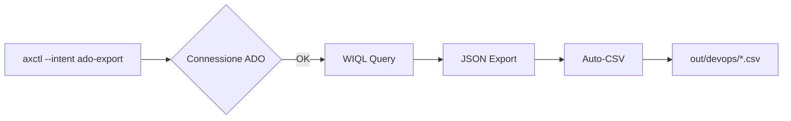

# Axet Agent Kernel

> **📚 LEGGERE PRIMA**: [RULES_MASTER.md](RULES_MASTER.md) contiene TUTTE le regole e comandi in un unico documento.

> **ARCHITETTURA TOKEN-EFFICIENT**:
> Al fine di risparmiare token e mantenere il contesto leggero:
> 1.  La cartella `Rules/` deve contenere **SOLO** le logiche di governance essenziali (`manifest.json`, `axctl`, `rules-manager`).
> 2.  Tutti gli script operativi (`.ps1`, `.py`), gli agenti completi e la documentazione pesante risiedono in `Rules.Vault/`.
> 3.  Usa `rules-manager.ps1` per caricare ("Mount") le risorse solo quando servono.
> **NON** copiare manualmente script in `Rules/scripts/` se non sono core kernel.

## Introduzione
Questo è il kernel leggero e portabile per l'orchestrazione di agenti AI autonomi.stema operativo per agenti pensato per rendere qualsiasi repository "agent‑ready".
È la base tecnologica per la sfida **Native AI Services (Category 3A)**.

Il bundle è progettato per:

- dare un **entrypoint unico** (`Rules/scripts/axctl.ps1` / `axctl.py`) per i principali agent,
- fornire una **flotta di agent** specializzati sotto `Rules/agents/`,
- esporre **script riusabili** sotto `Rules/scripts/` (DB, Datalake, Docs, Security, Governance, ETL/DQ),
- documentare tutto con una Wiki esterna (es. `Wiki/<NomeWiki>.wiki`) e una KB (`Rules/agents/kb/recipes.jsonl`).

---

## 1. Struttura del bundle

### 1.1 Cartelle principali

- `Rules.Vault/KERNEL_GOVERNANCE.md` – Specifica di Governance (ex AMS).
- `Rules/manifest.json` – manifest del bundle:
  - `wikiRoot`: root attesa della wiki nel repo che importa il bundle,
  - `playbooks`: mapping file `.axetrules`,
  - `scripts`: indice comandi wiki/agent disponibili,
  - `kb`: posizioni di schemi/esempi JSON/JSONL.

- `Rules/agents/` – flotta di agent:
  - `agent_ado_userstory` – Azure Boards / User Story,
  - `agent_ams` – AMS / variabili / checklist,
  - `agent_api` – triage errori API,
  - `agent_backend` – OpenAPI / backend API,
  - `agent_creator` – scaffolding nuovi agent,
  - `agent_datalake` – Datalake naming/ACL/retention/SLO,
  - `agent_dba` – DB utenti/DDL/artefatti tabelle,
  - `agent_docs_review` – Wiki/KB docs quality,
  - `agent_dq_blueprint` – blueprint DQ da CSV/XLSX,
  - `agent_frontend` – mini‑portal/UI demo,
  - `agent_governance` – checklist/gates governance,
  - `agent_infra` – Terraform / infra plan,
  - `agent_observability` – healthcheck/logging,
  - `agent_power` – Power Platform (Apps & Automate),
  - `agent_pr_manager` – gestione PR agentiche,
  - `agent_release` – runtime bundle per runner segregato,
  - `agent_retrieval` – RAG / retrieval bundles,
  - `agent_scrummaster` – Scrum / Boards,
  - `agent_security` – Key Vault / access registry,
  - `agent_snow` – ServiceNow (Tickets/Incidents),
  - `agent_synapse` – Synapse Workspace & SQL,
  - `agent_template` – scheletro generico.

- `Rules/agents/core/` – schemi e helper comuni:
  - `schemas/*.schema.json` – schema JSON per manifest, priority, action‑result, KB, plan,
  - `orchestrator.js` – orchestratore JS minimale (WHAT‑first + priority rules),
  - `generate-db-artifacts.js` – generator DDL/SP da mini‑DSL.

- `Rules/agents/kb/` – KB ricette:
  - `recipes.jsonl` – ricette operative JSONL,
  - `README.md` – formato e linee guida.

- `Rules/agents/logs/` – log strutturati (eventi agent / activity log).

- `Rules/docs/agent-bundle-scripts.md` – indice operativo degli script in `Rules/scripts/`.

### 1.2 Convenzione Cartella Output (`out/`)

Per mantenere organizzati gli artefatti generati dagli agent, la cartella `out/` è suddivisa per categoria:

```
out/
├── devops/              # agent_ado_userstory (PBI export, user stories, backlog)
├── dba/                 # agent_dba (schemas DDL, user grants, table artifacts)
├── dq/                  # agent_dq_blueprint (scorecard DQ, backlog DQ, reports)
├── wiki/                # agent_docs_review (frontmatter-lint, tags-lint, orphans)
├── datalake/            # agent_datalake (ACL reports, retention policies, SLO)
├── synapse/             # agent_synapse (workspace audit, SQL checks, scaffolds)
├── databricks/          # Future: notebooks export, cluster configs
├── azure-portal/        # Future: ARM templates, resource export
├── governance/          # agent_governance (checklist status, gates, compliance)
├── api/                 # agent_api (triage errors, health checks, OpenAPI)
├── frontend/            # agent_frontend (UI artifacts, demos, prototypes)
├── infra/               # agent_infra (Terraform plans, drift reports, state)
├── observability/       # agent_observability (logs, metrics, traces)
├── security/            # agent_security (audit reports, compliance scans)
├── pr/                  # agent_pr_manager (PR analysis, review reports)
└── kb/                  # agent_retrieval (RAG bundles, embeddings, indexes)
```

**Regola:** Ogni agent scrive nella propria sotto-cartella. Default path configurato nei manifest.

- `Rules/scripts/` – script operativi:
  - orchestrator/gates: `axctl.ps1`, `axctl.py`, `agent-governance.ps1`, `agent-docs-review.ps1`, `agent-ready-audit.ps1`, …
  - DB/Datalake: `agent-dba.ps1`, `agent-datalake.ps1`, `db-*`, …
  - Docs/Wiki/KB: `wiki-*`, `docs-dq-scorecard.ps1`, `kb-assessment.ps1`, …
  - Security/Infra: `agent-security.ps1`, `agent-infra.ps1`, `out-upload-datalake.ps1`, …
  - ETL/DQ workflow: `wf.run-excel-csv-upload.mjs` + `scripts/intents/*.mjs`.

---

## 2. Entry point di orchestrazione (`axctl`)

### 2.1 `Rules/scripts/axctl.ps1`

Wrapper PowerShell che orchestra i principali agent in modalità **human‑in‑the‑loop**:

- governa:
  - `agent_docs_review` (Wiki/KB),
  - `agent_governance` (Checklist/DB drift/KB consistency/Terraform/appsettings),
  - `agent_pr_manager`, `agent_dba`, `agent_datalake`, `agent_ado_userstory`, `agent_creator`, …
- accetta:
  - `--engine ps|ts` (default PS),
  - `--intent <id>` (es. `docs-dq`, `db-user-create`, `dlk-ensure-structure`, `ado-userstory-create`),
  - switch globali: `--all`, `--wiki`, `--checklist`, `--dbdrift`, `--kbconsistency`, `--terraformplan`, `--genappsettings`, `--pr`, `--noninteractive`, `--whatif`, `--logevent`.

> Dettaglio script: vedi `Rules/docs/agent-bundle-scripts.md`.

### 2.2 `Rules/scripts/ewctl.py`

Wrapper **Python** che offre la stessa semantica di alto livello:

- `--engine ps|py` (per ora usa sempre PowerShell come backend operativo),
- `--intent`, `--all`, `--wiki`, `--checklist`, `--dbdrift`, `--kbconsistency`, `--terraformplan`, `--genappsettings`, `--pr`,
- `--noninteractive`, `--whatif`, `--logevent`.

Serve sia come **CLI cross‑platform** sia come “orchestrator light” per ambienti dove PowerShell esiste ma si preferisce invocare Python come front.

---

## 3. Flotta di agent: modello e regole comuni

Ogni agent in `Rules/agents/agent_*` segue lo stesso modello:

- `manifest.json` – ruolo, descrizione, `allowed_paths`, `allowed_tools`, `required_gates`, `knowledge_sources`, `actions`,
- `priority.json` – regole di **priority/checklist** (mandatory/advisory) basate su:
  - branch, env, changedPaths, intent, colonne, variabili env,
- `templates/*.json` – intent sample,
- `doc/` / pagine Wiki correlate – runbook e spiegazioni.

Esempi:

- `agent_dba` – gestisce:
  - utenti DB (`db-user:create/rotate/revoke`),
  - inventario DDL (`db-doc:ddl-inventory`),
  - generazione artefatti tabella (`db-table:create`).
- `agent_datalake` – gestisce:
  - struttura/naming (`dlk-ensure-structure`),
  - ACL (`dlk-apply-acl`),
  - retention (`dlk-set-retention`),
  - export log (`dlk-export-log`),
  - validazione SLO (`etl-slo:validate`).
- `agent_release` – gestisce:
  - creazione di un **runtime bundle** (zip) privo di segreti (`runtime:bundle`).

---

## 4. KB agentica (`Rules/agents/kb/recipes.jsonl`)

La KB è usata per:

- mappare intent → comandi CLI concreti (PowerShell/Node/az/flyway),
- definire precondizioni, passi, verify, rollback, outputs, references,
- alimentare orchestratori (es. n8n) e RAG.

Formato di una recipe (semplificato):

```json
{
  "id": "kb-something-001",
  "intent": "some-intent-id",
  "question": "Domanda a cui risponde la ricetta",
  "tags": ["docs","db","etl", "..."],
  "preconditions": ["..."],
  "steps": ["comando 1", "comando 2"],
  "verify": ["check 1", "check 2"],
  "rollback": ["..."],
  "outputs": ["..."],
  "references": ["percorso/file.md", "scripts/qualcosa.ps1"],
  "updated": "YYYY-MM-DDThh:mm:ssZ"
}
```

Gli script `Rules/scripts/ps/kb-assessment.ps1` e `Rules/scripts/ps/agent-kb-add.ps1` aiutano a:

- validare la KB (JSON valido, references esistenti, campi minimi),
- aggiungere nuove ricette da CLI.

---

## 5. Eseguire il bundle in un altro repository

Per usare `Rules/` come bundle generico in un altro repo:

1. **Copia la cartella** `Rules/` nel root del nuovo repo.
2. Adatta, se necessario, in `Rules/manifest.json`:
   - `wikiRoot` (es. `Wiki/<NomePortale>.wiki`),
   - eventuali path nelle voci `kb.json.schemas/examples/jsonl`.
3. Crea (o collega) la wiki e la KB:
   - `Wiki/<NomePortale>.wiki` (anche in un altro repo, ma referenziata nei manifest),
   - `Rules/agents/kb/recipes.jsonl` come KB condivisa (può essere estesa).
4. Verifica che gli script **non distruttivi** funzionino:
   - `pwsh Rules/scripts/axctl.ps1 --engine ps --wiki`,
   - `pwsh Rules/scripts/ps/agent-ready-audit.ps1 -Mode core -SummaryOut agent-ready-audit.json`,
   - `pwsh Rules/scripts/ps/kb-assessment.ps1 -Out out/kb-assessment.json`.
5. Solo dopo aver configurato DB/Azure/ADO, abilitare gradualmente gli script che hanno effetti (WhatIf di default dove presente).

---

## 6. Intent sample: runtime bundle (agent_release)

Per rendere “WHAT‑first” la creazione del bundle runner, si può definire un intent sample (ad esempio in `docs/agentic/templates/intents/release.runtime-bundle.intent.json` nel repo che importa il bundle). Schema proposto:

```json
{
  "intent_id": "release.runtime-bundle-001",
  "title": "Genera runtime bundle agente (rules bundle)",
  "action": "runtime:bundle",
  "agent": "agent_release",
  "params": {
    "outZip": "out/runtime/runtime-bundle.zip"
  },
  "whatIf": false,
  "nonInteractive": true,
  "correlationId": "runtime-bundle-001",
  "updated": "2026-01-10T00:00:00Z",
  "owner": "team-platform",
  "references": [
    "Rules/scripts/ps/agent-release.ps1",
    "Rules/agents/agent_release/manifest.json",
    "Rules/docs/agent-bundle-scripts.md"
  ]
}
```

Chiamata standard:

```powershell
pwsh Rules/scripts/ps/agent-release.ps1 -Action runtime:bundle -IntentPath <path_intent.json> -NonInteractive -WhatIf:$false -LogEvent
```

L’output è un JSON `action-result@1.0` con almeno:

- `output.outZip` – path dello zip generato,
- `output.executed` – boolean,
- `output.hint` – note sul bundle (no segreti).

---

## 7. KB recipe: runtime bundle (esempio)

Una recipe KB tipica (da aggiungere a `Rules/agents/kb/recipes.jsonl` nel repo che usa il bundle) potrebbe essere:

```json
{
  "id": "kb-runtime-bundle-001",
  "intent": "release.runtime-bundle-001",
  "question": "Come genero il runtime bundle (zip) del Rules/ per esecuzione su runner segregato?",
  "tags": ["release","bundle","agents","runner"],
  "preconditions": [
    "Repo con cartella Rules/ clonata",
    "PowerShell 7+ disponibile"
  ],
  "steps": [
    "pwsh Rules/scripts/agent-release.ps1 -Action runtime:bundle -IntentPath docs/agentic/templates/intents/release.runtime-bundle.intent.json -NonInteractive -WhatIf",
    "Se l'anteprima è ok, riesegui senza WhatIf: pwsh Rules/scripts/agent-release.ps1 -Action runtime:bundle -IntentPath docs/agentic/templates/intents/release.runtime-bundle.intent.json -NonInteractive -WhatIf:$false -LogEvent"
  ],
  "verify": [
    "Esiste out/runtime/runtime-bundle.zip",
    "La dimensione è ragionevole e non include .env*, out/**, scripts/variables/**",
    "Se -LogEvent, esiste una nuova riga in agents/logs/events*.jsonl"
  ],
  "rollback": [
    "Eliminare o rigenerare lo zip se include file indesiderati",
    "Aggiornare manifest/allowed_paths se servono esclusioni aggiuntive"
  ],
  "outputs": [
    "out/runtime/runtime-bundle.zip",
    "agents/logs/events-YYYYMM.jsonl (se LogEvent)"
  ],
  "references": [
    "Rules/scripts/agent-release.ps1",
    "Rules/agents/agent_release/manifest.json",
    "Rules/docs/agent-bundle-scripts.md"
  ],
  "updated": "2026-01-10T00:00:00Z"
}
```

---

## 8. Uso come bundle generico (riassunto)

In qualsiasi repo che importa `Rules/`:

- **Per iniziare**:
  - leggi `Rules/docs/agent-bundle-scripts.md`,
  - esegui `pwsh Rules/scripts/axctl.ps1 --engine ps --wiki`,
  - valida KB/Wiki con `kb-assessment` e `agent-ready-audit`.

- **Per gates di governance**:

  ```powershell
  pwsh Rules/scripts/axctl.ps1 --engine ps --checklist --dbdrift --kbconsistency --noninteractive --logevent
  ```

- **Per bundle runtime** (runner segregato):

  ```powershell
  pwsh Rules/scripts/agent-release.ps1 -Action runtime:bundle -IntentPath docs/agentic/templates/intents/release.runtime-bundle.intent.json -NonInteractive -WhatIf:$false -LogEvent
  ```

- **Per docs DQ**:

  ```powershell
  pwsh Rules/scripts/docs-dq-scorecard.ps1 -WikiPath Wiki/<NomePortale>.wiki -OutScorecard out/docs-dq-scorecard.json -OutBacklog out/docs-dq-backlog.json
  ```
    "agents/logs/events-YYYYMM.jsonl (se LogEvent)"
  ],
  "references": [
    "Rules/scripts/agent-release.ps1",
    "Rules/agents/agent_release/manifest.json",
    "Rules/docs/agent-bundle-scripts.md"
  ],
  "updated": "2026-01-10T00:00:00Z"
}
```

---

## 8. Uso come bundle generico (riassunto)

In qualsiasi repo che importa `Rules/`:

- **Per iniziare**:
  - leggi `Rules/docs/agent-bundle-scripts.md`,
  - esegui `pwsh Rules/scripts/axctl.ps1 --engine ps --wiki`,
  - valida KB/Wiki con `kb-assessment` e `agent-ready-audit`.

- **Per gates di governance**:

  ```powershell
  pwsh Rules/scripts/axctl.ps1 --engine ps --checklist --dbdrift --kbconsistency --noninteractive --logevent
  ```

- **Per bundle runtime** (runner segregato):

  ```powershell
  pwsh Rules/scripts/agent-release.ps1 -Action runtime:bundle -IntentPath docs/agentic/templates/intents/release.runtime-bundle.intent.json -NonInteractive -WhatIf:$false -LogEvent
  ```

- **Per docs DQ**:

  ```powershell
  pwsh Rules/scripts/docs-dq-scorecard.ps1 -WikiPath Wiki/<NomePortale>.wiki -OutScorecard out/docs-dq-scorecard.json -OutBacklog out/docs-dq-backlog.json
  ```

Il bundle è pensato per essere **esteso**:

- aggiungendo nuovi agent in `Rules/agents/agent_*`,
- aggiornando KB (`agents/kb/recipes.jsonl`),
- collegando tutto alla wiki e alla pipeline CI (gates, report, artifact).

---

## 9. Agent Kernel Features

Il bundle Rules si è evoluto in un vero e proprio **Agent Kernel** che offre:

### 9.1 Project Scaffolding
Automatizza la creazione della struttura standard Axet (Wiki, Client, agents/kb) in qualsiasi repo.
```powershell
# Esegui dalla root del repo
pwsh Rules/scripts/ps/scaffold-project.ps1 -TargetRoot .
# Oppure via intent agentico
pwsh Rules/scripts/axctl.ps1 --intent project-scaffold
```

### 9.2 Architecture V2.0
Definisce uno standard rigoroso per gli agenti (Brain/Skills/Body).
Vedi: [Agent Architecture](docs/agent-architecture.md)

### 9.3 Self-Healing Kernel
Il wrapper `axctl` cattura i fallimenti in modo strutturato.
Se un comando fallisce, viene generato `agents/logs/failure_context.json` con:
- Stack trace completo.
- Contesto dell'intento e parametri.
- Suggerimenti per il fix (pronto per essere letto da un LLM di remediation).

### 9.4 Agent Orchestration (Composite Intents)
Quando un task richiede più domini (es. creare un environment), `axctl` funge da orchestratore chiamando più agenti in sequenza.

**Esempio: `project:synapse-init`**
Coordina 3 agenti:
1.  **Datalake** (`Run-PSDatalake`): Crea struttura FS e ACL.
2.  **Synapse** (`Run-PSSynapse`): Workspace scaffolding.
3.  **DBA** (`Run-PSDBA`): Security setup.

Questo risponde alla domanda *"Chi invoca chi?"*: È sempre il kernel (`axctl`) che orchestra gli specialisti, garantendo l'ordine di esecuzione corretto.

---

## 🛠️ Tools & AI Empowerment
Oltre agli agenti Axet, raccomandiamo l'uso di tool con capacità AI integrate per massimizzare la produttività.

### 🦫 DBeaver AI Smart Assistance
DBeaver (Community/Pro) offre funzionalità "AI Smart Assistance" per generare SQL da linguaggio naturale.
> [!TIP]
> **Utile per:** Creare query complesse su Synapse/SQL Server senza ricordare a memoria nomi di tabelle e colonne.
>
> 🔗 **Guida Ufficiale**: [AI Smart Assistance in DBeaver](https://github.com/dbeaver/dbeaver/wiki/AI-Smart-Assistance-in-DBeaver-Community)
>
> **Configurazione**: Richiede di abilitare il trasferimento dei metadati DB all'AI Vendor (vedi popup in DBeaver).
> **Provider Supportati**: Non sei vincolato a un solo vendor. Puoi usare le tue chiavi per:
> *   **OpenAI** (Pubblico)
> *   **Azure OpenAI** (Corporate/Enterprise)
> *   **GitHub Copilot** (se hai l'abbonamento)


---

## ❓ Troubleshooting & Q&A
Per errori comuni, problemi di connessione SQL o errori ADO (404, authorization), consulta la guida dedicata:
👉 **[Q&A e Soluzione Problemi](QA_TROUBLESHOOTING.md)**

> [!IMPORTANT]
> **Governance Alert**: È MANDATORIO aggiornare il file `QA_TROUBLESHOOTING.md` ogni volta che si incontra e risolve un nuovo tipo di errore. Le Rules AI (`.cursorrules`) impongono questa pratica per garantire la memoria storica del progetto.

### 9.5 Configuration Manual
Per i dettagli su come configurare Agenti, Connettori e Secrets:
👉 **[Vedi: Axet Rules Configuration Guide](Rules.Vault/docs/rules-configuration.md)**
(Path: `Rules.Vault/docs/rules-configuration.md`)

### 9.6 Azure DevOps Export Process

**Obiettivo**: Estrarre Work Items (PBI, User Story, Test Case) da Azure DevOps in formato JSON e CSV.

#### Processo Completo



#### Step 1: Verifica Connessione
```powershell
axctl --intent ado-check
```
Verifica che `connections.json` e `secrets.json` siano configurati correttamente.

#### Step 2: Export Work Items
```powershell
# PBI con tag specifico
axctl --intent ado-export --WorkItemType "Product Backlog Item" --Query "SELECT [System.Id], [System.Title] FROM WorkItems WHERE [System.Tags] CONTAINS 'IFRS9'"

# User Stories
axctl --intent ado-export --WorkItemType "User Story"
```

#### Step 3: Output Automatico
L'export genera automaticamente:
- `out/devops/yyyyMMddHHmmss_ado-export.json` - Formato JSON completo
- `out/devops/yyyyMMddHHmmss_ado-export.csv` - Formato CSV (pipe delimiter `|`)

**Non serve invocare il converter separatamente.**

#### Step 4: Creazione Test Case (Opzionale)
```powershell
axctl --intent ado-testcase --Title "TC-001 - Login" --Steps '[{"action":"Inserire credenziali","expectedResult":"Accesso OK"}]' --ParentId 12345
```

#### Step 5: Interrogare Operativi (PBI/Figli)
```powershell
# Visualizza a video senza creare file
axctl --intent pbi 184797

# Mostra i PBI figli (o task) collegati a un Epic/Feature
axctl --intent children -- 181579

# Oppure direttamente
pwsh Rules.Vault/scripts/ps/agent-ado-governance.ps1 -Action 'ado:pbi.get' -Id 184797
```

#### Step 6: Verificare Pipeline (Deployments)
```powershell
# Mostra Build e Release linkate al PBI
axctl --intent pipeline 199756
```

#### Step 7: Gestione Avanzata Pipeline (Nuovo)
```powershell
# Lista tutte le definizioni
axctl --intent pipelines

# Vedi storico esecuzioni (usa ID dalla lista)
axctl --intent pipeline-history 123
```

#### Step 8: ServiceNow Integration (Nuovo)
```powershell
# Verifica connessione
axctl --intent snow-check

# Lista incidenti aperti (limit 5)
axctl --intent incident-list
```

#### Step 9: SQL Connectivity & Connectors
```powershell
# Verifica DB (usa nome in connections.json)
axctl --intent sql-check synapse-prod
```

#### Tags Supportati
| Tag | Descrizione |
|-----|-------------|
| IFRS9 | Regolamentare/Finanziario |
| SID | Sistema Informativo Direzionale |
| DeepDive | Analytics/Approfondimenti |
| TeamTool | Strumenti interni |
| GCFO | Group CFO |
| AIR | Annual Integrated Reporting |

👉 **Guida completa**: [ADO_EXPORT_GUIDE.md](ADO_EXPORT_GUIDE.md)

#### ⚠️ Manutenzione della Guida ADO

**Quando aggiornare `ADO_EXPORT_GUIDE.md`:**
1. **Nuovi progetti/tag**: Quando vengono creati nuovi progetti o tag ADO (es. "NewProject2026")
2. **Cambi Work Item Type**: Se il team passa da Scrum (PBI) ad Agile (User Story) o viceversa
3. **Nuovi campi richiesti**: Se serve estrarre campi custom (es. `Custom.ReleaseVersion`)
4. **Problemi ricorrenti**: Se gli utenti/AI fanno errori comuni (aggiungi in Troubleshooting)

**Come aggiornare:**
```powershell
# 1. Aggiungi esempio nella sezione appropriata di ADO_EXPORT_GUIDE.md
# 2. Aggiungi recipe in Rules.Vault/agents/kb/recipes.jsonl
{"id":"kb-ado-export-newproject","trigger":"export newproject items","intent":"ado:intent.resolve","procedure":"axctl --intent ado:intent.resolve --Query \"SELECT [System.Id], [System.Title] FROM WorkItems WHERE [System.Tags] CONTAINS 'NewProject'\""}

# 3. OPZIONALE: Testa il comando
axctl --intent ado-export --Query "SELECT [System.Id] FROM WorkItems WHERE [System.Tags] CONTAINS 'NewTag'"
```

**Validazione**: Verifica JSON syntax con `Get-Content recipes.jsonl | ConvertFrom-Json`

---

## 10. Utility: Conversione JSON → CSV

Per convertire qualsiasi output JSON degli agent in formato CSV (compatibile Excel/Power BI):

### Comando Diretto
```powershell
pwsh Rules.Vault/scripts/ps/json-to-csv.ps1 -InputPath out/devops/ado-export.json -Flatten
```

### Via axctl (WIP)
```powershell
# Work in progress - parametri da sistemare
# axctl --intent json-to-csv out/devops/ado-export.json
```

### Opzioni
- `-Flatten`: Appiattisce oggetti nidificati (es. `fields.System.Id` → colonna separata)
- `-Fields`: Seleziona solo campi specifici (es. `-Fields "id","title","state"`)
- `-Delimiter`: Separatore custom (default: `,`)
- `-OutputPath`: Path output custom (default: stesso nome con `.csv`)

### Esempi Pratici
```powershell
# ADO Export: PBI con campi flattened
pwsh Rules.Vault/scripts/ps/json-to-csv.ps1 -InputPath out/devops/ado-export.json -Flatten

# DQ Scorecard: solo colonne specifiche
pwsh Rules.Vault/scripts/ps/json-to-csv.ps1 -InputPath out/dq/scorecard.json -Fields "rule","score","status"

# Wiki Audit: separatore punto e virgola
pwsh Rules.Vault/scripts/ps/json-to-csv.ps1 -InputPath out/wiki/frontmatter-lint.json -Delimiter ";"
```

**Output**: File `.csv` nella stessa cartella del JSON

> **Note**: L'export ADO (`axctl --intent ado-export`) genera automaticamente anche il CSV. Non serve invocare il converter separatamente.

---

## 11. Best Practices per AI Assistants

### Quando usare `task_boundary`
Usare solo per task **complessi** che richiedono:
- Più di 3-4 tool calls
- Modifiche a più file
- Planning/Execution/Verification cycle

### Quando **NON** usare `task_boundary`
Evitare per operazioni semplici:
- ❌ Spostare/copiare file
- ❌ Singole modifiche a un file
- ❌ Risposte a domande
- ❌ Comandi one-liner

### Convenzioni Output
Gli agent devono scrivere in sottocartelle dedicate:
```
out/devops/     → ADO exports
out/dq/         → DQ scorecards
out/wiki/       → Wiki lint reports
out/governance/ → Audit reports
```
(Vedi Sezione 1.2 per struttura completa)

### Naming Convention: Timestamp Prefix
**IMPORTANTE**: Tutti i file di export devono avere un prefisso timestamp:
```
yyyyMMddHHmmss_nomefile.json
yyyyMMddHHmmss_nomefile.csv
```

**Esempio**:
```
out/devops/20260111215504_ado-export.json
out/devops/20260111215504_ado-export.csv
```

**Vantaggi**:
- ✅ Storico automatico (nessun overwrite)
- ✅ Ordinamento cronologico in Explorer
- ✅ Tracciabilità per audit

### Promemoria Manutenzione
Se aggiungi nuovi tag/progetti ADO, aggiorna:
1. `Rules/ADO_EXPORT_GUIDE.md` (esempi)
2. `Rules.Vault/agents/kb/recipes.jsonl` (nuove recipe)


