# Il Flusso Sovrano: Dalla Fabbrica alla Vetrina

> **Proposta di Workflow**
> *"Il caos creativo resta in fabbrica. Il prodotto pulito esce in vetrina."*

Ecco come gestiremo il codice senza cambiare il tuo modo di lavorare.

```mermaid
graph TD
    subgraph "💻 IL TUO PC (Local Factory)"
        Factory[📂 C:\old\EasyWayDataPortal]
        style Factory fill:#fff,stroke:#333,stroke-width:2px
        
        Notelocal[Tutto il tuo caos creativo:<br/>- Docs<br/>- Esperimenti<br/>- Codice sporco<br/>- DQF Agent Folder]
    end

    subgraph "🏰 LA FORTEZZA (Sovereign GitLab)"
        RepoMonolith[📦 easyway-data-portal]
        RepoProduct[🚀 dqf-agent]
        style RepoProduct fill:#d4fae6,stroke:#198754,stroke-width:2px
    end

    subgraph "🌍 LA PIAZZA (GitHub Public)"
        GitHubProduct[⭐ dqf-agent]
    end

    %% Flussi
    Factory -->|1. Commit Totale| RepoMonolith
    Factory -->|2. Script 'Copy-Publish'| RepoProduct
    RepoProduct -.->|3. Auto-Mirror| GitHubProduct

    linkStyle 1 stroke:#198754,stroke-width:3px,color:green;
```

## Come funziona (Step-by-Step)

### 1. Lavoro Quotidiano (Libertà Totale)
Tu lavori dentro `C:\old\EasyWayDataPortal`.
Modifichi file, crei cartelle, fai esperimenti. Non ti preoccupi di "repository esterni".

### 2. Il Salvataggio (Backup Fabbrica)
Fai `git commit` e mandi tutto al repo `easyway-data-portal` su GitLab.
- **Risultato**: Tutto il tuo ambiente è salvato al sicuro.

### 3. La Spedizione (Publishing) 🚀
Quando `dqf-agent` (che è una cartella lì dentro) è pronto per una release:
- Lanci uno script: `PUBLISH-DQF.ps1`
- **Cosa fa lui**: Prende *solo* la cartella `dqf-agent`, la pulisce e la manda al repo `dqf-agent` su GitLab.

### 4. Il Mirroring (Automatico)
GitLab vede il nuovo codice su `dqf-agent` e lo copia su GitHub per prendere le star.

---

**Vantaggi:**
1.  **Zero Overhead**: Non devi gestire sottomoduli o comandi strani.
2.  **Privacy**: I tuoi appunti "sporchi" restano nel Monolito privato.
3.  **Pulizia**: Su GitHub arriva solo il codice "bello" del prodotto.
