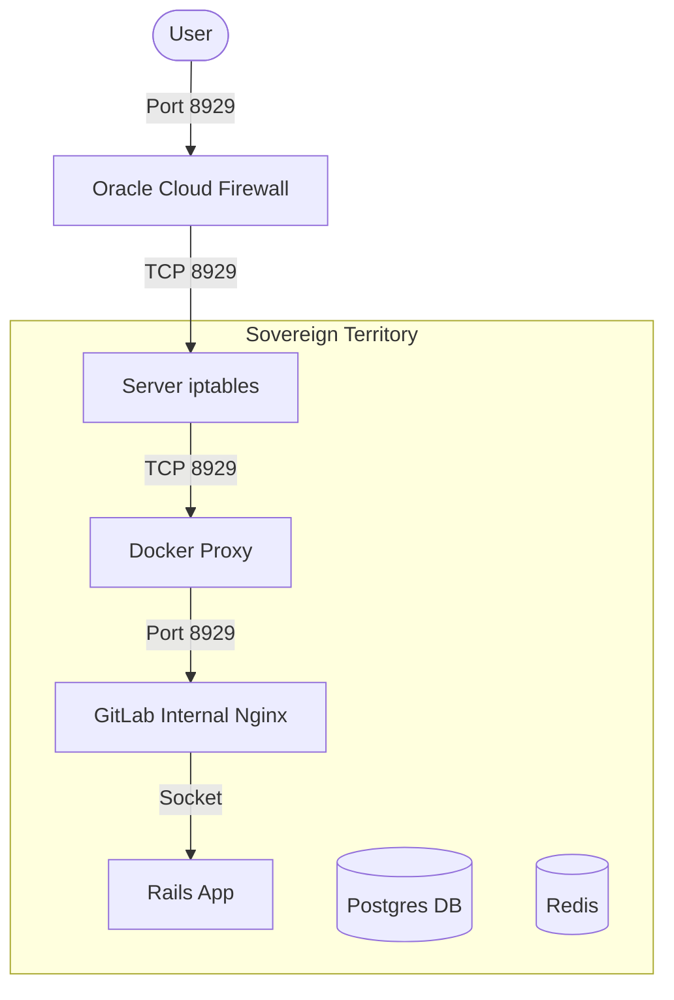

# 🏰 The Dawn of Sovereignty: GitLab Self-Managed

> *\"Non siamo inquilini nel cloud di qualcun altro. Siamo proprietari della nostra fortezza.\"*

**2026-02-03** segna una pietra miliare fondamentale nella storia di EasyWay: l'attivazione della nostra infrastruttura DevOps sovereign.

Come direbbe Roberto Pontremoli (CEO Dallara):
> *\"Stiamo perdendo la capacità di decidere, perché ci stanno abituando solo a scegliere. La differenza tra decisione e scelta è che: IO Quando scelgo vado AL RISTORANTE PRENDO IL MENU E SCELGO COSA MANGIARE. LA DECISIONE è FARE IL MENU. Siamo portati a fare scelte su un menù che ha deciso qualcun altro.\"*

Oggi, con GitLab Self-Managed, EasyWay ha smesso di scegliere dal menù di altri (GitHub, Azure DevOps). **Oggi abbiamo deciso di scrivere il nostro menù.**

> **Nota Bene**: Non vogliamo *eliminare* il cloud. Vogliamo essere **Antifragili**. Se domani decidiamo di staccarci, dobbiamo poterlo fare senza dolore. La sovranità non è isolamento, è la libertà di dire "no" senza conseguenze catastrofiche.

## 🏆 The Achievement: Writing Our Own Menu

Abbiamo completato il deployment di **GitLab Self-Managed** sul server di produzione Oracle Cloud (`80.225.86.168`). Non è solo un software installato; è una dichiarazione di sovranità.

### Perché è Epico?
1.  **Sovereignty (La Decisione)**: Il codice, le pipeline, i segreti e i backup sono al 100% sotto il nostro controllo. Nessuno può cambiarci il menù.
2.  **Antifragile Infrastructure**: Costruito per resistere. Disaster recovery in 15 minuti. Backup automatici.
3.  **Cost Optimized**: 23GB RAM sfruttati al massimo con un tuning di precisione (Puma workers, Postgres buffers).
4.  **Security First**: 3 livelli di firewall (Oracle Security List, iptables, Container isolation).

## ⚔️ The Battle (Lessons Learned)

La vittoria non è stata facile. Abbiamo sconfitto:
- **Il Drago del Port Mapping**: Docker vs GitLab Nginx (`Connection reset by peer` sconfitto mappando 8929:8929).
- **Il Labirinto del Firewall**: Oracle Cloud richiede *tre chiavi* per aprire una porta (Security List, iptables, ufw).
- **Lo Spettro della Sintassi**: `docker-compose` v1 vs `docker compose` v2.

## 🗺️ The Map (Architecture)

## 🔮 Next Steps

Con le fondamenta sicure, ora possiamo costruire:
- **DQF Agent Repository**: La casa pubblica del nostro agent framework.
- **Obsidian Integration**: Il ponte tra pensiero e codice.
- **Automated Pipelines**: CI/CD che obbedisce solo a noi.

---
*Signed by: The EasyWay Platform Team & Antigravity Agent*
