# Valentino Framework Operational Flow

> **Purpose**: Definire il ciclo di vita operativo del **Valentino Framework** (EasyWay Frontend), stabilendo "Chi fa Cosa", il flusso di validazione e i protocolli di remediation.
> **Scope**: Development, Testing, Deployment, Incident Response.

---

## 🔄 The Golden Loop (Ciclo di Vita)

```mermaid
graph TD
    A[Human Request] -->|Prompt/Ticket| B(Agent / Dev);
    B -->|Code Change| C{Local Verification};
    C -->|Run Playwright| D[E2E Suite];
    
    D -->|PASS| E[Commit & Push];
    D -->|FAIL| F[Remediation Loop];
    
    F -->|Analyze UI Trace| B;
    
    E -->|Git Push| G[CI/CD Pipeline];
    G -->|Deploy| H[Production];
    H -->|Smoke Test| I{Live Verification};
    
    I -->|PASS| J[Done 🎉];
    I -->|FAIL| K[Rollback / Hotfix];
```

---

## 🎭 Actors & Responsibilities

| Actor | Role | Responsibilities | Tools |
|-------|------|------------------|-------|
| 👤 **Human Architect** | Vision & Review | Definisce feature, approva PR, sblocca decisioni critiche. | Chat, Code Review |
| 🤖 **Agent / Dev** | Builder | Scrive codice, crea test, esegue fix, documenta. | VS Code, Terminal |
| 🛡️ **Playwright** | The Guardrail | Esegue test E2E, intercetta regressioni, genera report. | `npm run test:e2e` |
| 🚀 **Docker/CI** | The Carrier | Costruisce container, deploya in produzione. | Docker, Pipelines |

---

## 🛠️ Operational Workflows

### 1. Development Flow (Standard)
*Quando*: Nuova feature o modifica UI.

1.  **Human**: Richiede modifica (es. "Aggiungi pagina X").
2.  **Agent**: 
    *   Modifica `runtime-pages.ts` o JSON.
    *   Aggiunge/Aggiorna Test in `tests/e2e/`.
    *   Esegue `npm run test:e2e` (Navigation + Form).
3.  **Check**:
    *   Se ✅: Commit -> Push.
    *   Se ❌: Entra in **Remediation Code**.

### 2. Validation Flow (The Gatekeeper)
*Quando*: Prima di ogni commit.

L'Agente **DEVE** eseguire la suite E2E.
*   **Smoke Test**: Verifica salute generale.
*   **Navigation**: Verifica routing SPA.
*   **Interaction**: Verifica form e input.

---

## 🚑 Remediation Protocols (Troubleshooting)

Questa sezione definisce **cosa fare** quando i test falliscono.

### Scenario A: Navigation Test Fallito 🔴
*   **Sintomo**: Timeout su `should load page X`.
*   **Causa Probabile**: Pagina pesante, asset mancante, errore JS in console.
*   **Remediation**:
    1.  Esegui `npm run test:e2e:ui`.
    2.  Controlla Tab "Console" nel report per errori JS.
    3.  Aumenta timeout in `spec.ts` se pagina pesante (`test.setTimeout(60000)`).
    4.  Verifica `networkidle` (Patch A).

### Scenario B: Form Validation Fallita 🔴
*   **Sintomo**: `Element not visible` o `validity.valid` è falso.
*   **Causa Probabile**: Idratazione ritardata (Elemento non ancora pronto).
*   **Remediation**:
    1.  Verifica presenza `await page.waitForSelector('input[name="x"]')` (Patch B).
    2.  Verifica che il JSON della pagina (`public/pages/demo.json`) corrisponda al test.
    3.  Usa `await page.pause()` per debuggare visualmente.

### Scenario C: Smoke Test Fallito 🔴
*   **Sintomo**: Home page non carica o titolo errato.
*   **Causa Probabile**: Dev Server morto o crash applicativo grave.
*   **Remediation**:
    1.  Controlla terminale: `npm run dev` è attivo?
    2.  Kill process `node.exe` e riavvia.
    3.  Verifica `index.html` e entry point.

### Scenario D: Flaky Tests (A volte va, a volte no) 🟡
*   **Sintomo**: Passa in locale, fallisce in CI (o viceversa).
*   **Remediation**:
    1.  Sostituisci `waitForTimeout()` (fisso) con `waitForSelector()` o `waitForLoadState()` (dinamico).
    2.  Aumenta `retries: 2` in `playwright.config.ts`.

---

## 📜 Definition of Done (DoD)

Una feature si considera completata solo se:
1.  [ ] Codice implementato.
2.  [ ] Test E2E esistenti passano.
3.  [ ] Nuovi test coprono la nuova feature.
4.  [ ] Documentazione aggiornata (se architecture change).

---

*Last Updated: 2026-02-02 by Agent*
