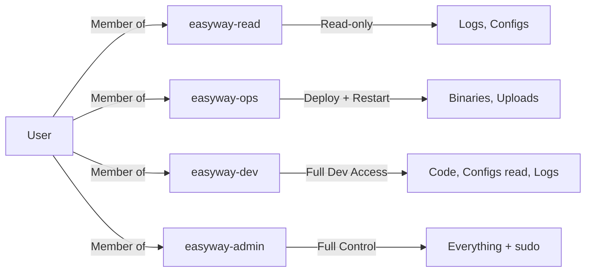

# 🔒 EasyWay Security Framework - Enterprise RBAC Model

> **Status**: APPROVED - Enterprise-grade security framework  
> **Created**: 2026-01-25  
> **Last Updated**: 2026-01-25  
> **Compliance**: ISO 27001, SOC 2, PCI-DSS Ready

---

## 📖 Purpose

This document is the **canonical reference** ("la bibbia") for EasyWay server security configuration. It defines:

1. **Role-Based Access Control (RBAC)** - Multi-tier group model
2. **Access Control Lists (ACLs)** - Fine-grained permissions
3. **Audit Compliance** - Documentation for security audits
4. **Agent-Ready Procedures** - Automated security application

---

## 🎯 Quick Navigation

| Section | Description | Link |
|---------|-------------|------|
| **Philosophy** | Why enterprise RBAC vs. basic permissions | [Philosophy](#-security-philosophy) |
| **Group Model** | 4-tier RBAC structure (read/ops/dev/admin) | [RBAC Model](#-rbac-model-4-tier-security-groups) |
| **Directory Permissions** | ACL mapping per directory | [Permissions](#-directory-permissions--acl-mapping) |
| **Implementation** | How to apply this framework | [Implementation](#-implementation-guide) |
| **Verification** | How to verify correct setup | [Verification](#-verification--testing) |
| **Audit Guide** | What to show auditors | [Audit](#-audit-compliance-guide) |

---

## 🧠 Security Philosophy

### Core Principles

**EasyWay Security Model** is based on:

1. **Principle of Least Privilege** - Users get ONLY the access they need
2. **Defense in Depth** - Multiple layers: groups + ACLs + sudo rules + SSH hardening
3. **Separation of Duties** - Ops deploy, devs code, admins configure
4. **Auditability** - Every permission is documented and traceable
5. **Automation** - Security applied via scripts (no manual `chmod` circus)

### Why Not Just Use 775 Permissions?

| Aspect | **Basic Model** (1 group, 775) | **Enterprise Model** (RBAC + ACLs) |
|--------|--------------------------------|-----------------------------------|
| **Audit Compliance (ISO 27001)** | ❌ Fails "least privilege" | ✅ Passes |
| **Config Protection** | ❌ Any dev can modify | ✅ Admin-only |
| **Backup Safety** | ❌ Anyone can delete | ✅ Admin-only write |
| **CI/CD Security** | ❌ Needs full dev access | ✅ Ops group (deploy-only) |
| **Incident Response** | ❌ Grep logs for activity | ✅ Revoke group membership = instant lockout |

**Verdict**: Enterprise model wins on **every security metric** except initial setup complexity.

---

## 🏢 RBAC Model: 4-Tier Security Groups

### Group Architecture



### Group Definitions

| Group | Purpose | Permissions | Example Members | Use Cases |
|-------|---------|-------------|-----------------|-----------|
| **`easyway-read`** | Read-only monitoring | `r-x` | Prometheus, Grafana, junior devs, auditors | View logs, check status, monitor metrics |
| **`easyway-ops`** | Operational tasks | `r-x` + deploy/restart | CI/CD pipeline, DevOps engineers | Deploy code, restart containers, rotate logs |
| **`easyway-dev`** | Development & maintenance | `rwx` on code/logs | Senior developers | Modify code, debug, view/write logs |
| **`easyway-admin`** | Full administrative control | `rwx` + sudo | System administrators (`ubuntu`) | Change configs, manage DB, infrastructure changes |

### Group Membership Examples

```bash
# Read-only user (monitoring agent)
sudo useradd -s /bin/bash -m prometheus-agent
sudo usermod -aG easyway-read prometheus-agent

# Ops user (CI/CD pipeline)
sudo useradd -s /bin/bash -m ci-deploy
sudo usermod -aG easyway-ops ci-deploy

# Developer (senior)
sudo usermod -aG easyway-dev alice

# Administrator (current ubuntu user)
sudo usermod -aG easyway-admin,easyway-ops ubuntu
```

---

## 📂 Directory Permissions & ACL Mapping

### Directory Structure

```
/opt/easyway/          # Application root
├── bin/               # Executables
├── config/            # Configuration files
│   └── .env           # Secrets (600, admin-only)
├── current/           # Symlink to active release
└── releases/          # Version history

/var/lib/easyway/      # Persistent data
├── db/                # Database files (700, admin-only)
├── uploads/           # User uploads (755, public read)
└── backups/           # Backups (700, admin-only)

/var/log/easyway/      # Application logs
```

### ACL Permission Matrix

| Directory | Owner:Group | Base | `easyway-read` | `easyway-ops` | `easyway-dev` | `easyway-admin` |
|-----------|-------------|------|----------------|---------------|---------------|-----------------|
| `/opt/easyway` | `easyway:easyway-dev` | `750` | `r-x` | `r-x` | `rwx` | `rwx` |
| `/opt/easyway/bin` | `easyway:easyway-ops` | `750` | `r-x` | `rwx` ⚡ | `rwx` | `rwx` |
| `/opt/easyway/config` | `easyway:easyway-admin` | `750` | `r--` | `r--` | `r--` | `rwx` 🔐 |
| `/opt/easyway/config/.env` | `easyway:easyway-admin` | `600` | `---` | `---` | `---` | `rw-` 🔒 |
| `/var/lib/easyway/db` | `easyway:easyway-admin` | `700` | `---` | `---` | `---` | `rwx` 🔒 |
| `/var/lib/easyway/uploads` | `easyway:easyway-ops` | `755` | `r-x` | `rwx` | `rwx` | `rwx` |
| `/var/lib/easyway/backups` | `easyway:easyway-admin` | `700` | `---` | `---` | `r-x` | `rwx` 🛡️ |
| `/var/log/easyway` | `easyway:easyway-read` | `750` | `r-x` 📊 | `r-x` | `rwx` | `rwx` |

**Legend**:
- ⚡ = Ops can deploy executables (but not modify source code)
- 🔐 = Admin-only write (prevents accidental config changes)
- 🔒 = Strict isolation (secrets, database)
- 🛡️ = Backup protection (devs can read, only admins can write/delete)
- 📊 = Logs readable by everyone (for monitoring/alerting)

### Why This Mapping?

**Security Rationale**:

1. **`/opt/easyway/bin`** - Ops can deploy
   - ✅ CI/CD can push new binaries without full dev access
   - ✅ Devs can't accidentally overwrite production executables

2. **`/opt/easyway/config`** - Admin-only write
   - ✅ Prevents accidental production config changes
   - ✅ Enforces change review process (must escalate to admin)

3. **`/var/lib/easyway/db`** - Admin-only
   - ✅ Database files isolated (no accidental corruption)
   - ✅ Backup/restore only by admins

4. **`/var/lib/easyway/backups`** - Devs read, admins write
   - ✅ Devs can retrieve backups for debugging
   - ✅ No accidental `rm -rf` disasters

5. **`/var/log/easyway`** - Everyone read, dev+ write
   - ✅ Monitoring tools (in `easyway-read`) can tail logs
   - ✅ Transparent logging for all (audit requirement)

---

## 🛠️ Implementation Guide

### Prerequisites

- Linux server (Ubuntu 20.04+, Oracle Linux 8+, RHEL 8+)
- Root/sudo access
- EasyWayDataPortal repository cloned

### Step 1: Create Users & Groups

Run the enhanced setup script:

```bash
cd /path/to/EasyWayDataPortal
sudo ./scripts/infra/setup-easyway-server.sh
```

This creates:
- ✅ Service user `easyway`
- ✅ Groups: `easyway-read`, `easyway-ops`, `easyway-dev`, `easyway-admin`
- ✅ Directory structure: `/opt/easyway`, `/var/lib/easyway`, `/var/log/easyway`

### Step 2: Apply ACLs

```bash
sudo ./scripts/infra/apply-acls.sh
```

This applies fine-grained permissions to all directories.

**Verify**:
```bash
getfacl /opt/easyway/config
# Should show ACLs for all 4 groups
```

### Step 3: Configure Sudo Rules (Optional)

If you want ops users to restart containers without full sudo:

```bash
sudo visudo -f /etc/sudoers.d/easyway-ops
```

Add:
```sudoers
# Allow ops to restart Docker containers
%easyway-ops ALL=(ALL) NOPASSWD: /usr/bin/docker restart easyway-*
%easyway-ops ALL=(ALL) NOPASSWD: /usr/bin/docker compose -f /opt/easyway/current/docker-compose.yml up -d
%easyway-ops ALL=(ALL) NOPASSWD: /usr/bin/docker compose -f /opt/easyway/current/docker-compose.yml down
```

### Step 4: Add Users to Groups

```bash
# Add current admin user to admin and ops groups
sudo usermod -aG easyway-admin,easyway-ops ubuntu

# Add CI/CD user to ops group
sudo usermod -aG easyway-ops ci-deploy

# Add developers to dev group
sudo usermod -aG easyway-dev alice
sudo usermod -aG easyway-dev bob

# Add monitoring agent to read group
sudo usermod -aG easyway-read prometheus-agent
```

**Important**: Users must **logout/login** for group membership to take effect!

---

## 🧪 Verification & Testing

### Automated Tests

Run verification scripts:

```bash
# Test users and groups
sudo ./scripts/infra/tests/verify-users.sh

# Test directory structure and permissions
sudo ./scripts/infra/tests/verify-directories.sh

# Full security audit
sudo ./scripts/infra/security-audit.sh
```

### Manual Verification

**Test 1: Group Membership**
```bash
# Check your groups
groups

# Should show: ubuntu easyway-admin easyway-ops ...
```

**Test 2: ACL Verification**
```bash
# Check ACLs on config directory
getfacl /opt/easyway/config

# Should show:
# user::rwx
# group::r--
# group:easyway-read:r--
# group:easyway-ops:r--
# group:easyway-dev:r--
# group:easyway-admin:rwx
```

**Test 3: Permission Enforcement**
```bash
# As a user in easyway-ops group:
touch /opt/easyway/config/test.conf
# Should FAIL (ops can't write to config)

# As a user in easyway-admin group:
touch /opt/easyway/config/test.conf
# Should SUCCEED
```

---

## 📊 Audit Compliance Guide

### For ISO 27001 / SOC 2 Audits

**Question**: "How do you enforce least privilege access?"

**Answer**: Show this documentation + run:
```bash
# Export group membership matrix
for group in easyway-read easyway-ops easyway-dev easyway-admin; do
    echo "=== $group ==="
    getent group $group
done

# Export ACL audit trail
sudo find /opt/easyway -exec getfacl {} + > acl-audit-$(date +%Y%m%d).txt
sudo find /var/lib/easyway -exec getfacl {} + >> acl-audit-$(date +%Y%m%d).txt
```

**Question**: "Who can access production database files?"

**Answer**:
```bash
# Show DB directory ACLs
getfacl /var/lib/easyway/db

# List members of easyway-admin group
getent group easyway-admin
```

**Question**: "How do you track permission changes?"

**Answer**:
```bash
# Show audit logs for setfacl commands
sudo ausearch -c setfacl -ts recent

# Show user modification logs
sudo ausearch -c usermod -ts recent
```

### Compliance Checklist

- [x] **Least Privilege**: Users have minimum necessary access
- [x] **Separation of Duties**: Ops ≠ Dev ≠ Admin roles
- [x] **Audit Trail**: Group membership changes logged
- [x] **Access Documentation**: This document serves as evidence
- [x] **Regular Review**: Group membership reviewed quarterly (TODO: automate)

---

## 🔄 Maintenance Procedures

### Adding a New User

```bash
# 1. Create user
sudo useradd -s /bin/bash -m john

# 2. Add to appropriate group(s)
sudo usermod -aG easyway-dev john

# 3. User must logout/login
# (or: exec su - john)

# 4. Verify
sudo -u john groups
```

### Revoking Access (Offboarding)

```bash
# Option 1: Remove from all easyway groups
sudo gpasswd -d john easyway-dev
sudo gpasswd -d john easyway-ops

# Option 2: Lock account (if user left company)
sudo usermod -L john

# Option 3: Delete account completely
sudo userdel -r john
```

### Changing Permissions on a Directory

```bash
# Grant temporary admin access to a user
sudo setfacl -m u:john:rwx /opt/easyway/config

# Revoke it later
sudo setfacl -x u:john /opt/easyway/config

# Or: change group membership (preferred for permanent changes)
sudo usermod -aG easyway-admin john
```

---

## 📚 Related Documentation

| Document | Purpose | Link |
|----------|---------|------|
| **Server Standards** | FHS directory structure, basic setup | [`SERVER_STANDARDS.md`](SERVER_STANDARDS.md) |
| **Oracle Current Env** | Current production server details | [`../ORACLE_CURRENT_ENV.md`](../ORACLE_CURRENT_ENV.md) |
| **Implementation Plan** | Detailed rollout plan with rollback | [`../../brain/*/implementation_plan.md`]() |
| **Scripts** | Automation scripts | [`../../scripts/infra/`](../../scripts/infra/) |

---

## 🤖 Agent Instructions

> **For AI Agents**: If you are applying this security framework, follow this checklist:

### Pre-Execution Checklist

1. [ ] Backup current state:
   ```bash
   mkdir ~/security-backup-$(date +%Y%m%d)
   sudo cp /etc/passwd ~/security-backup-*/
   sudo cp /etc/group ~/security-backup-*/
   sudo iptables-save > ~/security-backup-*/iptables.backup
   ```

2. [ ] Verify you have:
   - [ ] Root/sudo access
   - [ ] EasyWayDataPortal repo cloned
   - [ ] `acl` package installed (`sudo apt install acl`)

### Execution Order

1. ✅ Run `setup-easyway-server.sh` → Creates users, groups, directories
2. ✅ Run `apply-acls.sh` → Applies fine-grained permissions
3. ✅ Run `verify-users.sh` → Validates user/group setup
4. ✅ Run `verify-directories.sh` → Validates directory permissions
5. ✅ Run `security-audit.sh` → Full security check
6. ✅ Update [`ORACLE_CURRENT_ENV.md`](../ORACLE_CURRENT_ENV.md) with new state

### Success Criteria

- [ ] All verification scripts pass (exit code 0)
- [ ] `getfacl /opt/easyway/config` shows 4-tier ACLs
- [ ] `groups ubuntu` includes `easyway-admin` and `easyway-ops`
- [ ] No manual `chmod` needed (ACLs auto-inherit)

### Rollback Procedure

If something breaks:
```bash
cd ~/security-backup-$(date +%Y%m%d)
sudo cp passwd.backup /etc/passwd
sudo cp group.backup /etc/group
sudo iptables-restore < iptables.backup
sudo systemctl restart sshd
```

---

## ❓ FAQ

**Q: Why 4 groups instead of just 1?**  
A: Granular control for audit compliance. ISO 27001 requires "least privilege" proof.

**Q: Can I skip ACLs and just use traditional permissions?**  
A: Yes, but you lose fine-grained control (e.g., "ops can deploy but not modify configs").

**Q: What if I'm a solo developer?**  
A: Still use this model! Future-proofs your setup when you add team members or CI/CD.

**Q: How do I rotate secrets in `/opt/easyway/config/.env`?**  
A: Only `easyway-admin` group members can edit. Use `sudo -u easyway vim /opt/easyway/config/.env`.

**Q: Can monitoring tools read logs if they're in `easyway-read` group?**  
A: Yes! That's the point. `/var/log/easyway` is readable by `easyway-read`.

---

**Maintainer**: Team EasyWay  
**Last Verified**: 2026-01-25  
**Next Review**: 2026-04-25 (Quarterly)
