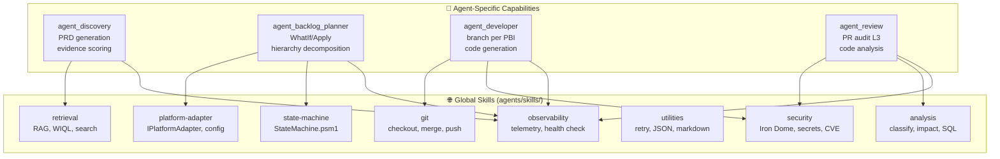

# Skills Framework — EasyWay Agentic Platform

> **Principio**: le skill globali sono il sistema nervoso condiviso;
> le capability specifiche sono i muscoli specializzati di ogni agente.

---

## Modello Ibrido

## Stato Formalizzazione (Session 18)

- Freeze Batch 1 L2: `agent_review`, `agent_release`, `agent_pr_manager`, `agent_developer`, `agent_observability`
- Agenti formalizzati: **7/34**
  - Pre-esistenti: `agent_discovery`, `agent_backlog_planner`
  - Nuovi in Session 18: i 5 agenti del batch freeze

---



---

## Regola pratica

| Criterio | → Globale | → Agent-Specific |
|---|---|---|
| Usata da 2+ agenti | ✅ | |
| Specifica di 1 solo agente/processo | | ✅ |
| Gestisce infrastruttura (auth, log, git) | ✅ | |
| Gestisce logica di dominio (PRD, audit) | | ✅ |

---

## Global Skills — Inventario

| Skill | Path | Funzioni | Usata da |
|---|---|---|---|
| `retrieval` | `agents/skills/retrieval/` | RAG, WIQL, vector search | Discovery, Review, Knowledge |
| `security` | `agents/skills/security/` | CVE scan, secret vault | Tutti |
| `observability` | `scripts/pwsh/core/TelemetryLogger.psm1` | Write-Event, Measure-Action | Tutti |
| `platform-adapter` | `scripts/pwsh/core/adapters/` | Adapter factory, WIQL dedup | Planner, Executor |
| `state-machine` | `scripts/pwsh/core/StateMachine.psm1` | State transitions, gates | Orchestratore |
| `utilities` | `agents/skills/utilities/` | Retry, JSON validate, markdown | Tutti |
| `git` | `agents/skills/git/` | Checkout, merge, push, sync | Developer, Release |
| `analysis` | `agents/skills/analysis/` | Classify, impact, SQL, summarize | Review, Discovery |

---

## Agent Manifest — Sezione Skills

Ogni `manifest.json` dichiara le skill che l'agente può usare:

```json
{
  "id": "agent_backlog_planner",
  "skills": {
    "global": ["platform-adapter", "state-machine", "observability"],
    "local": ["backlog-decomposition", "whatif-preview"]
  }
}
```

### Enforcement

- Il `Load-Skills.ps1` carica solo le skill dichiarate nel manifest
- Skill non dichiarate → `RBAC_DENY` (Sovereign Law)
- `allowed_callers` su skill sensibili (es. `security/Invoke-SecretVault.ps1`)

---

## Ciclo di vita skill

1. **Proposta**: PR con nuova skill + test Pester
2. **Review**: code review + conformance check
3. **Registrazione**: aggiungere a `agents/skills/registry.json`
4. **Consumo**: aggiungere al `manifest.json` degli agenti che la usano
5. **Versionamento**: ogni skill ha un `version` nel registry
